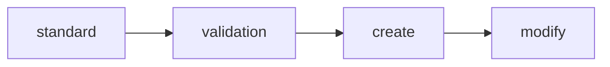

# Стандарт инструкций

Версия стандарта: 1.3

Формат и шаблон для файлов инструкций в папках `.instructions/`.

**Полезные ссылки:**
- [Инструкции](./README.md)

**Связанные документы:**

| Тип | Документ |
|-----|----------|
| Стандарт | Этот документ |
| Валидация | [validation-instruction.md](./validation-instruction.md) |
| Создание | [create-instruction.md](./create-instruction.md) |
| Модификация | [modify-instruction.md](./modify-instruction.md) |

## Оглавление

- [1. Четыре типа инструкций](#1-четыре-типа-инструкций)
- [2. Инструкции типа standard](#2-инструкции-типа-standard)
  - [Раздел "Frontmatter"](#раздел-frontmatter)
  - [Раздел "Заголовок"](#раздел-заголовок)
  - [Раздел "Оглавление"](#раздел-оглавление)
  - [Раздел "Содержание"](#раздел-содержание)
  - [Обновление версии стандарта](#обновление-версии-стандарта)
- [3. Инструкции типа create](#3-инструкции-типа-create)
  - [Секция "Принципы"](#секция-принципы)
  - [Секция "Шаги"](#секция-шаги)
  - [Секция "Чек-лист"](#секция-чек-лист)
  - [Секция "Примеры"](#секция-примеры)
  - [Секция "Скрипты"](#секция-скрипты)
  - [Секция "Скиллы"](#секция-скиллы)
- [4. Инструкции типа modify](#4-инструкции-типа-modify)
  - [Секция "Типы изменений"](#секция-типы-изменений)
  - [Секция "Обновление"](#секция-обновление)
  - [Секция "Деактивация"](#секция-деактивация)
  - [Секция "Миграция"](#секция-миграция)
  - [Секция "Обновление ссылок"](#секция-обновление-ссылок)
  - [Секция "Чек-лист"](#секция-чек-лист-1)
  - [Секция "Примеры"](#секция-примеры-1)
  - [Секция "Скрипты"](#секция-скрипты-1)
  - [Секция "Скиллы"](#секция-скиллы-1)
- [5. Инструкции типа validation](#5-инструкции-типа-validation)
  - [Секция "Когда валидировать"](#секция-когда-валидировать)
  - [Секция "Шаги"](#секция-шаги-1)
  - [Секция "Чек-лист"](#секция-чек-лист-2)
  - [Секция "Типичные ошибки"](#секция-типичные-ошибки)
  - [Секция "Скрипты"](#секция-скрипты-2)
  - [Секция "Скиллы"](#секция-скиллы-2)
- [6. Шаблоны](#6-шаблоны)
  - [Шаблон standard-инструкции](#шаблон-standard-инструкции)
  - [Шаблон create-инструкции](#шаблон-create-инструкции)
  - [Шаблон modify-инструкции](#шаблон-modify-инструкции)
  - [Шаблон validation-инструкции](#шаблон-validation-инструкции)
- [7. Правила именования и расположения](#7-правила-именования-и-расположения)
  - [Индексация в README.md](#индексация-в-readmemd)
- [8. Правила работы со ссылками](#8-правила-работы-со-ссылками)
- [9. Общие правила](#9-общие-правила)
  - [Приоритет скриптов в шагах](#приоритет-скриптов-в-шагах)
- [10. Правила для create/modify инструкций](#10-правила-для-createmodify-инструкций)
  - [Порядок создания инструкций](#порядок-создания-инструкций)
  - [Проверка существующих ресурсов](#проверка-существующих-ресурсов)
  - [Циклы подтверждения](#циклы-подтверждения)
  - [Отчёт о проделанной работе](#отчёт-о-проделанной-работе)
  - [Связь со скиллом](#связь-со-скиллом)
  - [Связь с rule](#связь-с-rule)
  - [Удаление инструкций](#удаление-инструкций)
- [Скиллы](#скиллы)

---

> **Шаблоны — из примеров SSOT.** При создании файлов использовать шаблоны из секции "Шаблоны". Запрещено придумывать свой формат.

---

## 1. Четыре типа инструкций

Тип определяется по префиксу имени файла.

| Тип | Префикс | Назначение | Вопрос |
|-----|---------|------------|--------|
| **standard** | `standard-` | Формат и правила объекта | Что это? Как должно выглядеть? |
| **create** | `create-` | Процесс создания | Как создать? |
| **modify** | `modify-` | Процесс изменения | Как изменить? Как удалить? |
| **validation** | `validation-` | Процесс проверки | Как проверить? |

**Принцип:** Инструкции = ТОЛЬКО стандарты (КАК делать). README описывает структуру (ЧТО есть).

**Структура этого документа:**

Этот стандарт построен по принципу: **описание объекта → шаблон → общие правила**.

1. Сначала описывается каждый тип инструкции — с полным примером разделов и секций
2. Затем приводятся шаблоны — готовые скелеты для копирования (используются скриптами и create-воркфлоу)
3. В конце — общие правила работы с инструкциями (именование, расположение, ссылки)

**Эталонные примеры:**

| Тип | Эталон |
|-----|--------|
| standard | Этот документ (`standard-instruction.md`) |
| create | [create-structure.md](/.structure/.instructions/create-structure.md) |
| modify | [modify-structure.md](/.structure/.instructions/modify-structure.md) |
| validation | [validation-structure.md](/.structure/.instructions/validation-structure.md) |

---

## 2. Инструкции типа standard

**Инструкция типа standard** — описывает формат, структуру и правила оформления объекта.

**Обязательная валидация:**

> **Каждый `standard-*.md` ДОЛЖЕН пройти семантический анализ (агент meta-reviewer) ПЕРЕД использованием.**

**БЛОКИРОВКА:** Без анализа meta-reviewer стандарт НЕ МОЖЕТ использоваться как SSOT для других инструкций.

Стандарты — фундамент для validation/create/modify. Ошибки в стандарте каскадно влияют на все зависимые документы. Семантический анализ выявляет двойственность формулировок и риски неправильной интерпретации LLM.

**Шаги валидации standard-инструкции:**

1. Создать standard-инструкцию
2. Вызвать meta-reviewer для анализа:
   ```
   Task tool:
     subagent_type: meta-reviewer
     prompt: "Проанализируй файл: {путь к standard-*.md}"
   ```
3. Исправить P1-проблемы (БЛОКИРУЮЩИЕ)
4. Опционально: исправить P2/P3-проблемы
5. Только после исправления P1 — стандарт можно использовать

**Критерии прохождения:**
- P1-проблемы → **БЛОКИРУЮЩИЕ**: исправить перед использованием стандарта
- P2/P3-проблемы → рекомендуется исправить

**Структура каждого файла (ОБЯЗАТЕЛЬНЫЕ разделы):**

1. Раздел "Frontmatter" — ОБЯЗАТЕЛЕН
   - Секция "Frontmatter"
2. Раздел "Заголовок" — ОБЯЗАТЕЛЕН
   - Секция "Заголовок"
   - Секция "Описание"
   - Секция "Полезные ссылки"
   - Секция "Связанные документы"
3. Раздел "Оглавление" — ОБЯЗАТЕЛЕН
   - Секция "Оглавление"
4. Раздел "Содержание" — ОБЯЗАТЕЛЕН
   - Секции с правилами (нумерованные, выбираются автором под объект)

---

#### Раздел "Frontmatter"

**Назначение:** Метаданные документа в YAML-формате.

**SSOT:** [standard-frontmatter.md](/.structure/.instructions/standard-frontmatter.md)

> Версионирование инструкций, обработка конфликтов версий, миграция — см. [standard-frontmatter.md § 1, § 5](/.structure/.instructions/standard-frontmatter.md#1-обязательные-поля).

#### Раздел "Заголовок"

**Назначение:** Название инструкции и её краткое описание.

**Секция "Заголовок":**
- формат: `# Стандарт {объекта}`
- именование: см. [7. Правила именования и расположения](#7-правила-именования-и-расположения)

**Секция "Описание":**
- 1-2 предложения после заголовка
- описывает что регулирует инструкция

**Секция "Полезные ссылки":**
- правила: см. [8. Правила работы со ссылками](#8-правила-работы-со-ссылками)

```markdown
**Полезные ссылки:**
- [Инструкции](./README.md)
```

**Секция "Связанные документы":**
- таблица с 4 типами документов для объекта
- именование: см. [7. Правила именования и расположения](#7-правила-именования-и-расположения)

```markdown
**Связанные документы:**

| Тип | Документ |
|-----|----------|
| Стандарт | Этот документ |
| Валидация | [validation-{object}.md](./validation-{object}.md) |
| Создание | [create-{object}.md](./create-{object}.md) |
| Модификация | [modify-{object}.md](./modify-{object}.md) |
```

#### Раздел "Оглавление"

**Назначение:** Навигация по секциям документа.

**Секция "Оглавление":**
- Включает все секции уровня h2 из раздела "Содержание"
- Для каждой h2 включает подсекции уровня h3 (если есть)
- Глубина: максимум 2 уровня (h2 → h3). Подсекции h4 и глубже — не включаются

```markdown
## Оглавление

- [1. {Секция}](#1-секция)
  - [{Подсекция}](#подсекция)
- [2. {Секция}](#2-секция)
```

#### Раздел "Содержание"

**Назначение:** Основные правила и требования.

**Принципы:**
- каждая секция — `## {N}. {Название}`
- разделитель `---` ставится ПОСЛЕ каждой секции уровня h2 (кроме последней в документе)
- между подсекциями h3 разделитель НЕ ставится
- таблицы для сравнений и списков
- примеры в блоках кода

**Рекомендованные секции standard-инструкции** (необязательны, зависят от объекта):

| Секция | Содержание |
|--------|------------|
| Назначение | Когда создавать, когда НЕ создавать |
| Расположение | Путь, правила именования |
| Формат файла | Структура, обязательные элементы |
| Правила | Конкретные требования |

Автор standard-инструкции выбирает секции, необходимые для описания конкретного объекта.

#### Обновление версии стандарта

При изменении standard-инструкции:

1. Определить тип изменения:
   - Мелкие исправления (опечатки, уточнения) → `v1.0` → `v1.1`
   - Новая секция или изменение структуры → `v1.1` → `v1.2`
   - Кардинальное переосмысление (breaking changes) → `v1.x` → `v2.0`

2. Обновить версию в двух местах:
   - В тексте: `Версия стандарта: X.Y`
   - Во frontmatter: `standard-version: vX.Y`

**Важно:** Синхронизация зависимых файлов — отдельный процесс. Версия стандарта обновляется независимо от зависимых документов.

---

## 3. Инструкции типа create

**Инструкция типа create** — описывает процесс создания объекта.

**Структура каждого файла (ОБЯЗАТЕЛЬНЫЕ разделы):**

1. Раздел "Frontmatter" — ОБЯЗАТЕЛЕН, SSOT: [standard-frontmatter.md](/.structure/.instructions/standard-frontmatter.md)
2. Раздел "Заголовок" — ОБЯЗАТЕЛЕН
   - Секция "Заголовок" — формат: `# Воркфлоу создания`
   - Секция "Рабочая версия" — формат: `Рабочая версия стандарта: X.Y`
   - Секция "Описание"
   - Секция "Полезные ссылки"
   - Секция "Связанные документы"
3. Раздел "Оглавление" — ОБЯЗАТЕЛЕН (как в standard)
4. Раздел "Содержание" — ОБЯЗАТЕЛЕН
   - Секция "Принципы" — ОБЯЗАТЕЛЬНА
   - Секция "Шаги" — ОБЯЗАТЕЛЬНА
   - Секция "Чек-лист" — ОБЯЗАТЕЛЬНА
   - Секция "Примеры" — ОБЯЗАТЕЛЬНА
   - Секция "Скрипты" — ОБЯЗАТЕЛЬНА (если скриптов нет — указать `*Нет скриптов.*`)
   - Секция "Скиллы" — ОБЯЗАТЕЛЬНА (если скиллов нет — указать `*Нет скиллов.*`)

---

#### Раздел "Содержание"

**Секция "Принципы":**
- ключевые принципы создания объекта
- формат: цитаты `>` с выделением жирным

```markdown
## Принципы

> **README.md создаётся ВМЕСТЕ с папкой.** Папка без README не существует.
```

**Секция "Шаги":**
- нумерованные шаги с заголовками `### Шаг N: {Действие}`
- каждый шаг содержит команду или описание действия
- bash-команды в блоках кода

```markdown
## Шаги

### Шаг 1: {Действие}

{Описание или команда}

### Шаг 2: {Действие}

{Описание или команда}
```

**Секции "Чек-лист", "Примеры", "Скрипты", "Скиллы":**
- Формат секций одинаков для create, modify, validation (структура markdown, таблицы)
- Содержимое различается в зависимости от типа инструкции
- См. [Общие секции для create, modify, validation](#общие-секции-для-create-modify-validation)

---

## 4. Инструкции типа modify

**Инструкция типа modify** — описывает процессы изменения объекта: обновление, деактивация, миграция.

**Структура каждого файла (ОБЯЗАТЕЛЬНЫЕ разделы):**

1. Раздел "Frontmatter" — ОБЯЗАТЕЛЕН, SSOT: [standard-frontmatter.md](/.structure/.instructions/standard-frontmatter.md)
2. Раздел "Заголовок" — ОБЯЗАТЕЛЕН
   - Секция "Заголовок" — формат: `# Воркфлоу изменения`
   - Секция "Рабочая версия" — формат: `Рабочая версия стандарта: X.Y`
   - Секция "Описание"
   - Секция "Полезные ссылки"
   - Секция "Связанные документы"
3. Раздел "Оглавление" — ОБЯЗАТЕЛЕН (как в standard)
4. Раздел "Содержание" — ОБЯЗАТЕЛЕН
   - Секция "Типы изменений" — ОБЯЗАТЕЛЬНА
   - Секция "Обновление" (шаги) — ОБЯЗАТЕЛЬНА
   - Секция "Деактивация" (шаги) — ОБЯЗАТЕЛЬНА
   - Секция "Миграция" (шаги) — ОБЯЗАТЕЛЬНА
   - Секция "Обновление ссылок" — ОБЯЗАТЕЛЬНА
   - Секция "Чек-лист" (по типам изменений) — ОБЯЗАТЕЛЬНА
   - Секция "Примеры" — ОБЯЗАТЕЛЬНА
   - Секция "Скрипты" — ОБЯЗАТЕЛЬНА (если скриптов нет — `*Нет скриптов.*`)
   - Секция "Скиллы" — ОБЯЗАТЕЛЬНА (если скиллов нет — `*Нет скиллов.*`)

---

#### Раздел "Содержание"

**Секция "Типы изменений":**
- таблица `| Тип | Описание | Пример |`

```markdown
## Типы изменений

| Тип | Описание | Пример |
|-----|----------|--------|
| Обновление | Изменение содержимого | Добавить правило, исправить пример |
| Деактивация | Объект больше не актуален | Технология не используется |
| Миграция | Переименование или перемещение | `naming.md` → `naming-conventions.md` |
```

**Секции по типам (Обновление, Деактивация, Миграция):**
- каждая секция содержит нумерованные шаги `### Шаг N: {Действие}`
- шаги включают bash-команды и описания

**Секция "Обновление ссылок":**
- отдельные подсекции для разных сценариев (файлы, заголовки)

**Секция "Чек-лист"** (специфична для modify):
- отдельные чек-листы для каждого типа изменения
- формат: `### {Тип}` → список `- [ ]`

**Секции "Примеры", "Скрипты", "Скиллы":**
- Формат секций одинаков для create, modify, validation
- Содержимое различается в зависимости от типа инструкции
- См. [Общие секции для create, modify, validation](#общие-секции-для-create-modify-validation)

---

## 5. Инструкции типа validation

**Инструкция типа validation** — описывает процедуру проверки объекта.

**Структура каждого файла (ОБЯЗАТЕЛЬНЫЕ разделы):**

1. Раздел "Frontmatter" — ОБЯЗАТЕЛЕН, SSOT: [standard-frontmatter.md](/.structure/.instructions/standard-frontmatter.md)
2. Раздел "Заголовок" — ОБЯЗАТЕЛЕН
   - Секция "Заголовок" — формат: `# Валидация {объекта}`
   - Секция "Рабочая версия" — формат: `Рабочая версия стандарта: X.Y`
   - Секция "Описание"
   - Секция "Полезные ссылки"
   - Секция "Связанные документы"
3. Раздел "Оглавление" — ОБЯЗАТЕЛЕН (как в standard)
4. Раздел "Содержание" — ОБЯЗАТЕЛЕН
   - Секция "Когда валидировать" — ОБЯЗАТЕЛЬНА
   - Секция "Шаги" — ОБЯЗАТЕЛЬНА
   - Секция "Чек-лист" — ОБЯЗАТЕЛЬНА
   - Секция "Типичные ошибки" — ОБЯЗАТЕЛЬНА
   - Секция "Скрипты" — ОБЯЗАТЕЛЬНА (если скриптов нет — `*Нет скриптов.*`)
   - Секция "Скиллы" — ОБЯЗАТЕЛЬНА (если скиллов нет — `*Нет скиллов.*`)

---

#### Раздел "Содержание"

**Секция "Когда валидировать":**
- условия запуска валидации
- ссылки на связанные create/modify инструкции

```markdown
## Когда валидировать

После любого изменения в {объекте}:

- Создание → [create-{object}.md](./create-{object}.md)
- Изменение → [modify-{object}.md](./modify-{object}.md)
```

**Секция "Шаги":**
- нумерованные шаги `### Шаг N: {Проверка}`
- два паттерна в зависимости от наличия комплексного скрипта

**Паттерн А — есть комплексный скрипт** (один скрипт покрывает все проверки):

`````markdown
## Шаги

### Шаг 0: Автоматическая валидация

```bash
python {script}.py {путь}
```

Скрипт проверяет все правила {коды}. Если валидация пройдена — **готово**, шаги 1-N не нужны.

**Если скрипт недоступен** — выполнить шаги 1-N вручную.

### Шаг 1: {Проверка}

{описание ручной проверки}
`````

**Паттерн Б — нет комплексного скрипта** (разные инструменты, LLM-анализ):

`````markdown
## Шаги

### Шаг 1: {Проверка}

{описание проверки с командой}
`````

**Секция "Типичные ошибки"** (специфична для validation):
- таблица `| Ошибка | Код | Причина | Решение |`
- колонка "Код" — для интеграции со скриптами валидации (ERROR_CODES)

**Секции "Чек-лист", "Скрипты", "Скиллы":**
- Формат секций одинаков для create, modify, validation
- Содержимое различается в зависимости от типа инструкции
- См. [Общие секции для create, modify, validation](#общие-секции-для-create-modify-validation)

---

## 6. Шаблоны

Готовые шаблоны для создания инструкций. Используются скриптами и create-воркфлоу.

### Шаблон standard-инструкции

`````markdown
---
description: {Краткое описание — одно предложение}
standard: .instructions/standard-instruction.md
index: {область}/.instructions/README.md
---

# Стандарт {объекта}

{Краткое описание — что регулирует эта инструкция, 1-2 предложения.}

**Полезные ссылки:**
- [Инструкции {область}](./README.md)

**Связанные документы:**

| Тип | Документ |
|-----|----------|
| Стандарт | Этот документ |
| Валидация | [validation-{object}.md](./validation-{object}.md) |
| Создание | [create-{object}.md](./create-{object}.md) |
| Модификация | [modify-{object}.md](./modify-{object}.md) |

## Оглавление

- [1. {Секция}](#1-секция)
- [2. {Секция}](#2-секция)

---

## 1. {Секция}

{Содержание}

---

## 2. {Секция}

{Содержание}
`````

### Шаблон create-инструкции

`````markdown
---
description: {Краткое описание — одно предложение}
standard: .instructions/standard-instruction.md
index: {область}/.instructions/README.md
---

# Воркфлоу создания

Рабочая версия стандарта: {X.Y}

{Краткое описание — что создаётся, 1-2 предложения.}

**Полезные ссылки:**
- [Инструкции {область}](./README.md)

**Связанные документы:**

| Тип | Документ |
|-----|----------|
| Стандарт | [standard-{object}.md](./standard-{object}.md) |
| Валидация | [validation-{object}.md](./validation-{object}.md) |
| Создание | Этот документ |
| Модификация | [modify-{object}.md](./modify-{object}.md) |

## Оглавление

- [Принципы](#принципы)
- [Шаги](#шаги)
- [Чек-лист](#чек-лист)
- [Примеры](#примеры)
- [Скрипты](#скрипты)
- [Скиллы](#скиллы)

---

## Принципы

> **{Ключевой принцип.}**

---

## Шаги

### Шаг 1: {Действие}

{Описание или команда}

### Шаг 2: {Действие}

{Описание или команда}

---

## Чек-лист

- [ ] {Пункт}
- [ ] {Пункт}

---

## Примеры

### {Сценарий}

```bash
{команды}
```

---

## Скрипты

| Скрипт | Назначение | Инструкция |
|--------|------------|------------|
| [{script}.py](./.scripts/{script}.py) | {описание} | Этот документ |

---

## Скиллы

| Скилл | Назначение | Инструкция |
|-------|------------|------------|
| [/{skill}](/.claude/skills/{skill}/SKILL.md) | {описание} | Этот документ |
`````

### Шаблон modify-инструкции

`````markdown
---
description: {Краткое описание — одно предложение}
standard: .instructions/standard-instruction.md
index: {область}/.instructions/README.md
---

# Воркфлоу изменения

Рабочая версия стандарта: {X.Y}

{Краткое описание — что изменяется, 1-2 предложения.}

**Полезные ссылки:**
- [Инструкции {область}](./README.md)

**Связанные документы:**

| Тип | Документ |
|-----|----------|
| Стандарт | [standard-{object}.md](./standard-{object}.md) |
| Валидация | [validation-{object}.md](./validation-{object}.md) |
| Создание | [create-{object}.md](./create-{object}.md) |
| Модификация | Этот документ |

## Оглавление

- [Типы изменений](#типы-изменений)
- [Обновление](#обновление)
- [Деактивация](#деактивация)
- [Миграция](#миграция)
- [Обновление ссылок](#обновление-ссылок)
- [Чек-лист](#чек-лист)
- [Примеры](#примеры)
- [Скрипты](#скрипты)
- [Скиллы](#скиллы)

---

## Типы изменений

| Тип | Описание | Пример |
|-----|----------|--------|
| Обновление | {описание} | {пример} |
| Деактивация | {описание} | {пример} |
| Миграция | {описание} | {пример} |

---

## Обновление

### Шаг 1: {Действие}

{Описание или команда}

---

## Деактивация

### Шаг 1: {Действие}

{Описание или команда}

---

## Миграция

### Шаг 1: {Действие}

{Описание или команда}

---

## Обновление ссылок

{Воркфлоу обновления ссылок при изменении путей}

---

## Чек-лист

### Обновление
- [ ] {Пункт}

### Деактивация
- [ ] {Пункт}

### Миграция
- [ ] {Пункт}

---

## Примеры

### {Сценарий}

```bash
{команды}
```

---

## Скрипты

| Скрипт | Назначение | Инструкция |
|--------|------------|------------|
| [{script}.py](./.scripts/{script}.py) | {описание} | Этот документ |

---

## Скиллы

| Скилл | Назначение | Инструкция |
|-------|------------|------------|
| [/{skill}](/.claude/skills/{skill}/SKILL.md) | {описание} | Этот документ |
`````

### Шаблон validation-инструкции

`````markdown
---
description: {Краткое описание — одно предложение}
standard: .instructions/standard-instruction.md
index: {область}/.instructions/README.md
---

# Валидация {объекта}

Рабочая версия стандарта: {X.Y}

{Краткое описание — что проверяется, 1-2 предложения.}

**Полезные ссылки:**
- [Инструкции {область}](./README.md)

**Связанные документы:**

| Тип | Документ |
|-----|----------|
| Стандарт | [standard-{object}.md](./standard-{object}.md) |
| Валидация | Этот документ |
| Создание | [create-{object}.md](./create-{object}.md) |
| Модификация | [modify-{object}.md](./modify-{object}.md) |

## Оглавление

- [Когда валидировать](#когда-валидировать)
- [Шаги](#шаги)
- [Чек-лист](#чек-лист)
- [Типичные ошибки](#типичные-ошибки)
- [Скрипты](#скрипты)
- [Скиллы](#скиллы)

---

## Когда валидировать

{Условия запуска}

---

## Шаги

### Шаг 0: Автоматическая валидация

```bash
{команда скрипта}
```

Скрипт проверяет все правила {коды}. Если валидация пройдена — **готово**, шаги 1-N не нужны.

**Если скрипт недоступен** — выполнить шаги 1-N вручную.

### Шаг 1: {Проверка}

{описание ручной проверки}

---

## Чек-лист

- [ ] {Пункт}

---

## Типичные ошибки

| Ошибка | Код | Причина | Решение |
|--------|-----|---------|---------|
| {ошибка} | {код} | {причина} | {решение} |

---

## Скрипты

| Скрипт | Назначение | Инструкция |
|--------|------------|------------|
| [{script}.py](./.scripts/{script}.py) | {описание} | Этот документ |

---

## Скиллы

| Скилл | Назначение | Инструкция |
|-------|------------|------------|
| [/{skill}](/.claude/skills/{skill}/SKILL.md) | {описание} | Этот документ |
`````

---

## 7. Правила именования и расположения

### Расположение

```
{область}/.instructions/{prefix}-{object}.md
```

| Область | Путь |
|---------|------|
| Инструкции и скрипты | `/.instructions/` |
| Скиллы | `/.claude/.instructions/skills/` |
| Структура | `/.structure/.instructions/` |
| Спецификации | `/specs/.instructions/` |

### Именование файлов

| Правило | Пример ✅ | Пример ❌ |
|---------|----------|----------|
| Префикс по типу | `standard-api.md` | `api-standard.md` |
| Kebab-case | `error-handling.md` | `error_handling.md` |
| Латиница | `design.md` | `дизайн.md` |
| Нижний регистр | `api-v2.md` | `API-V2.md` |

### Префиксы

| Префикс | Тип | Назначение |
|---------|-----|------------|
| `standard-` | standard | Формат и правила |
| `create-` | create | Создание |
| `modify-` | modify | Изменение, удаление, миграция |
| `validation-` | validation | Проверка соответствия |

### Индексация в README.md

После создания инструкции:

1. Добавить ссылку в `{область}/.instructions/README.md`
2. Формат:
   ```markdown
   - [standard-{object}.md](./standard-{object}.md) — {краткое описание}
   ```
3. Группировать по типу (standard, create, modify, validation)

---

## 8. Правила работы со ссылками

**SSOT:** [standard-links.md](/.structure/.instructions/standard-links.md)

---

## 9. Общие правила

### Правило секций

Если в документе есть раздел, он обязан содержать хотя бы одну секцию. Пустых разделов быть не должно.

### Общие разделы

Разделы "Frontmatter", "Заголовок" и "Оглавление" одинаковы для всех 4 типов. Раздел "Содержание" специфичен для каждого типа.

### Приоритет скриптов в шагах

> **Если для шага существует скрипт — использовать скрипт. Если скрипта нет — рассмотреть создание через `/script-create`.**

**Приоритет скриптов:**
- Если скрипт для шага УЖЕ существует — использовать его в инструкции
- Если скрипта нет — шаг описывается ВРУЧНУЮ (bash-команды или текстовое описание)
- Создание скрипта — РЕКОМЕНДУЕТСЯ (после создания инструкции, через `/script-create`)
- В секции "Скрипты" указать: "Скрипты будут созданы" или `*Нет скриптов.*` (если автоматизация не планируется)

Ручной способ выполнения шага допустим только как альтернатива, когда скрипт недоступен или требуется нестандартное поведение.

**Формат шага со скриптом:**

````markdown
### Шаг N: {Действие}

```bash
python .instructions/.scripts/{script}.py {args}
```

**Если скрипт недоступен:** {описание ручного способа}.
````

**Принцип:** Скрипты создаются для автоматизации шагов. Если скрипт существует — он должен использоваться. Ручной способ — только fallback.

### Общие секции для create, modify, validation

Секции "Чек-лист", "Примеры", "Скрипты" и "Скиллы" присутствуют во всех трёх типах и имеют одинаковый формат.

#### Секция "Чек-лист"

Контрольный список для проверки выполнения шагов.

```markdown
## Чек-лист

- [ ] {Пункт 1}
- [ ] {Пункт 2}
```

#### Секция "Примеры"

Конкретные примеры использования с реальными путями.

```markdown
## Примеры

### {Сценарий}

```bash
{команды}
```
```

#### Секция "Скрипты"

Таблица скриптов, используемых в инструкции.

```markdown
## Скрипты

| Скрипт | Назначение | Инструкция |
|--------|------------|------------|
| [{script}.py](./.scripts/{script}.py) | {описание} | {ссылка} |
```

Если скриптов нет — `*Нет скриптов.*`

**Скиллы для работы со скриптами:**
- [/script-create](/.claude/skills/script-create/SKILL.md) — создание
- [/script-modify](/.claude/skills/script-modify/SKILL.md) — обновление, рефакторинг, удаление
- [/script-validate](/.claude/skills/script-validate/SKILL.md) — валидация

#### Секция "Скиллы"

Таблица скиллов, связанных с инструкцией.

```markdown
## Скиллы

| Скилл | Назначение | Инструкция |
|-------|------------|------------|
| [/{skill}](/.claude/skills/{skill}/SKILL.md) | {описание} | {ссылка} |
```

Если скиллов нет — `*Нет скиллов.*`

---

## 10. Правила для create/modify инструкций

Инструкции типа create и modify следуют дополнительным правилам.

### Порядок создания инструкций

> **Инструкции создаются в строгом порядке: standard → validation → create → modify.**



> **ЗАПРЕЩЕНО:** Параллельное создание инструкций разных типов. Пропуск шагов невозможен.

Каждый следующий тип НЕ МОЖЕТ быть создан без предыдущего:

| Создаём | Требуется | Почему |
|---------|-----------|--------|
| `validation-{object}.md` | `standard-{object}.md` | Нечего валидировать без стандарта |
| `create-{object}.md` | `validation-{object}.md` | Нечем проверять созданное |
| `modify-{object}.md` | `create-{object}.md` | Нечего модифицировать без создания |

**Проверка при создании (БЛОКИРУЮЩАЯ):**

1. Определить тип создаваемой инструкции
2. Проверить наличие предыдущих типов в цепочке (посмотреть в дереве `.instructions/`)
3. Если предыдущий тип отсутствует — **ОБЯЗАТЕЛЬНО** сначала создать его (пропуск невозможен)

**Действие при нарушении порядка:**

1. LLM обнаруживает отсутствие предыдущего типа (например, validation отсутствует при создании create)
2. **ОСТАНОВИТЬ** выполнение текущей задачи
3. **СООБЩИТЬ** пользователю: "Невозможно создать create-{object}.md без validation-{object}.md. Сначала создайте validation."
4. **ПРЕДЛОЖИТЬ** создать недостающий тип СЕЙЧАС (если пользователь согласен — создать последовательно)

**Пример:**
```
Хочу создать: create-api.md
Проверяю: standard-api.md? ✅ validation-api.md? ❌
Действие: СТОП → сообщить пользователю → предложить создать validation-api.md
```

### Режим создания инструкций

> **Инструкции `standard` создаются ТОЛЬКО интерактивно с пользователем.**

> **Инструкции `validation`, `create`, `modify` создаются интерактивно ИЛИ через агента (режим Agent — опционален).**

| Тип | Режим | Кто создаёт | Ревью |
|-----|-------|-------------|-------|
| `standard` | Интерактивный | LLM + пользователь | Пользователь |
| `validation` | Интерактивный или Agent | LLM + пользователь или Агент | Пользователь или LLM |
| `create` | Интерактивный или Agent | LLM + пользователь или Агент | Пользователь или LLM |
| `modify` | Интерактивный или Agent | LLM + пользователь или Агент | Пользователь или LLM |

**Выбор режима (validation/create/modify):**

1. По умолчанию — Интерактивный (пользователь контролирует каждый шаг)
2. Режим Agent — только если пользователь явно запросил автоматизацию
3. LLM НЕ ДОЛЖЕН выбирать режим самостоятельно — всегда AskUserQuestion: "Создать интерактивно или через агента?"

**Режим Agent:**

1. Основной LLM запускает агента для создания инструкции
2. Агент следует SSOT и создаёт инструкцию
3. Основной LLM проверяет результат за пользователя
4. При ошибках — агент исправляет

**Важно:** Режим agent — опционален. Порядок создания (standard → validation → create → modify) — ОБЯЗАТЕЛЕН в любом режиме.

### Проверка существующих ресурсов

> **Перед созданием — проверить существующие (DRY).**

Каждая create-инструкция ДОЛЖНА содержать шаг проверки существующих ресурсов:

1. Получить список существующих ресурсов (скрипт или просмотр дерева)
2. LLM анализирует на совпадения:
   - Имя файла (совпадает объект: standard-api.md и standard-api-v2.md)
   - Description в frontmatter (семантически схожие описания)
   - Секция "Назначение" (совпадает область применения)
3. Если найден хотя бы 1 критерий совпадения — AskUserQuestion:
   - Переиспользовать существующий
   - Доработать существующий → вызвать modify-воркфлоу
   - Создать новый

**Принцип:** Не создавать дубликаты. Сначала проверить, потом создавать.

### Циклы подтверждения

> **При отклонении — исправить и повторить.**

**Цикл подтверждения — опционален.** Автор инструкции решает, нужен ли цикл для конкретного шага. Добавлять цикл, если:
- Шаг критичен (удаление, массовая модификация)
- Высокая вероятность ошибки при первой попытке
- Требуется итеративное уточнение (например, генерация промпта агента)

Инструкция МОЖЕТ содержать цикл подтверждения:

1. AskUserQuestion: "Подтверждаю / Нужны правки"
2. При выборе "Нужны правки":
   - Спросить что исправить
   - Внести изменения
   - Повторить шаг подтверждения

**Важно:** Количество итераций не ограничено. Пользователь сам решает, когда результат готов.

### Отчёт о проделанной работе

> **Каждый воркфлоу завершается отчётом.**

Инструкции типа create и modify ДОЛЖНЫ содержать финальный шаг "Отчёт".

**Позиция:** Шаг "Отчёт" — ПОСЛЕДНИЙ шаг в секции "Шаги". Формат:

```markdown
### Шаг N: Отчёт о выполнении

Вывести отчёт по шаблону ниже.
```

**Шаблон для create-инструкций:**

```
## 📋 Отчёт о создании {объекта}

✅ **Создан {объект}:** `{путь или имя}`

🏷️ **Тип:** {тип объекта, если применимо}

📝 **Описание:** {description}

**Содержит:**
- {ключевые элементы}

**Связанный скилл:** `/{skill-name}` или "не требуется"

✅ **Валидация:** пройдена
```

**Шаблон для modify-инструкций:**

```
## 📋 Отчёт об изменении {объекта}

✏️ **Изменён {объект}:** `{путь или имя}`

🏷️ **Тип изменения:** {Обновление/Деактивация/Миграция}

📝 **Что изменено:**
- {список изменений}

✅ **Валидация:** пройдена
```

**Исключение:** validation-инструкции — отчёт не требуется (результат уже ✅/❌).

### Связь со скиллом

> **Каждая инструкция create/modify/validation ДОЛЖНА иметь связанный скилл.**

**Порядок создания:**

1. Создать инструкцию
2. Добавить секцию "Скиллы" с пометкой `*Скилл будет создан.*`
3. После завершения инструкции — вызвать `/skill-create`
4. Обновить секцию "Скиллы" в инструкции ссылкой на скилл

Требования:
1. Секция "Скиллы" обязательна
2. Скилл указывает на инструкцию как SSOT

**Исключения:**
- standard-инструкции — скилл не требуется (нет воркфлоу)
- Инструкции, описывающие РУЧНЫЕ процессы (принципы, naming conventions, архитектурные решения) — скилл не требуется. В секции "Скиллы" указать: `*Скилл не требуется (ручной процесс).*`

### Связь с rule

> **Если для области создан хотя бы 1 скилл — ДОЛЖЕН быть rule.**

Rule обеспечивает автоматическую загрузку контекста при работе с файлами области.

Требования:
1. После создания скилла — вызвать `/rule-create`
2. Rule содержит ссылки на доступные скиллы области
3. При изменении/деактивации скилла — вызвать `/rule-modify`

**Важно:** rule создаётся даже для одного скилла.

### Удаление инструкций

При необходимости удалить инструкцию:

1. Проверить входящие ссылки (grep по проекту на имя файла)
2. Перенаправить ссылки на альтернативную инструкцию ИЛИ удалить зависимые файлы
3. Удалить связанный скилл (если есть) через `/skill-modify --deactivate`
4. Удалить файл инструкции
5. Обновить индекс (`README.md`) в соответствующей папке `.instructions/`

**Важно:** Удаление инструкции описано в [modify-instruction.md](./modify-instruction.md) → секция "Деактивация".

---

## Скиллы

| Скилл | Назначение | Инструкция |
|-------|------------|------------|
| [/instruction-create](/.claude/skills/instruction-create/SKILL.md) | Создание новой инструкции | [create-instruction.md](./create-instruction.md) |
| [/instruction-modify](/.claude/skills/instruction-modify/SKILL.md) | Изменение инструкции | [modify-instruction.md](./modify-instruction.md) |
| [/instruction-validate](/.claude/skills/instruction-validate/SKILL.md) | Валидация инструкции | [validation-instruction.md](./validation-instruction.md) |
