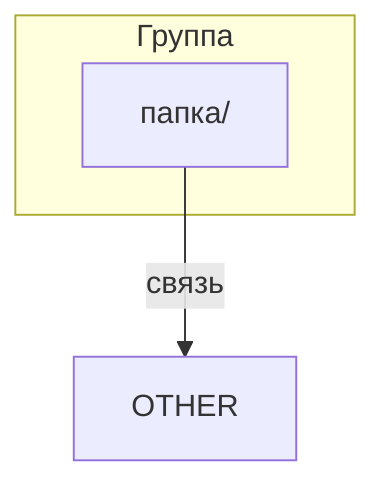

# Стандарт README

Версия стандарта: 1.1

Формат и шаблон для двух типов README: папок проекта и папок инструкций.

**Полезные ссылки:**
- [Инструкции для .structure](./README.md)
- [SSOT структуры проекта](../README.md)

**Связанные документы:**

| Тип | Документ |
|-----|----------|
| Стандарт | Этот документ |
| Валидация | [validation-structure.md](./validation-structure.md) |
| Создание | [create-structure.md](./create-structure.md) |
| Модификация | [modify-structure.md](./modify-structure.md) | 

## Оглавление

- [1. Определение типа README](#1-определение-типа-readme)
- [2. README папок проекта](#2-readme-папок-проекта)
  - [Раздел "Frontmatter"](#раздел-frontmatter)
  - [Раздел "Заголовок"](#раздел-заголовок)
  - [Раздел "Оглавление"](#раздел-оглавление)
  - [Раздел "Содержание"](#раздел-содержание)
  - [Раздел "Дерево"](#раздел-дерево)
  - [Раздел "Диаграмма"](#раздел-диаграмма)
- [3. README папок инструкций](#3-readme-папок-инструкций)
  - [Заголовок (инструкции)](#заголовок-инструкции)
  - [Оглавление (инструкции)](#оглавление-инструкции)
  - [Раздел "Вложенные области" (опционально)](#раздел-вложенные-области-опционально)
  - [Содержание (инструкции)](#содержание-инструкции)
- [4. Правила работы с контекстными ссылками](#4-правила-работы-с-контекстными-ссылками)
  - [Формат блока](#формат-блока)
  - [В README папок проекта](#в-readme-папок-проекта)
  - [В README папок инструкций](#в-readme-папок-инструкций)
  - [Правило формирования текста](#правило-формирования-текста)
- [5. Требования для обновления при изменении структуры](#5-требования-для-обновления-при-изменении-структуры)
- [6. Валидация](#6-валидация)
- [7. Граничные случаи](#7-граничные-случаи)
- [8. Примеры полных README](#8-примеры-полных-readme)
- [9. Связь с другими форматами документации](#9-связь-с-другими-форматами-документации)

---

> **Шаблоны — из примеров SSOT.** При создании файлов использовать шаблоны из секции "Примеры". Запрещено придумывать свой формат.

---

## 1. Определение типа README

Если путь к README содержит `.instructions/` — это README папки инструкций.
Всё остальное — README папки проекта.

---

## 2. README папок проекта

**README папки проекта** — описывает зону ответственности папки: что внутри, какие подпапки, за что отвечает.

**Структура каждого файла должна содержать разделы:**

1. Раздел "Frontmatter"
   - Секция "Frontmatter"
2. Раздел "Заголовок"
   - Секция "Заголовок"
   - Секция "Расширенное описание"
   - Секция "Полезные ссылки"
3. Раздел "Оглавление"
   - Секция "Оглавление"
4. Раздел "Содержание"
   - Секция "Папки"
     - Секция "Краткое описание"
     - Секция "Расширенное описание"
   - Секция "Файлы"
     - Секция "Краткое описание"
     - Секция "Расширенное описание"
5. Раздел "Дерево"
   - Секция "Дерево файлов"
   - Секция "Дерево папок"
6. Раздел "Диаграмма"
   - Секция "Диаграмма"

---

#### Раздел "Frontmatter"

**Назначение:** Метаданные документа в YAML-формате.

**SSOT:** [standard-frontmatter.md](./standard-frontmatter.md)

#### Раздел "Заголовок"

**Назначение:** Название папки и её зона ответственности в проекте.

**Секция "Заголовок":**
- формат: `# /{имя_папки}/ — {Назначение}`
- `{имя_папки}` — имя папки БЕЗ пути (для `.claude/` писать `.claude`, а не полный путь)
- `{Назначение}` — краткое описание роли папки (одно предложение без точки)

**Секция "Расширенное описание":**
- Содержит контекст папки: что она содержит, какие файлы, какие папки
- Если папка содержит файлы, то описания функционала этих файлов объединяются, обрабатываются, и выдаются как контекст

**Секция "Полезные ссылки":**
- содержит блок ссылок, с которыми может ознакомиться пользователь или LLM
- правила работы: [4. Правила работы с контекстными ссылками](#4-правила-работы-с-контекстными-ссылками)

#### Раздел "Оглавление"

**Назначение:** Навигация по секциям документа.

**Секция "Оглавление":**
- содержит ссылки на секции раздела "Содержание"
- **структура двухуровневая:** секции верхнего уровня + вложенные элементы
- вложенные элементы — папки/файлы первого уровня вложенности текущей папки (отступ 2 пробела)
- НЕ включает подпапки этих папок — они документируются в соответствующих README

> **Примечание:** Оглавление показывает только первый уровень вложенности, а Дерево показывает полную структуру.

```markdown
- [1. {Секция}](#1-секция)
  - [{элемент}](#элемент)
  - [{элемент}](#элемент)
- [2. {Секция}](#2-секция)
```

#### Раздел "Содержание"

**Назначение:** Описание содержимого папки: файлы и вложенные папки, находящиеся непосредственно в текущей папке (прямые потомки). Файлы и папки в подпапках НЕ описываются в этом разделе — они описываются в README соответствующих подпапок.

**Секция "Папки":**
- заголовок: `## 1. {имя}/`
- ссылка: `### 🔗 [{имя}/]({путь}/README.md)`
- вложенные секции:
  - **Секция "Краткое описание":** одно предложение, формат: `**{Описание}.**`
  - **Секция "Расширенное описание":** 1-2 предложения связного текста, описывающего назначение папки через её содержимое. Упомянуть основные подпапки и файлы (не обязательно все) в формате `имя/` и `имя.ext`. Выбрать те элементы, которые помогают понять назначение папки. Порядок упоминания: по значимости, а не алфавитный.

**Секция "Файлы":**
- заголовок: `## 2. {имя}`
- ссылка: `### 🔗 [{имя}]({путь})`
- вложенные секции:
  - **Секция "Краткое описание":** одно предложение, формат: `**{Описание}.**`
  - **Секция "Расширенное описание":** 1-2 предложения связного текста, описывающего назначение файла (что он делает) и его роль в контексте папки (как связан с другими элементами). Технические детали реализации не включаются.

#### Раздел "Дерево"

**Назначение:** Визуальное представление структуры папки.

**Правила:**
- Соблюдать алфавитный порядок
- Добавить комментарий с назначением (5-7 слов)
- Если есть подпапки — добавить полное дерево (включая вложенные уровни, если это критично для понимания структуры)
- Комментарии выровнены по столбцу
- Вложенные папки — отступ 2 пробела в комментарии
- TODO-папки: `# Стандарты (TODO)`

**Секция "Дерево файлов":**

```
/{папка}/
├── {файл1}            # Комментарий
└── {файл2}            # Комментарий
```

**Секция "Дерево папок":**

```
/{папка}/
├── {подпапка}/        # Комментарий
│   └── {вложенная}/   #   Комментарий (с отступом)
└── {подпапка2}/       # Комментарий
```

#### Раздел "Диаграмма"

**Назначение:** Визуальная схема связей между папками проекта.

**Применимость:** Диаграмма может создаваться для любого README, если это помогает понять структуру или зависимости. Рекомендуется для корневого `/.structure/README.md` и сложных папок с множеством зависимостей.

**Секция "Диаграмма":**
- формат: mermaid `graph TD`
- группировка папок по subgraph (Инфраструктура, Конфигурация, Код, Документация)
- стрелки показывают зависимости и потоки данных



**Плейсхолдеры:** замени `Группа`, `папка/`, `связь`, `NAME`, `OTHER` на реальные значения.

---

## 3. README папок инструкций

**README папки инструкций** — индекс инструкций для области: какие инструкции есть, оглавление каждой, связанные скиллы.

**Эталон:**
- [/.structure/.instructions/README.md](./README.md)

**Структура каждого файла должна содержать разделы:**

1. Раздел "Frontmatter"
   - Секция "Frontmatter"
2. Раздел "Заголовок"
   - Секция "Заголовок"
   - Секция "Полезные ссылки"
   - Секция "Содержание"
3. Раздел "Оглавление"
   - Секция "Таблица"
   - Секция "Дерево"
4. Раздел "Вложенные области" (опционально)
   - Секция "Вложенные области"
5. Раздел "Содержание" (5 обязательных секций — присутствуют всегда, даже если пустые)
   - Секция "1. Стандарты"
   - Секция "2. Воркфлоу"
   - Секция "3. Валидация"
   - Секция "4. Скрипты"
   - Секция "5. Скиллы"

---

#### Раздел "Frontmatter"

**Назначение:** Метаданные документа в YAML-формате.

**SSOT:** [standard-frontmatter.md](./standard-frontmatter.md)

---

#### Заголовок (инструкции)

**Назначение:** Название и краткое описание папки инструкций.

**Секция "Заголовок":**
- формат: `# Инструкции /{путь}/`
- под заголовком: одно предложение-описание (обязательное). Если описание отсутствует — использовать description из frontmatter. Если описание длиннее одного предложения — сократить до ключевой мысли.

**Секция "Полезные ссылки":**
- цепочка до родительского README
- правила: [4. Правила работы с контекстными ссылками](#4-правила-работы-с-контекстными-ссылками) (раздел "В README папок инструкций")

**Секция "Содержание":**
- темы инструкций — ключевые объекты, описываемые в инструкциях (README, структура, ссылки)
- формат: `**Содержание:** {объект1}, {объект2}, {объект3}.`
- пример: `**Содержание:** README, структура проекта, валидация ссылок.`

#### Оглавление (инструкции)

**Назначение:** Навигация по инструкциям и ресурсам.

**Секция "Таблица":**

Фиксированная структура из 5 секций:

```markdown
| Секция | Инструкция | Описание |
|--------|------------|----------|
| [1. Стандарты](#1-стандарты) | — | Форматы и правила |
| [2. Воркфлоу](#2-воркфлоу) | — | Создание и изменение |
| [3. Валидация](#3-валидация) | — | Проверка согласованности |
| [4. Скрипты](#4-скрипты) | — | Автоматизация |
| [5. Скиллы](#5-скиллы) | — | Скиллы для этой области |
```

**Секция "Дерево":**
- ASCII-дерево файлов папки инструкций
- комментарии к каждому файлу — краткое назначение (5-7 слов). Комментарии дублируют или сокращают краткие описания из секций 1-5. Формат: `file.md  # {назначение}`

#### Раздел "Вложенные области" (опционально)

**Назначение:** Описание подпапок инструкций.

**Условие:** Присутствует если в папке `.instructions/` есть подпапки (кроме `.scripts/`).

**Расположение:** После оглавления, ПЕРЕД секцией "1. Стандарты".

**Формат:**

```markdown
## Вложенные области

Инструкции разделены на подобласти:

| Область | Описание | Индекс |
|---------|----------|--------|
| [{папка}/](./{папка}/) | {Описание} | [README](./{папка}/README.md) |
```

**Правила:**
- Таблица содержит все прямые подпапки (первый уровень) внутри `.instructions/`, кроме `.scripts/`. Подпапки внутри подпапок НЕ включаются — они документируются в README соответствующих подпапок.
- Описание — краткое (одно предложение)
- Ссылка на README подпапки

**Если в корне `.instructions/` нет файлов инструкций (все инструкции находятся в подпапках):**

```markdown
# 1. Стандарты

*Нет стандартов в корне — см. вложенные области.*
```

---

#### Содержание (инструкции)

**Назначение:** 5 фиксированных секций для документации области.

**Принцип 4 типов документации:**
- [standard-instruction.md § 1](/.instructions/standard-instruction.md#1-четыре-типа-инструкций)

| Тип | Префикс | Вопрос |
|-----|---------|--------|
| Стандарт | `standard-` | Что это? Как должно выглядеть? |
| Валидация | `validation-` | Как проверить? |
| Создание | `create-` | Как создать? |
| Модификация | `modify-` | Как изменить/удалить? |

---

**Секция "1. Стандарты":**
- документы с префиксом `standard-`
- описывают форматы и правила

```markdown
# 1. Стандарты

## 1.1. Стандарт {объекта}

{Описание — одно предложение.}

**Оглавление:**
- [{Раздел}](./standard-{object}.md#раздел)

**Инструкция:** [standard-{object}.md](./standard-{object}.md)
```

Если стандартов нет:
```markdown
# 1. Стандарты

*Нет стандартов.*
```

---

**Секция "2. Воркфлоу":**
- документы с префиксами `create-` и `modify-`
- описывают процессы создания и изменения

```markdown
# 2. Воркфлоу

## 2.1. Создание {объекта}

{Описание — одно предложение.}

**Оглавление:**
- [{Раздел}](./create-{object}.md#раздел)

**Инструкция:** [create-{object}.md](./create-{object}.md)

## 2.2. Изменение {объекта}

{Описание — одно предложение.}

**Инструкция:** [modify-{object}.md](./modify-{object}.md)
```

Если воркфлоу нет:
```markdown
# 2. Воркфлоу

*Нет воркфлоу.*
```

---

**Секция "3. Валидация":**
- документы с префиксом `validation-`
- описывают проверки

```markdown
# 3. Валидация

## 3.1. Валидация {объекта}

{Описание — одно предложение.}

**Оглавление:**
- [{Раздел}](./validation-{object}.md#раздел)

**Инструкция:** [validation-{object}.md](./validation-{object}.md)
```

Если валидаций нет:
```markdown
# 3. Валидация

*Нет валидаций.*
```

---

**Секция "4. Скрипты":**
- таблица `| Скрипт | Назначение | Инструкция |`

```markdown
# 4. Скрипты

| Скрипт | Назначение | Инструкция |
|--------|------------|------------|
| [{script}.py](./.scripts/{script}.py) | {описание} | [{инструкция}.md](./{инструкция}.md) |
```

Если скриптов нет:
```markdown
# 4. Скрипты

*Нет скриптов.*
```

---

**Секция "5. Скиллы":**
- таблица `| Скилл | Назначение | Инструкция |`

```markdown
# 5. Скиллы

| Скилл | Назначение | Инструкция |
|-------|------------|------------|
| [/{skill}](/.claude/skills/{skill}/SKILL.md) | {описание} | [{инструкция}.md](./{инструкция}.md) |
```

Если скиллов нет:
```markdown
# 5. Скиллы

*Нет скиллов.*
```

---

## 4. Правила работы с контекстными ссылками

Блок "Полезные ссылки" в шапке документов для навигации по иерархии.

### Формат блока

```markdown
**Полезные ссылки:**
- [{текст}]({ссылка})
- [{текст}]({ссылка})
```

**Правило:** каждая ссылка на отдельной строке, маркированный список.

### В README папок проекта

Цепочка ссылок до структуры проекта.

| Уровень | Цепочка ссылок |
|---------|----------------|
| 1 (корневой) | → `/.structure/README.md` |
| 2 | → `../README.md` → `/.structure/README.md` |
| 3+ | → `../README.md` → `../../README.md` → ... → `/.structure/README.md` |

**Примеры:**

```markdown
<!-- Уровень 1: /config/ -->
**Полезные ссылки:**
- [Структура проекта](/.structure/README.md)

<!-- Уровень 2: /.claude/skills/ -->
**Полезные ссылки:**
- [Claude Code окружение](../README.md)
- [Структура проекта](/.structure/README.md)

<!-- Уровень 3: /.claude/skills/spec-create/ -->
**Полезные ссылки:**
- [Скиллы Claude](../README.md)
- [Claude Code окружение](../../README.md)
- [Структура проекта](/.structure/README.md)
```

### В README папок инструкций

Цепочка до README родительской папки (не до структуры проекта).

| Уровень | Тип файла | Ссылки |
|---------|-----------|--------|
| 1 | README инструкций | → `../README.md` |
| 2 | Файл инструкции | → `./README.md` → `../README.md` |
| 2 | README подпапки | → `../README.md` → `../../README.md` |
| 3 | Файл в подпапке | → `./README.md` → `../README.md` → `../../README.md` |

**Примеры:**

```markdown
<!-- README инструкций: /.structure/.instructions/README.md -->
**Полезные ссылки:**
- [Структура проекта](../README.md)

<!-- Файл инструкции: /.structure/.instructions/standard-readme.md -->
**Полезные ссылки:**
- [Инструкции для .structure](./README.md)
- [Структура проекта](../README.md)

<!-- Файл в подпапке: /.structure/.instructions/.scripts/validate-structure.py -->
**Полезные ссылки:**
- [Инструкции для .structure](../README.md)
- [Структура проекта](../../README.md)
```

### Правило формирования текста

Текст ссылки описывает контекст документа, на который она ведёт.

| Позиция | Принцип | Пример |
|---------|---------|--------|
| Первая | Контекст родителя | `Claude Code окружение`, `Скиллы Claude` |
| Промежуточные | Контекст предка | `Инфраструктура платформы` |
| Последняя | Фиксированный | `Структура проекта` |

**Принцип:** текст ссылки = краткое описание того, что найдёт читатель.

---

## 5. Требования для обновления при изменении структуры

При создании или изменении папок/файлов необходимо обновить связанные документы.

### 5.1. Обновление SSOT структуры

> **ПРАВИЛО:** ВСЕ папки добавляются в SSOT, включая подпапки. Используйте полный путь (например, `test/subtest`).

| Действие | Что обновить в `/.structure/README.md` |
|----------|----------------------------------------|
| Создание папки | Добавить секцию, оглавление, дерево (с учётом вложенности) |
| Удаление папки | Удалить секцию, оглавление, дерево |
| Переименование | Обновить секцию, оглавление, дерево |
| Перемещение | Удалить старый путь, добавить новый |

### 5.2. Обновление README родительской папки

> **ПРАВИЛО:** При добавлении папки или файла — обновить README родительской папки.

| Действие | Что обновить в README родителя |
|----------|--------------------------------|
| Создание подпапки | Секция "Папки" — добавить описание, Дерево — добавить ветку |
| Создание файла | Секция "Файлы" — добавить описание, Дерево — добавить запись |
| Удаление подпапки | Секция "Папки" — удалить описание, Дерево — удалить ветку |
| Удаление файла | Секция "Файлы" — удалить описание, Дерево — удалить запись |
| Переименование | Обновить ссылки и названия в секциях и дереве |

### 5.3. Обновление ссылок

| Действие | Что обновить |
|----------|--------------|
| Переименование | Все ссылки на старое имя в markdown-файлах |
| Перемещение | Все ссылки на старый путь, цепочки "Полезные ссылки" |

**Связанные документы:**
- [create-structure.md](./create-structure.md) — воркфлоу создания
- [modify-structure.md](./modify-structure.md) — воркфлоу изменения

> **Примечание:** Скрипты `ssot.py` и `mirror-instructions.py` НЕ обновляют автоматически блок "Полезные ссылки". При перемещении/переименовании папки — обновить цепочки вручную согласно [4. Правила работы с контекстными ссылками](#4-правила-работы-с-контекстными-ссылками).

---

## 6. Валидация

После создания или изменения README выполнить валидацию:

```bash
/structure-validate
# или
python .structure/.instructions/.scripts/validate-structure.py
```

---

## 7. Граничные случаи

| Ситуация | Действие |
|----------|----------|
| Папка содержит >30 файлов | Группировать файлы по категориям в дереве, не перечислять все в секции "Файлы" |
| Имя папки со спецсимволами | Экранировать в markdown: `\@папка\@/` |
| README уже существует | Прочитать, извлечь описания, обновить структуру по стандарту |

---

## 8. Примеры полных README

### README корневой папки проекта

Полный пример: [/.claude/README.md](/.claude/README.md)

### README папки инструкций

Полный пример: [/.structure/.instructions/README.md](/.structure/.instructions/README.md)

---

## 9. Связь с другими форматами документации

README папки — SSOT для структуры, но НЕ для детальной документации кода.

| Формат | Когда использовать | Как связать с README |
|--------|-------------------|---------------------|
| JSDoc/TypeDoc | Документация API кода | Ссылка в секции "Файлы": `Документация: [TSDoc](./docs/)` |
| Swagger/OpenAPI | REST API эндпоинты | Ссылка в README: `API спецификация: [OpenAPI](./api.yaml)` |
| Changelog | История изменений | Ссылка в корневом README: [CHANGELOG.md](/CHANGELOG.md) |

**Принцип:** README описывает структуру и назначение. Детали реализации — в специализированной документации.
