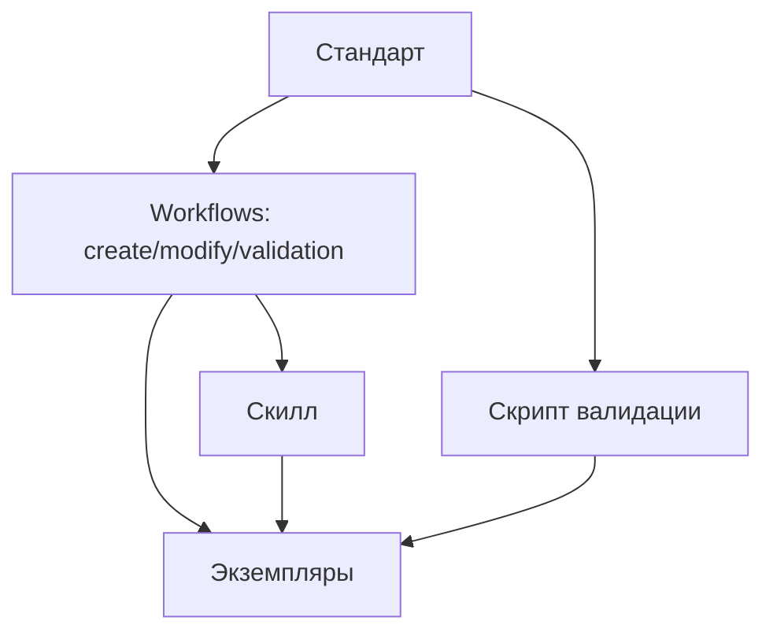

# Quick Start для Claude

Минимальный контекст для начала работы.

## 1. SSOT — единый источник истины

**SSOT (Single Source of Truth)** — принцип, при котором каждый тип артефакта имеет один авторитетный документ (стандарт), определяющий его структуру и правила.

**Правило:** Если видишь `**SSOT:** [файл](путь)` — **ОБЯЗАТЕЛЬНО** прочитай перед выполнением. Нельзя работать по памяти или предположениям.

### Иерархия документов

```
Стандарт (standard-*.md)
    ↓
Workflows (create-*, modify-*, validation-*)
    ↓
Экземпляры (конкретные инструкции, скиллы, rules)
```

| Уровень | Описание | Пример |
|---------|----------|--------|
| Стандарт | Определяет структуру и правила | `standard-instruction.md` |
| Workflows | Процедуры работы со стандартом | `create-instruction.md`, `validation-instruction.md` |
| Экземпляры | Конкретные экземпляры | `/.instructions/backend/api-design.md` |

### Версионирование

Каждый стандарт имеет версию в frontmatter:

```yaml
---
standard-version: v1.2
---
```

При изменении стандарта — **ОБЯЗАТЕЛЬНА** миграция через `/migration-create` (9 шагов).

### Исключения (без SSOT)

Черновики, `/CLAUDE.md`, `/README.md`, `/CONTRIBUTING.md`.

## 2. Артефакты системы

**Артефакт** — файл с определённой структурой, подчиняющийся стандарту.

### Иерархия артефактов

```
┌─────────────────────────────────────────────────────────┐
│                    Структура                            │
│                    (README)                             │
├─────────────────────────────────────────────────────────┤
│     Автономность          │        Контекст            │
│     (Агенты)              │        (Rules)             │
├───────────────────────────┴────────────────────────────┤
│                   Автоматизация                         │
│                    (Скиллы)                             │
├─────────────────────────────────────────────────────────┤
│        Базовый слой: Инструкции + Скрипты              │
├─────────────────────────────────────────────────────────┤
│                   Временные                             │
│                  (Черновики)                            │
└─────────────────────────────────────────────────────────┘
```

### Таблица артефактов

| Артефакт | SSOT (стандарт) | Расположение экземпляров | Скиллы |
|----------|-----------------|--------------------------|--------|
| Инструкция | `/.instructions/standard-instruction.md` | `/.instructions/**/*.md` | `/instruction-*` |
| Скрипт | `/.instructions/standard-script.md` | `**/.scripts/*.py` | `/script-*` |
| Скилл | `/.claude/.instructions/skills/standard-skill.md` | `/.claude/skills/*/SKILL.md` | `/skill-*` |
| Rule | `/.claude/.instructions/rules/standard-rule.md` | `/.claude/rules/*.md` | `/rule-*` |
| Агент | `/.claude/.instructions/agents/standard-agent.md` | `/.claude/agents/*/AGENT.md` | `/agent-*` |
| README | `/.structure/.instructions/standard-readme.md` | `**/README.md` | `/structure-*` |
| Черновик | `/.claude/.instructions/drafts/standard-draft.md` | `/.claude/drafts/*.md` | `/draft-*` |

### Связи между артефактами



## 3. Скиллы вместо команд

| Действие | ЗАПРЕЩЕНО | ОБЯЗАТЕЛЬНО |
|----------|-----------|-------------|
| Создать папку | `mkdir`, Write README | `/structure-create` |
| Изменить папку | `rm -rf`, Edit README | `/structure-modify` |
| Создать инструкцию | Write вручную | `/instruction-create` |
| Создать скилл | Write вручную | `/skill-create` |
| Изменить стандарт | Edit напрямую | `/migration-create` |

## 4. Инициализация

| Команда | Когда |
|---------|-------|
| `make setup` | Минимум — pre-commit хуки |
| `make init` | Автоматизация — setup + labels + verify |
| `/init-project` | Полная настройка с Claude (интерактивно) |
| `/init-project --check` | Healthcheck — проверка без изменений |

## 5. Процесс поставки ценности

**Изменение поведения системы → `/chain`**, баги и хотфиксы → `/hotfix`** — оркестратор создаёт TaskList с полной последовательностью.

SSOT процесса: [standard-process.md](/specs/.instructions/standard-process.md)

Описывает пути: Happy Path (15 задач TaskList), CONFLICT (обратная связь код → спецификации), альтернативные маршруты (Rollback, Cross-chain). Баги → `/hotfix`.

## Навигация

- **Процесс:** [/specs/.instructions/standard-process.md](/specs/.instructions/standard-process.md)
- **Структура проекта:** [/.structure/README.md](/.structure/README.md)
- **Скиллы:** [/.claude/skills/README.md](/.claude/skills/README.md)
- **Rules:** [/.claude/rules/](/.claude/rules/)
- **Агенты:** [/.claude/agents/README.md](/.claude/agents/README.md)
