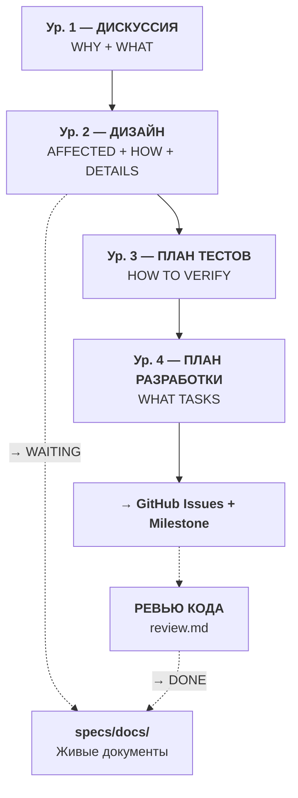
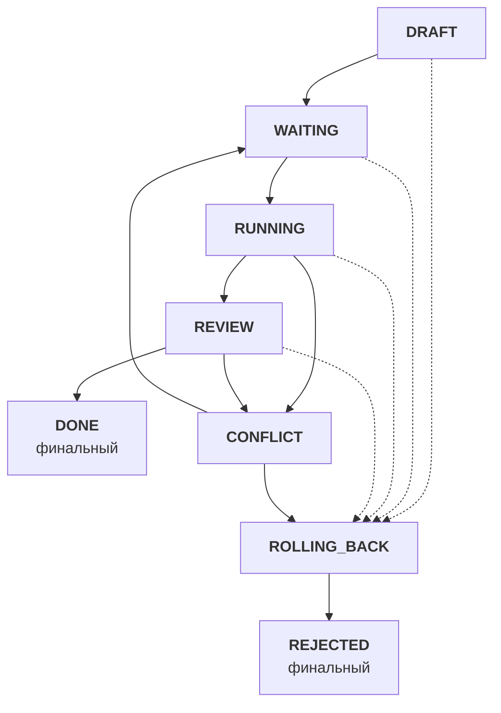
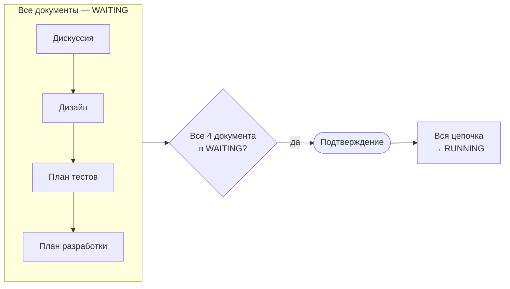
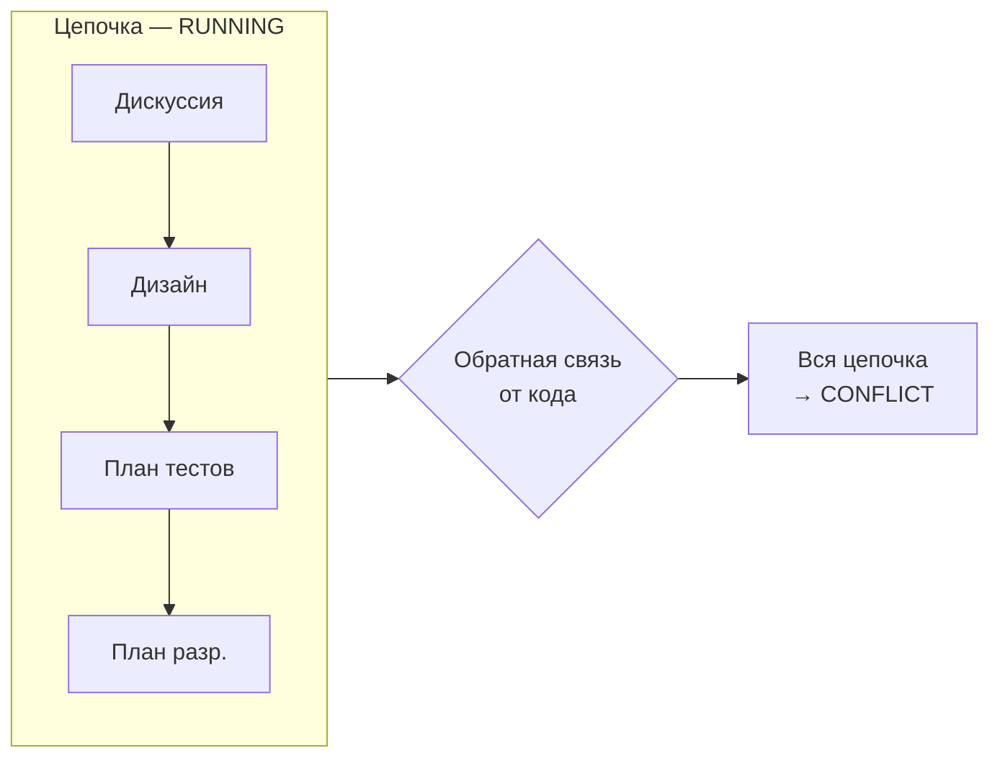
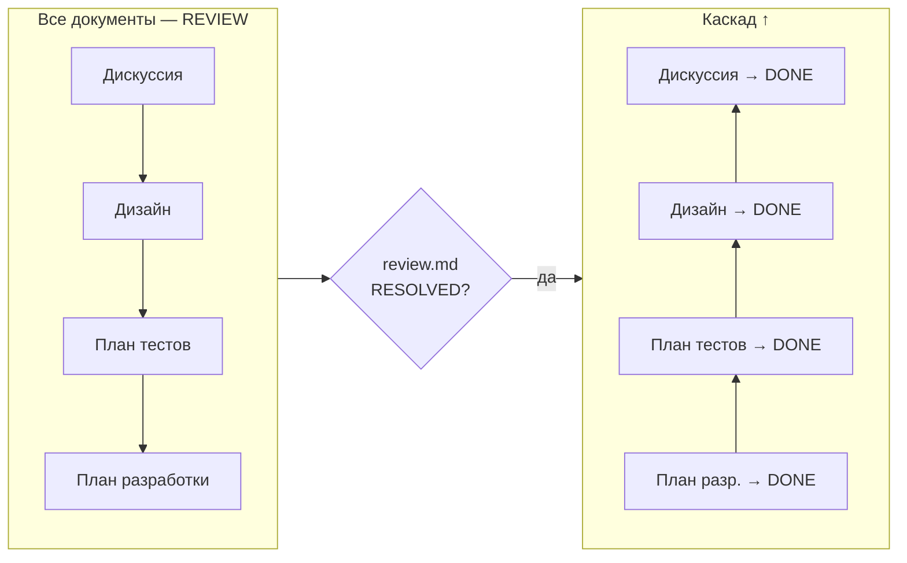
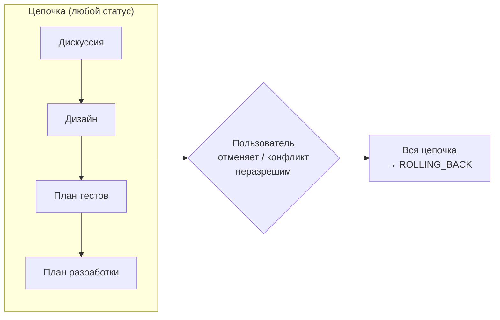

# Стандарт analysis/

Версия стандарта: 1.4

Полное описание аналитического контура Specification-Driven Development v2: философия двух контуров (analysis/ + specs/docs/), четыре уровня (Discussion → Design → Plan Tests → Plan Dev), 7-шаговый воркфлоу объекта, 8 статусов, каскады, правила обновления specs/docs/ при переходах, Clarify-паттерн, именование, запреты. Все per-object стандарты ссылаются на этот документ как SSOT.

**Полезные ссылки:**
- [Инструкции specs/](../README.md)

**SSOT-зависимости:**
- [standard-issue.md](/.github/.instructions/issues/standard-issue.md) — управление Issues (§ 6 закрытие, § 8 зависимости)
- [standard-milestone.md](/.github/.instructions/milestones/standard-milestone.md) — Milestones (§ 9 связь)
- [standard-github-workflow.md](/.github/.instructions/standard-github-workflow.md) — общий workflow (стадия 1: Подготовка)

**Связанные документы:**

| Тип | Документ |
|-----|----------|
| Валидация | — (инструменты валидации — в стандартах объектов, § 11) |
| Создание | — (инструменты создания — в стандартах объектов, § 11) |
| Модификация | — (инструменты модификации — в стандартах объектов, § 11) |

## Оглавление

- [1. Философия](#1-философия)
  - [1.1 Два контура](#11-два-контура)
  - [1.2 Принципы](#12-принципы)
- [2. Четыре уровня](#2-четыре-уровня)
  - [2.1 Обзорная диаграмма](#21-обзорная-диаграмма)
  - [2.2 Таблица объектов](#22-таблица-объектов)
  - [2.3 Design v2: объединённый уровень](#23-design-v2-объединённый-уровень)
  - [2.4 Общий паттерн объекта](#24-общий-паттерн-объекта)
  - [2.5 Расширяемость](#25-расширяемость)
- [3. Связи между объектами](#3-связи-между-объектами)
  - [3.1 Frontmatter и навигация](#31-frontmatter-и-навигация)
  - [3.2 Unified Scan (Design)](#32-unified-scan-design)
  - [3.3 Фильтрация Design → Plan Tests](#33-фильтрация-design-plan-tests)
  - [3.4 Shared код (/shared/)](#34-shared-код-shared)
  - [3.5 Upward feedback](#35-upward-feedback)
- [4. Воркфлоу](#4-воркфлоу)
  - [4.1 Прямой поток](#41-прямой-поток)
  - [4.2 Границы analysis/ ↔ specs/docs/ ↔ проект](#42-границы-analysis-docs-проект)
  - [4.3 Возобновление работы](#43-возобновление-работы)
- [5. Статусы](#5-статусы)
- [6. Последовательность статусов](#6-последовательность-статусов)
  - [6.1 DRAFT to WAITING](#61-draft-to-waiting)
  - [6.2 WAITING to RUNNING](#62-waiting-to-running)
  - [6.3 RUNNING to CONFLICT](#63-running-to-conflict)
  - [6.4 CONFLICT to WAITING](#64-conflict-to-waiting)
  - [6.5 RUNNING to REVIEW](#65-running-to-review)
  - [6.6 REVIEW to DONE](#66-review-to-done)
  - [6.7 to ROLLING_BACK](#67-to-rolling_back)
  - [6.8 ROLLING_BACK to REJECTED](#68-rolling_back-to-rejected)
- [7. Обновление specs/docs/ при переходах](#7-обновление-docs-при-переходах)
  - [7.1 Обновление при планировании (/docs-sync)](#71-обновление-при-планировании-docs-sync)
  - [7.2 Конфликт исполнения (CONFLICT)](#72-конфликт-исполнения-conflict)
  - [7.3 Обновление при реализации (to DONE)](#73-обновление-при-реализации-to-done)
  - [7.4 Параллельные цепочки](#74-параллельные-цепочки)
  - [7.5 Обновление при откате (ROLLING_BACK → REJECTED)](#75-обновление-при-откате-rolling_back-rejected)
- [8. Clarify и блокирующие правила](#8-clarify-и-блокирующие-правила)
  - [8.1 Clarify на каждом уровне](#81-clarify-на-каждом-уровне)
  - [8.2 Маркер ТРЕБУЕТ УТОЧНЕНИЯ](#82-маркер-требует-уточнения)
  - [8.3 Dependency Barrier](#83-dependency-barrier)
- [9. Именование и расположение](#9-именование-и-расположение)
- [10. Запреты](#10-запреты)
- [11. Стандарты объектов](#11-стандарты-объектов)
- [12. Решения](#12-решения)

---

## 1. Философия

### 1.1 Два контура

SDD v2 разделяет спецификации на два контура:

| Контур | Путь | Назначение | Аудитория |
|--------|------|------------|-----------|
| **analysis/** | `specs/analysis/` | Процесс: обсуждение, проектирование, планирование | LLM + пользователь (авторы) |
| **docs/** | `specs/docs/` | Результат: живое описание системы AS IS + Planned Changes | Разработчик (читатель) |

**analysis/** — строительные леса. Группирует документы по изменению (цепочке). После завершения (DONE) остаётся как история решений — WHY за результатом в specs/docs/.

**specs/docs/** — доставочный формат. Разработчик читает только specs/docs/ для понимания системы. Документы specs/docs/ обновляются при переходах статусов в analysis/ ([§ 7](#7-обновление-docs-при-переходах)).

**Терминология:** **Тип** — один из 4 типов: Discussion, Design, Plan Tests, Plan Dev. **Документ** — конкретный файл-экземпляр типа (например, `0001-oauth2/design.md`). **Цепочка** — набор из 4 документов в одной папке `analysis/NNNN-{topic}/`.

**Разделение зон ответственности:**
- analysis/ **читает** specs/docs/ (при Scan) и **пишет в** specs/docs/ (при переходах статусов)
- specs/docs/ **не ссылается** на analysis/ — ни одна секция specs/docs/ не содержит прямых ссылок на analysis/

### 1.2 Принципы

**Спецификация первична, код вторичен.** Спецификации — SSOT проекта. Код — выражение спецификаций на конкретном языке. Обслуживание проекта = эволюция спецификаций. Пользователь описывает намерение, LLM собирает остальное.

**LLM не угадывает — уточняет.** На каждом уровне иерархии LLM задаёт уточняющие вопросы (Clarify) через AskUserQuestion, пока все неясности не закрыты. Если что-то осталось неясным — ставится блокирующий маркер `[ТРЕБУЕТ УТОЧНЕНИЯ]`.

**Тесты первичны, реализация вторична (ATDD).** Тестовые сценарии определяются **до** формирования плана реализации. Разработчик (или LLM) знает, что именно нужно покрыть тестами, ещё до написания первой строки кода. Acceptance Test-Driven Development на уровне спецификаций.

**Инструкции распределены по объектам.** Нет единого файла "конституции". Принципы и правила живут в `.instructions/` каждого объекта — загружаются только при работе с ним. Шаблоны встроены в `standard-*.md`.

---

## 2. Четыре уровня

### 2.1 Обзорная диаграмма



### 2.2 Таблица объектов

Поток: Дискуссия → Дизайн → План тестов → План разработки → GitHub Issues → Разработка. (→ [standard-github-workflow.md](/.github/.instructions/standard-github-workflow.md) § 3)

| Объект | Файл | Вопрос | Содержит | НЕ содержит | SSOT |
|--------|------|--------|----------|-------------|------|
| **Дискуссия** | `discussion.md` | Что нужно? Какие требования? | Проблему, требования, user stories, варианты, критерии | Технические детали, затронутые сервисы | [standard-discussion.md](discussion/standard-discussion.md) |
| **Дизайн** | `design.md` | Какие сервисы затронуты? Как распределить ответственности? Какие решения по реализации? | Scan docs/, SVC-N секции (9 подсекций: §§ 1-8 зеркало {svc}.md + решения по реализации), INT-N блоки взаимодействия, STS-N системные тест-сценарии | Тестовые сценарии, задачи на реализацию | [standard-design.md](design/standard-design.md) |
| **План тестов** | `plan-test.md` | Как проверяем решение? | Per-service разделы: тестовые сценарии (e2e, integration, unit), acceptance criteria → тесты, тестовые данные. Два агента (plantest-agent + plantest-reviewer), один документ | Реализацию тестов, задачи | [standard-plan-test.md](plan-test/standard-plan-test.md) |
| **План разработки** | `plan-dev.md` | Какие задачи? | Per-service разделы: задачи, сложность, зависимости, ссылки на планы тестов. Два агента (plandev-agent + plandev-reviewer), один документ | Бизнес-обоснование, архитектуру | [standard-plan-dev.md](plan-dev/standard-plan-dev.md) |
| **Ревью** | `review.md` | *артефакт статуса REVIEW* | Формализованный результат ревью кода: замечания RV-N, приоритеты P1/P2/P3, вердикт, история итераций. Шаблон при WAITING, итерации при REVIEW | Нет (не уровень chain) | [standard-review.md](review/standard-review.md) |

### 2.3 Design v2: объединённый уровень

Design в новой модели объединяет три бывших уровня: Impact, Design, ADR. Внутри Design выделяются логические фазы:

| Фаза внутри Design | Бывший уровень | Что делает |
|--------------------|---------------|------------|
| **Scan** | Impact (Quick Scan) + Design (Deep Scan) | Читает specs/docs/: README, overview, {svc}.md, .technologies/. Unified Scan из 5 источников: Discussion + `specs/docs/README.md` + `specs/docs/.system/overview.md` + `specs/docs/{svc}.md` + `specs/docs/.technologies/` |
| **Decide** | Design | Распределяет ответственности между сервисами. Формирует SVC-N секции |
| **Detail** | ADR | Per-service реализационные решения: алгоритмы, библиотеки, конфигурации. Расширенные подсекции в каждом SVC-N |
| **Contract** | Design (INT-N) | Межсервисные контракты API, sequences |
| **Test Scenarios** | Design (STS-N) | Системные тест-сценарии |

**Структура Design-документа:**

```markdown
# design: {Тема}

## Резюме
## SVC-N: {Сервис}
### 1. Назначение              ← delta к specs/docs/{svc}.md § 1
### 2. API контракты           ← delta к specs/docs/{svc}.md § 2  (ADDED/MODIFIED/REMOVED)
### 3. Data Model              ← delta к specs/docs/{svc}.md § 3  (ADDED/MODIFIED/REMOVED)
### 4. Потоки                  ← delta к specs/docs/{svc}.md § 4  (новые/изменённые сценарии)
### 5. Code Map                ← delta к specs/docs/{svc}.md § 5  (пакеты, точки входа)
### 6. Зависимости             ← delta к specs/docs/{svc}.md § 6
### 7. Доменная модель         ← delta к specs/docs/{svc}.md § 7  (ADDED/MODIFIED/REMOVED)
### 8. Границы автономии LLM   ← delta к specs/docs/{svc}.md § 8  (Свободно/Флаг/CONFLICT)
### 9. Решения по реализации   ← Design-only (WHY, trade-offs, алгоритмы)
## INT-N: {Взаимодействие}
### Контракт
### Sequence
## Системные тест-сценарии
```

**Маппинг SVC-N → {svc}.md:** Подсекции §§ 1-8 в SVC-N имеют **идентичные названия** с секциями §§ 1-8 в `docs/{svc}.md`. При Design → DONE содержимое каждой подсекции K пишется в соответствующую секцию K `docs/{svc}.md` (1:1). Подсекция § 9 «Решения по реализации» — Design-only (WHY-контекст, trade-offs, выбор алгоритмов), не пишется в {svc}.md, остаётся в design.md как архивная запись. Секции §§ 9-10 из {svc}.md (Planned Changes, Changelog) НЕ включаются в SVC-N — они процессные и заполняются автоматически при переходах статусов.

**Unified Scan** — Design и предлагает, и решает (роли Предлагатель/Решатель объединены). Одна фаза вместо двух отдельных документов.

**Два агента, один документ:** Design генерируется двумя агентами последовательно:
- **design-agent-first:** Unified Scan → Clarify → Резюме + Выбор технологий (7 критериев) → user confirm
- **design-agent-second:** SVC-N (9 подсекций) + INT-N + STS-N на основе выбранного стека
Оба агента пишут в один `design.md`. DRAFT → WAITING после завершения обоих + обработки PROP.

### 2.4 Общий паттерн объекта

Каждый объект проходит одинаковый цикл из 7 шагов. Детали каждого шага — в `create-*.md` конкретного уровня.

| Шаг | Название | Что происходит |
|-----|----------|----------------|
| 1 | **PREPARE** | Определить тип объекта, создать файл из шаблона (`standard-*.md` → § Шаблон), заполнить frontmatter (status: DRAFT). Файл создаётся **до** Clarify — обеспечивает resumability при прерывании |
| 2 | **CLARIFY** | LLM читает входные данные (parent-документ, specs/docs/ и т.д.), формулирует выводы и предлагает их пользователю через AskUserQuestion. Пользователь подтверждает или корректирует. При `--auto-clarify` — LLM пропускает вопросы, ставит маркеры `[ТРЕБУЕТ УТОЧНЕНИЯ]` |
| 3 | **GENERATE** | Заполнить все разделы по шаблону. Разрешить маркеры через AskUserQuestion (итеративно, пока маркеров = 0). Сгенерировать предложения PROP-N, проработать каждое с пользователем (принять/отклонить). Зарегистрировать документ в README папки. При Dependency Barrier — остановить генерацию, разрешить блокирующий маркер, продолжить. **Для Design:** GENERATE делегируется design-agent-first + design-agent-second. **Для Plan Tests:** GENERATE делегируется plantest-agent (генерация) + plantest-reviewer (проверка). Оркестратор вызывает агентов через Task tool последовательно |
| 4 | **VALIDATE** | Запустить скрипт `validate-*.py` (если доступен) или пройти чек-лист из `standard-*.md`. Проверки: обязательные секции, маркеры, Dependency Barrier, зона ответственности, frontmatter, нумерация |
| 5 | **AGENT REVIEW** | Опционально. Специализированный агент проверяет документ на полноту, генерирует PROP-N → вернуться к GENERATE для проработки. Пользователь решает, запускать ли агента |
| 6 | **USER REVIEW** | Пользователь ревьюит документ. Одобрил → WAITING (шаг 7). Замечания → вернуться к CLARIFY. Отклонил → REJECTED |
| 7 | **REPORT** | Обновить статус в frontmatter (DRAFT → WAITING) и README. Вывести отчёт о выполнении |

Весь цикл происходит в статусе **DRAFT**. Только после одобрения на шаге 6 статус меняется на WAITING (шаг 7). Итераций может быть сколько угодно — пользователь возвращает документ на доработку через "замечания".

### 2.5 Расширяемость

Текущая иерархия — 4 уровня. Добавление нового типа объекта = новая папка + новый `standard-*.md` в `.instructions/analysis/`. Существующие связи parent→children не меняются.

**Пример расширения — review.md:** review.md — артефакт статуса REVIEW. Не является 5-м уровнем цепочки (нет parent→children связей в цепочке), но REVIEW — полноценный tree-level статус. Шаблон review.md создаётся при Plan Dev → WAITING (`/review-create`). Итерации заполняются при статусе REVIEW (`/review`). RESOLVED → DONE, P1 → CONFLICT.

---

## 3. Связи между объектами

### 3.1 Frontmatter и навигация

**SSOT frontmatter:** [standard-frontmatter.md](/.structure/.instructions/standard-frontmatter.md) ([§ 1 — базовые поля](/.structure/.instructions/standard-frontmatter.md#1-обязательные-поля) + [§ 4 — поля specs](/.structure/.instructions/standard-frontmatter.md#4-дополнительные-поля-для-спецификаций-specs))

Документы analysis/ используют стандарт frontmatter проекта — все обязательные поля и дополнительные поля:

| Поле | Тип | Обязательность | Описание |
|------|-----|----------------|----------|
| `parent` | строка (путь) | Обязательно (кроме Discussion) | Путь к родительскому документу |
| `children` | список путей | Обязательно (кроме plan-dev) | Пути к дочерним документам |
| `status` | строка | Обязательно | Текущий статус ([§ 5](#5-статусы)) |
| `milestone` | строка | Обязательно | Целевой Milestone (наследуется дочерними) |

```yaml
---
description: Design OAuth2 авторизации — распределение ответственностей, контракты API, решения по реализации.
standard: specs/.instructions/analysis/design/standard-design.md
standard-version: v1.0
index: specs/analysis/0001-oauth2-authorization/README.md
parent: specs/analysis/0001-oauth2-authorization/discussion.md
children:
  - specs/analysis/0001-oauth2-authorization/plan-test.md
status: WAITING
milestone: v1.2.0
---
```

**Milestone:** Определяется при Clarify на уровне Discussion и сохраняется в его frontmatter. Все дочерние документы наследуют milestone от Discussion. Один Milestone может содержать несколько цепочек (Discussions).

### 3.2 Unified Scan (Design)

Design выполняет Unified Scan — объединённый Quick Scan + Deep Scan из 5 источников:

| # | Источник | Что читается | Назначение |
|---|----------|-------------|------------|
| 1 | Discussion | Полный текст parent-документа | Требования, критерии |
| 2 | `specs/docs/README.md` | Список сервисов, технологии | Обзор ландшафта |
| 3 | `specs/docs/.system/overview.md` | Архитектура, data flows, Planned Changes | Текущее состояние + запланированные изменения |
| 4 | `specs/docs/{svc}.md` | API, Data Model, Code Map, зависимости | Детали затронутых сервисов |
| 5 | `specs/docs/.technologies/` | Per-tech стандарты кодирования | Технологические конвенции |

Design **предлагает и решает** (роли объединены): сканирует specs/docs/, выявляет затронутые сервисы, распределяет ответственности, детализирует решения по реализации.

**Правило чтения для Plan Tests:** Plan Tests читает:
1. **Design-документ** — SVC-N секции (ответственность, решения по реализации) + INT-N контракты + STS-N сценарии
2. **`specs/docs/.system/testing.md`** — текущая стратегия тестирования
3. **`specs/docs/{svc}.md`** — API контракты для формирования тест-сценариев

### 3.3 Фильтрация Design → Plan Tests

Plan Tests для каждого per-service раздела читает:
1. **SVC-N секцию** сервиса из Design (ответственность, компоненты, решения по реализации)
2. **INT-N блоки взаимодействия**, где участвует сервис — для интеграционных тестов
3. **STS-N системные тест-сценарии** из Design — для e2e тестов
4. **Требования из Дискуссии** (REQ-N) — acceptance criteria для маппинга в тесты
5. **`specs/docs/{svc}.md`** — текущее AS IS (для регрессионных тестов)

Plan Tests определяет **что тестировать** (сценарии, данные, ожидаемые результаты). **Как** реализовать тесты — задача Плана разработки.

### 3.4 Shared код (/shared/)

**Контекст:** Папка `/shared/` в кодовой базе содержит межсервисный код — контракты API (protobuf, OpenAPI), схемы событий, общие библиотеки. Этот код используется несколькими сервисами одновременно и не принадлежит ни одному конкретному сервису.

**Принцип:** `shared/` — **не сервис**. Папка `specs/docs/shared.md` **не создаётся**. Контент shared/ полностью описывается через существующие механизмы SDD: INT-N блоки взаимодействия в Design определяют контракты, SVC-N секции описывают создание и использование.

**Правила:**

1. **Владение изменением:** SVC-N секция сервиса-провайдера (кто создаёт/модифицирует контракт) включает дельту для файлов в shared/. SVC-N секции сервисов-потребителей указывают **внешнюю зависимость** от shared/, но не включают дельту для shared/ файлов — они не владеют этими файлами

2. **Зависимости в specs/docs/:** Каждый сервис указывает зависимости от shared/ в секции "Зависимости" своего `specs/docs/{svc}.md`

3. **Зависимости задач:** Задача "создать схему в shared/" (из Plan Dev провайдера) блокирует задачи "реализовать обработчик" (из Plan Dev потребителей). Зависимость через `**Зависит от:** #N` в GitHub Issues (→ [standard-issue.md](/.github/.instructions/issues/standard-issue.md) § 8)

4. **Обратная связь Code → Specs:** Изменение контракта в shared/ — это изменение INT-N блока взаимодействия → CONFLICT уровня Design, каскад на все per-service разделы

5. **Что НЕ попадает в shared/:** Код, используемый только одним сервисом. Даже если "может пригодиться другим" — пока используется одним, живёт внутри сервиса. Выносится в shared/ только при появлении второго потребителя

### 3.5 Upward feedback

При работе на уровне N может обнаружиться информация, затрагивающая уровень N-1 или выше. Обновление **обязательно**:

| Где обнаружили | Что обнаружили | Что обновить |
|----------------|----------------|--------------|
| **Дизайн** | Новые требования пользователя | → Дискуссия |
| **План тестов** | Новые ограничения | → Дизайн → проверить Дискуссию |
| **План разработки** | Новые зависимости или риски | → План тестов → проверить Дизайн → проверить Дискуссию |

**Критерий обнаружения:** При работе на уровне N, LLM проверяет каждый факт/вывод: попадает ли он в **зону ответственности** вышестоящего уровня ([§ 2.2](#22-таблица-объектов)) и **отсутствует** ли в документе этого уровня? Если оба условия выполнены — это upward feedback.

Ориентир — колонка **"Вопрос"** из таблицы объектов: если обнаруженная информация отвечает на вопрос вышестоящего уровня и этот ответ там не зафиксирован — дополнить.

**Правило каскада:** LLM **всегда** проверяет все уровни вверх до Discussion включительно, независимо от того, потребовалось ли обновление на промежуточных уровнях.

**Механика:** Если уровень N (DRAFT) обнаруживает информацию, затрагивающую вышестоящие уровни:

1. Работа с N **приостанавливается**
2. LLM обновляет N-1 (статус остаётся **WAITING** — без перевода в DRAFT)
3. LLM проверяет **все уровни вверх до Discussion** включительно
4. Пользователь подтверждает изменения
5. Работа с N **возобновляется** (с учётом обновлённых уровней)

Upward feedback происходит **во время проектирования** — это нормальная часть workflow. Обратный каскад Code → Specs ([§ 6.3](#63-running-to-conflict)) запускается **после начала разработки**.

---

## 4. Воркфлоу

### 4.1 Прямой поток

Каждый документ проходит путь DRAFT → WAITING на своём уровне, затем вся цепочка переходит в RUNNING одновременно.

1. Discussion: DRAFT → [итерации с пользователем] → WAITING
2. Design: DRAFT → [Unified Scan + итерации] → WAITING
3. Plan Tests (per-service разделы): DRAFT → [итерации] → WAITING
4. Plan Dev (per-service разделы): DRAFT → [итерации] → WAITING
5. **Docs Sync:** `/docs-sync` — агенты синхронизируют specs/docs/ с Design ([§ 7.1](#71-обновление-при-планировании-docs-sync)): per-service docs (service-agent), per-tech стандарты (technology-agent), overview.md (system-agent mode=sync). Маркер `docs-synced: true` в design.md

6. **Когда ВСЕ 4 документа цепочки в WAITING:**
   - Пользователь запускает `/dev-create {NNNN}` ([create-development.md](/.github/.instructions/development/create-development.md))
   - `/dev-create` создаёт GitHub Issues, Milestone, ветку
   - ВСЕ документы в цепочке переходят в RUNNING ([§ 6.2](#62-waiting-to-running))
   - Начинается разработка ([standard-development.md](/.github/.instructions/development/standard-development.md))

7. **Когда разработка завершена (все TASK-N готовы к ревью):**
   - ВСЕ документы цепочки переходят в REVIEW ([§ 6.5](#65-running-to-review))
   - `/review` запускает N+1 code-reviewer агентов → итерация в review.md
   - Вердикт READY → каскад DONE ([§ 6.6](#66-review-to-done))

### 4.2 Границы analysis/ ↔ specs/docs/ ↔ проект

```
analysis/                     │  specs/docs/                  │  Проект
                              │                               │
ЗАЧЕМ, ЧТО, КАК              │  КАК УСТРОЕНО (AS IS)         │  РЕАЛИЗАЦИЯ
                              │                               │
Discussion (требования)       │  .system/overview.md          │  src/ (код)
Design (проектирование)       │  .system/conventions.md       │  tests/ (тесты)
Plan Tests (тест-сценарии)    │  .system/infrastructure.md    │  .github/ (Issues, PR, CI)
Plan Dev (задачи)             │  .system/testing.md           │  config/ (конфигурации)
                              │  {svc}.md (per-service)       │  platform/ (инфра)
                              │  .technologies/standard-*.md  │
                              │                               │
───── процесс ────────────────│───── результат ───────────────│──── код ─────
                              │                               │
analysis/ говорит ЗАЧЕМ и КАК │  specs/docs/ говорит ЧТО ЕСТЬ │  Код делает
```

### 4.3 Возобновление работы

При обращении к существующей цепочке (после прерывания сессии) LLM:

1. Читает статусы цепочки через `ChainManager("NNNN").status()` — возвращает dict `{doc: status}` для всех 4 документов + review.md
2. Определяет текущее состояние цепочки (какой документ в DRAFT/WAITING/RUNNING)
3. Читает последний незавершённый документ полностью
4. Продолжает с шага, где остановился (PREPARE/CLARIFY/GENERATE/VALIDATE/REVIEW/REPORT)

---

## 5. Статусы

> **SSOT реализация:** [`chain_status.py`](../.scripts/chain_status.py) — модуль `ChainManager` кодифицирует всё описанное в §5-§7: матрицу переходов (`TRANSITION_MATRIX`), проверку prerequisites (`check_prerequisites()`), каскады, обновление README dashboard, cross-chain awareness (`check_cross_chain()`). **Запрещено** менять `status:` в frontmatter вручную — только через `ChainManager.transition()`.

8 статусов жизненного цикла. Статус хранится в frontmatter каждого документа, но большинство переходов — **tree-level** (все документы цепочки переходят одновременно):



| Статус | Скоуп | Значение |
|--------|-------|----------|
| **DRAFT** | per-document | Документ создаётся, итерируется, ревьюится пользователем |
| **WAITING** | per-document | Пользователь согласовал. Ожидает готовности всей цепочки |
| **RUNNING** | tree-level | Все уровни согласованы. Идёт реализация (код) |
| **REVIEW** | tree-level | Реализация завершена. Ожидает ревью кода — `/review` запускает code-reviewer агентов, формирует итерации в review.md |
| **DONE** | per-document | Реализация конкретного документа завершена, артефакты обновлены. Каскад снизу вверх (§ 6.6). **Финальный** — не переходит в другие статусы. Пересмотр реализованной фичи = новая Discussion (§ 9.8) |
| **CONFLICT** | tree-level | Обратная связь от кода — вся цепочка останавливается. Выход: top-down разрешение → WAITING → RUNNING |
| **ROLLING_BACK** | tree-level | Откат артефактов. Из любого статуса (кроме DONE) по команде пользователя, или из CONFLICT (неразрешим) |
| **REJECTED** | tree-level | Отклонён (финальный). Единственный путь: из ROLLING_BACK |

**Допустимые переходы** (кодифицированы в `TRANSITION_MATRIX` модуля `chain_status.py`):

| ID | Из | В | Скоуп | Условие | `check_prerequisites()` |
|----|----|----|-------|---------|------------------------|
| T1 | DRAFT | WAITING | per-document | Пользователь одобрил | `status==DRAFT`, маркеров=0, barriers=0 |
| T2 | WAITING | DRAFT | per-document + каскад | Parent вернулся в DRAFT | — (безусловный) |
| T3 | WAITING | RUNNING | tree-level | Все 4 в WAITING, подтверждение | Все 4 `status==WAITING`, маркеров=0 |
| T4 | RUNNING | CONFLICT | tree-level | Обратная связь от кода (§ 6.3) | — (безусловный) |
| T5 | CONFLICT | WAITING | per-document (top-down) | LLM исправил, пользователь одобрил | — (безусловный) |
| T6 | RUNNING | REVIEW | tree-level | Все TASK-N выполнены, подтверждение | Все чекбоксы `[x]` в plan-dev.md |
| T7 | REVIEW | DONE | per-document (bottom-up) | review.md RESOLVED (вердикт READY) | `review.md status==RESOLVED` |
| T8 | REVIEW | CONFLICT | tree-level | review.md P1 (вердикт CONFLICT) | — (безусловный) |
| T9 | любой¹ | ROLLING_BACK | tree-level | Пользователь отменяет / неразрешим | — (безусловный) |
| T10 | ROLLING_BACK | REJECTED | tree-level | Артефакты откачены | Все 4 `status==ROLLING_BACK` |

> ¹ Любой статус, кроме DONE и REJECTED (финальные).

---

## 6. Последовательность статусов

Жизненный цикл цепочки документов от создания до завершения. Разделы 6.1–6.6 — нормальный поток (включая разрешение конфликтов и ревью). Разделы 6.7–6.8 — откат и отклонение.

> **Автоматизация:** Все переходы — через `ChainManager.transition()`. Prerequisites, каскады, frontmatter, README dashboard — автоматически. API — § 11.

### 6.1 DRAFT to WAITING

Документы создаются **сверху вниз**: Discussion → Design → Plan Tests → Plan Dev. Каждый документ проходит цикл CLARIFY → GENERATE → VALIDATE → REVIEW в статусе DRAFT ([§ 2.4](#24-общий-паттерн-объекта)). Пользователь одобряет документ → **WAITING**.

Переход DRAFT → WAITING — **per-document**. Каждый документ переходит в WAITING независимо после одобрения пользователем.

**chain_status.py:** **T1** — `transition(to="WAITING", document="...")`. Возвращает `auto_propose` с предложением создать следующий документ.

### 6.2 WAITING to RUNNING

**Триггер:** LLM проверяет после каждого документа → WAITING. Когда все 4 документа цепочки в WAITING — LLM предлагает переход через AskUserQuestion: "Все спецификации готовы. Перейти в RUNNING?" Пользователь может подтвердить (→ RUNNING) или отложить (цепочка остаётся в WAITING).

**Воркфлоу перехода:** `/dev-create {NNNN}` ([standard-development.md § 0](/.github/.instructions/development/standard-development.md#0-запуск-разработки)).

**Переход:** Tree-level — при подтверждении **все** документы в цепочке (Discussion, Design, Plan Tests, Plan Dev) одновременно переходят в RUNNING. Спецификации согласованы и переходят в режим реализации: изменения возможны только через CONFLICT (§ 6.3).

**chain_status.py:** **T3** — `transition(to="RUNNING", document="discussion")`. Tree-level — переводит все 4 документа.



### 6.3 RUNNING to CONFLICT

При разработке (статус RUNNING) код может выявить несовместимость со спецификациями. "Код" включает результаты тестов — упавший тест является такой же обратной связью, как и обнаружение проблемы при написании кода. Проверку выполняет агент-разработчик непрерывно в процессе выполнения задач из Plan Dev.

**Уровни обратной связи**

Критерий масштаба — границы автономии из Code Map (`specs/docs/{svc}.md` → секция "Границы автономии LLM"):

| Граница в Code Map | Уровень | Действие |
|---|---|---|
| **Свободно** (реализация внутри пакета) | Спецификации не затронуты | Нет обратной связи |
| **Флаг** (контракты между пакетами) | План разработки / План тестов | Рабочие правки — LLM автономно обновляет документы, продолжает работу и выводит в чат краткое резюме. Статус не меняется |
| **CONFLICT** (API сервиса, data model, архитектура) | Дизайн или выше | → Вся цепочка → CONFLICT |

**Граница "рабочие правки" vs CONFLICT:** Рабочие правки — изменения, не затрагивающие ответственность сервиса (SVC-N), API контракт сервиса (INT-N) и data model: уточнение имён методов внутри пакета, изменение порядка задач, добавление задач по оптимизации. Если правка затрагивает SVC-N (секцию "Ответственность"), API контракт сервиса или data model — это Design и выше → CONFLICT.

**Источники обратной связи Code → Specs:** LLM-агент обнаруживает при написании кода, LLM-агент запускает тесты и получает падения, разработчик сообщает вручную. В любом случае — LLM инициирует переход CONFLICT и уведомляет пользователя через AskUserQuestion.

**Формализованный результат ревью кода** — файл `review.md`. P1-замечание в review.md автоматически инициирует CONFLICT цепочки. Агент code-reviewer записывает вердикт `CONFLICT` в review.md и уведомляет через AskUserQuestion.

**chain_status.py:** **T4** (из RUNNING) / **T8** (из REVIEW) — `transition(to="CONFLICT", document="discussion")`. Граница обратной связи — `classify_feedback(level)`: `"free"` → нет реакции, `"flag"` → допустимо при RUNNING, `"conflict"` → допустимо при RUNNING/REVIEW.

**Каскад CONFLICT**

При обнаружении проблемы CONFLICT-уровня **вся цепочка останавливается** — tree-level: **все** документы цепочки → CONFLICT. DONE-документы не затрагиваются каскадом CONFLICT (DONE — финальный статус, § 5.1).



**Обнаружение затронутого уровня**

LLM определяет **самый высокий затронутый документ** — снизу вверх, от Plan Dev до Discussion: "Содержание этого документа стало неверным?"

**Документ затронут**, если хотя бы одно его утверждение стало фактически неверным из-за изменений в коде (контракт API изменился, компонент удалён/добавлен, алгоритм заменён). **Документ НЕ затронут**, если его утверждения остаются верными (рефакторинг внутри пакета, оптимизация, изменение реализации без изменения контракта).

| Тип изменения | Документ затронут? |
|---------------|-------------------|
| Изменён алгоритм (bcrypt → argon2) в SVC-N "Решения по реализации" | Да — Design |
| Изменено имя метода внутри пакета (без смены API) | Нет |
| Изменена схема БД (добавлена колонка) | Да — Design (SVC-N data model) |
| Изменён retry-механизм без смены контракта | Нет |

LLM проверяет вверх до первого незатронутого уровня → **СТОП**. Самый высокий затронутый документ — точка начала разрешения (§ 6.4).

**Обнаружение — обязанность dev-agent:** Dev-agent ([AGENT.md](/.claude/agents/dev-agent/AGENT.md)) обязан после каждого коммита выполнить CONFLICT-CHECK: сопоставить внесённые изменения с `specs/docs/{svc}.md` → секция "Границы автономии LLM", классифицировать по таблице выше (Свободно / Флаг / CONFLICT). При обнаружении CONFLICT агент определяет **самый высокий затронутый документ** (снизу вверх) и возвращает в отчёте: `level` (design/plan-test/plan-dev), `affected_doc` (SVC-N/INT-N/TC-N), `description` (что стало неверным). Формат отчёта — в [modify-development.md](/.github/.instructions/development/modify-development.md).

**CONFLICT при параллельных агентах**

При блочной параллельной модели выполнения (несколько dev-agent на одной волне, [standard-plan-dev.md](plan-dev/standard-plan-dev.md#блоки-выполнения)) CONFLICT обнаруживается одним из агентов. Политика: **остановить всех.**

| Шаг | Действие | Кто |
|-----|----------|-----|
| 1 | Агент возвращает результат с `STATUS: CONFLICT` | Dev-agent |
| 2 | Main LLM получает результат | Main LLM |
| 3 | Main LLM вызывает `TaskStop` для всех запущенных агентов волны | Main LLM |
| 4 | Main LLM собирает частичные результаты остановленных агентов | Main LLM |
| 5 | Main LLM запускает CONFLICT-разрешение (§ 6.4): chain_status.py T4 → top-down → WAITING → RUNNING | Main LLM |
| 6 | После разрешения: main LLM перезапускает незавершённые блоки (REMAINING_ISSUES — уже закрытые Issues пропускаются) | Main LLM |

**Обоснование "остановить всех":**
- CONFLICT меняет спецификации → другие агенты работают по устаревшим specs
- Дешевле перезапустить, чем разбирать конфликты в коде
- Код завершённых Issues сохраняется (коммиты уже сделаны)

**Новый сервис при RUNNING:** Если для реализации требуется создать новый сервис, не предусмотренный в Design (SVC-N нового сервиса отсутствует) — это CONFLICT уровня Design. Разрешение по § 6.4.

### 6.4 CONFLICT to WAITING

Разрешение — сверху вниз: начиная с самого высокого затронутого документа (определённого в § 6.3), каждый уровень последовательно обновляется. LLM **читает весь документ целиком** и вносит точечные правки в затронутые секции, сохраняя остальной контент:

1. LLM исправляет самый высокий затронутый документ
2. На основе обновлённого — исправляет дочерние
3. Продолжить вниз до Plan Dev
4. **Незатронутые документы:** LLM отображает содержимое. Пользователь подтверждает, что документ остаётся верным → **WAITING** (без изменений контента)
5. **Затронутые документы:** Пользователь ревьюит каждый изменённый документ (из шагов 1–3) → каждый → **WAITING**
7. Когда все 4 документа цепочки в WAITING → каскад RUNNING (§ 6.2)

Если пользователь отклоняет изменения → ROLLING_BACK (§ 6.7).

**chain_status.py:** **T5** — `transition(to="WAITING", document="...")`. Per-document: каждый документ отдельно. Авто-каскада T5→T3 нет — `auto_propose` указывает на следующий шаг.

| Исход | Переход | Описание |
|-------|---------|----------|
| Конфликт разрешён | Per-document → WAITING, затем каскад RUNNING | LLM и пользователь верифицируют **все** документы (top-down). Когда все в WAITING → RUNNING |
| Конфликт неразрешим | → ROLLING_BACK (§ 6.7) | Пользователь подтверждает откат через AskUserQuestion |
| Пользователь отклоняет разрешение | → ROLLING_BACK (§ 6.7) | Предложенные изменения не устраивают |

**Примеры**

**Контекст для сценариев:**

```
Discussion: "Добавить OAuth2 авторизацию"
Design:
  SVC-1 auth: "токены, JWT с RS256, ротация ключей"
  SVC-2 gateway: "rate limiting через Redis"
  SVC-3 users: "профили в PostgreSQL, кэш в Redis"
  INT-1: auth ↔ gateway (token validation)
  INT-2: auth ↔ users (user lookup)
Plan Tests: per-service тест-сценарии для auth, gateway, users
Plan Dev: per-service задачи для auth, gateway, users
```

**Сценарий 1 — затронут только Design (детали реализации):**

При реализации auth обнаружено, что RS256 слишком медленный. Нужен ES256. Это меняет SVC-1 auth → подсекцию "Решения по реализации".

```
→ Вся цепочка → CONFLICT (§ 6.3)

Обнаружение (↑):
  Plan Dev затронут? → Да (другая библиотека)
  Plan Tests затронут? → Да (другие тестовые данные для ключей)
  Design затронут? → Да (RS256 → ES256 в SVC-1) → точка начала
  Discussion затронут? → Нет ("OAuth2 авторизация" не изменилось) → СТОП

Разрешение (↓):
  1. Design: обновить SVC-1 → пользователь ревьюит → WAITING
  2. Plan Tests: обновить раздел auth → WAITING
  3. Plan Dev: обновить раздел auth → WAITING
  4. Незатронутые документы верифицируются → WAITING
  5. Все в WAITING → каскад RUNNING
```

**Сценарий 2 — затронута Discussion:**

Обнаружено, что OAuth2 требует zero-downtime миграции (новое требование). Это затрагивает Discussion (критерии успеха).

```
→ Вся цепочка → CONFLICT (§ 6.3)

Обнаружение (↑):
  Plan Dev затронут? → Да (новые задачи миграции)
  Plan Tests затронут? → Да (тесты миграции)
  Design затронут? → Да (миграционная стратегия)
  Discussion затронут? → Да (новый критерий: zero-downtime) → точка начала

Разрешение (↓):
  1. Discussion: добавить критерий zero-downtime → WAITING
  2. Design: обновить стратегию → WAITING
  3. Plan Tests: добавить миграционные тесты → WAITING
  4. Plan Dev: добавить задачи миграции → WAITING
  5. Все в WAITING → каскад RUNNING
```

### 6.5 RUNNING to REVIEW

**Триггер:** Все TASK-N из Plan Dev выполнены. LLM предлагает через AskUserQuestion: "Разработка завершена. Перейти в REVIEW?"

**Переход:** Tree-level — **все** документы цепочки (Discussion, Design, Plan Tests, Plan Dev) одновременно переходят в REVIEW.

**chain_status.py:** **T6** — `transition(to="REVIEW", document="discussion")`. Tree-level — переводит все 4 документа.

**При переходе:**
1. `/review-create` создаёт review.md с "Контекст ревью" (если файл ещё не создан)
2. Пользователь запускает `/review`
3. code-reviewer агенты проверяют код → формируется `## Итерация N` в review.md
4. Вердикт определяет следующий переход

| Вердикт | Переход |
|---------|---------|
| READY | → DONE (§ 6.6, per-document каскад bottom-up) |
| NOT READY | Остаётся REVIEW — правки кода → повторный `/review` |
| CONFLICT | → CONFLICT (§ 6.3, tree-level) |

### 6.6 REVIEW to DONE

**Единственный per-document каскад.** Снизу вверх: родитель → DONE когда **все дети DONE**.

**chain_status.py:** **T7** — `transition(to="DONE", document="plan-dev")`. Автоматический bottom-up каскад: plan-dev → plan-test → design → discussion. Возвращает `side_effects` для обновления specs/docs/ (§ 7.3).



| Шаг каскада | Триггер | Результат | Кто инициирует |
|-------------|---------|-----------|----------------|
| 1 | review.md RESOLVED (вердикт READY) | Plan Dev → DONE | `/review` → code-reviewer |
| 2 | Plan Dev → DONE | Plan Tests → DONE | Автоматически |
| 3 | Plan Tests → DONE | Design → DONE + обновление AS IS в specs/docs/ ([§ 7.3](#73-обновление-при-реализации-to-done)) | Автоматически |
| 4 | Design → DONE | Discussion → DONE | Автоматически |

**Обновление specs/docs/ при каскаде DONE:** Именно Design → DONE (шаг 3) является триггером переноса Planned Changes → AS IS в specs/docs/. Design → DONE наступает **после** Plan Tests → DONE (шаг 2), т.е. все тесты уже пройдены.

**Кросс-цепочечная обратная связь:** при обновлении specs/docs/ (через каскад DONE или разрешение CONFLICT) проверяются все другие цепочки — механизм и таблица реакций в [§ 7.2](#72-конфликт-исполнения-conflict).

### 6.7 to ROLLING_BACK

**Триггер:** пользователь даёт команду на откат (из любого статуса цепочки, кроме DONE), конфликт неразрешим (§ 6.4), или пользователь отклоняет разрешение конфликта.

**Переход:** Tree-level — **все** не-DONE документы цепочки → ROLLING_BACK (включая Discussion). LLM откатывает артефакты per-document. DONE-документы не затрагиваются (DONE — финальный).

**chain_status.py:** **T9** — `transition(to="ROLLING_BACK", document="discussion")`. Tree-level — переводит все не-DONE документы. Возвращает `side_effects` для отката (§ 7.5).



**Откат артефактов по уровням:**

| Уровень | Что откатывается |
|---------|-----------------|
| **Discussion** | Нет артефактов (no-op) |
| **Design** | Откат изменений в specs/docs/: удаление Planned Changes из `{svc}.md` § 9, откат inline-правок в `overview.md`. Удаление заглушек новых сервисов (если уникальны). Удаление per-tech стандартов + rule + строки реестра (если технология введена этим Design). Удаление меток `svc:{svc}` (если сервис создан этим Design). Сброс `docs-synced: true` в design.md |
| **Plan Tests** | Откат изменений в `specs/docs/.system/testing.md` |
| **Plan Dev** | Все Issues закрываются `--reason "not planned"` с комментарием "rolled back" ([standard-issue.md § 6](/.github/.instructions/issues/standard-issue.md#6-закрытие-issue)). Feature-ветка удаляется. Код в main отсутствует — revert не нужен |

**Перезапуск:** если бизнес-потребность остаётся актуальной, пользователь создаёт новую Discussion со ссылкой на отклонённую.

### 6.8 ROLLING_BACK to REJECTED

**REJECTED** — финальный статус. Единственный путь: ROLLING_BACK → REJECTED.

**Условие перехода:** LLM проверяет, что все документы цепочки в ROLLING_BACK и артефакты каждого уровня откачены → вся цепочка → REJECTED.

**chain_status.py:** **T10** — `transition(to="REJECTED", document="discussion")`. Tree-level — финальный статус.

---

## 7. Обновление specs/docs/ при переходах

Документы specs/docs/ — живое описание системы. Не имеют статусов — обновляются при планировании (§ 7.1), реализации (§ 7.3) и откате (§ 7.5). Обновление происходит **только при переходах статусов** в analysis/, не при обычных операциях внутри статуса.

> **chain_status.py:** `transition()` возвращает `result.side_effects` — список конкретных действий для LLM (какие файлы specs/docs/ создать, обновить, удалить). Модуль **не выполняет** обновление specs/docs/ — это задача LLM по инструкциям create-*/modify-*. После обновления specs/docs/ — вызвать `check_cross_chain()` для проверки влияния на другие цепочки (§ 7.2).

| Документ specs/docs/ | При /docs-sync | При DONE | При REJECTED |
|----------------|:-----------:|:--------:|:------------:|
| `specs/docs/README.md` | R | — | — |
| `specs/docs/.system/overview.md` | R+W (sync) | W (done) | DEL |
| `specs/docs/.system/conventions.md` | — | W? (done) | DEL? |
| `specs/docs/.system/infrastructure.md` | — | W? (done) | DEL? |
| `specs/docs/.system/testing.md` | — | W? (done) | — |
| `specs/docs/{svc}.md` (существующие) | R+W | R+W | DEL |
| `specs/docs/{svc}.md` (новые) | CREATE | R+W | DEL? |
| `specs/docs/.technologies/standard-{tech}.md` | R / CREATE | — | DEL? |

**Легенда:** R = read, W = write, W? = write если применимо, DEL = удалить Planned Changes, DEL? = удалить файл если уникален, CREATE = создать новый.

### 7.1 Обновление при планировании (/docs-sync)

> Обновление specs/docs/ выполняется отдельным шагом `/docs-sync` (после Plan Dev, перед Dev), а не при переходе Design → WAITING. Агенты работают параллельно. Маркер завершения: `docs-synced: true` в frontmatter design.md.

**Заглушка** — минимальный `{svc}.md` для нового сервиса, содержащий: frontmatter с полем `created-by: {цепочка NNNN}`, заголовок `# {Сервис}`, stub-секции и блок Planned Changes (§ 9). Используется как маркер: сервис запланирован, но ещё не реализован. Создаётся через `/service-create`.

При запуске `/docs-sync` создаются **Planned Changes** — структурированные дельты (ADDED/MODIFIED/REMOVED) в specs/docs/, по одному блоку на каждую активную цепочку. LLM при чтении specs/docs/ **обязан** учитывать Planned Changes. Удаляются при каскаде DONE (§ 7.3) или REJECTED (§ 7.5).

#### Design → /docs-sync

| Условие | Файл specs/docs/ | Действие | Формат |
|---------|-----------|----------|--------|
| Первый для сервиса | `{svc}.md` | Создать заглушку + Planned Changes | [standard-service.md](../docs/service/standard-service.md) |
| Существующий сервис | `{svc}.md` § 9 | Добавить блок Planned Changes | [standard-service.md](../docs/service/standard-service.md) |
| Новый сервис | `README.md` | Добавить строку (минимально) | Алфавитный порядок |
| Архитектурные изменения | `.system/overview.md` | Обновить inline (system-agent mode=sync) | [standard-overview.md](../docs/overview/standard-overview.md) |
| Новая технология | `.technologies/standard-{tech}.md` | Создать per-tech стандарт | `/technology-create` |
| Новая технология (ревью) | `.technologies/standard-{tech}.md` | Ревью содержания per-tech стандартов | technology-reviewer |
| Новая технология | `.technologies/README.md` | Добавить строку в реестр | [standard-technology.md](../docs/technology/standard-technology.md) |
| Существующая технология | `.technologies/README.md` | Обновить колонку "Сервисы" | [standard-technology.md](../docs/technology/standard-technology.md) |
| Новый сервис | `labels.yml` + GitHub | Создать метку `svc:{svc}` | через `/labels-modify` |

### 7.2 Конфликт исполнения (CONFLICT)

При разрешении CONFLICT (§ 6.4) или каскаде DONE specs/docs/ изменяется на месте. Это затрагивает **другие цепочки**, ссылающиеся на изменённые файлы.

Реакция зависит от текущего статуса другой цепочки:

| Статус цепочки | Реакция |
|---|---|
| **DRAFT** | Затронутые документы перегенерируются с учётом нового specs/docs/ |
| **WAITING** | Затронутые документы дообновляются в WAITING (контекст изменился) |
| **RUNNING** | → **CONFLICT** (tree-level, вся цепочка останавливается) |
| **DONE** | LLM предлагает пользователю (AskUserQuestion) создать **новую Discussion** для приведения к общему знаменателю. Новая Discussion — самостоятельная (не дочерняя), со ссылкой на затронутые цепочки. DONE-документы исходных цепочек остаются DONE |
| **REJECTED** | Не обрабатывается |

**Определение "кого проверять":** Planned Changes (§ 7.1) показывают, какие цепочки затрагивают какие файлы. При обновлении файла — проверить все цепочки из Planned Changes + все DONE-цепочки, обновлявшие этот файл ранее.

**LLM автоматически** (без дополнительной команды) после каждого обновления specs/docs/ вызывает `ChainManager.check_cross_chain()` — модуль сканирует `<!-- chain: NNNN-{topic} -->` маркеры в docs/, находит пересечения с другими цепочками, возвращает `CrossChainAlert` с severity (`info`/`warning`/`critical`) и рекомендацией. Проверка происходит **до завершения** текущего каскада DONE/CONFLICT.

**GitHub Issues при CONFLICT:** Открытые Issues остаются открытыми (работа приостановлена, не отменена). При обновлении Plan Dev в процессе разрешения — Issues обновляются через `/issue-modify`. Новые Issues (если появились новые задачи) создаются через `/issue-create`.

### 7.3 Обновление при реализации (to DONE)

#### Design → DONE

Design → DONE (триггер: Plan Tests → DONE, каскад § 6.6 шаг 3) обновляет AS IS в specs/docs/: Planned Changes переносятся в основной контент, затем перемещаются в Changelog. Это первый уровень каскада, где обновляются specs/docs/.

| Файл specs/docs/ | Действие |
|-----------|----------|
| `{svc}.md` § 1-8 | Planned Changes → AS IS (обновить секции) |
| `{svc}.md` § 10 | Planned Changes → Changelog |
| `.system/overview.md` | Финализация из реального кода (system-agent mode=done) |
| `.system/conventions.md` | Обновить из Design + реального кода (system-agent mode=done) |
| `.system/infrastructure.md` | Обновить из реального кода (system-agent mode=done) |

#### Plan Tests → DONE

| Файл specs/docs/ | Действие |
|-----------|----------|
| `.system/testing.md` | Обновить стратегию тестирования (если изменилась) |

### 7.4 Параллельные цепочки

**Проблема:** Цепочка А в работе, цепочка Б стартует. Б не видит планируемых изменений от А — specs/docs/ ещё не обновлены.

**Механизм:** Planned Changes в specs/docs/ ([§ 7.1](#71-обновление-при-планировании-docs-sync)). Каждый блок Planned Changes содержит дельты ADDED/MODIFIED/REMOVED с данными из Design — другие цепочки видят запланированные изменения напрямую в specs/docs/, без перехода в Design.

**Конфликт Planned Changes:** Если две цепочки добавляют Planned Changes в один и тот же `{svc}.md` — каждый блок маркируется идентификатором цепочки (`<!-- chain: NNNN-{topic} -->`). LLM при чтении обязан учитывать оба блока. При реализации — CONFLICT не возникает автоматически; ответственность за непротиворечивость — на Design каждой цепочки. `check_cross_chain()` обнаруживает пересечения и возвращает alerts по severity.

**Cross-chain guard (D-12):** При переходе **Design → WAITING** скрипт `check_pending_docs_sync()` проверяет: есть ли цепочка M < N с Design+ в WAITING, но без `docs-synced: true` в design.md? Если да — отказ в переходе с сообщением "Завершите /docs-sync для цепочки {M}". Discussion создаётся и принимается свободно (не читает specs/docs/), блокировка только при Design → WAITING.

### 7.5 Обновление при откате (ROLLING_BACK → REJECTED)

При откате (§ 6.7–6.8) все артефакты, созданные или изменённые отвергнутой цепочкой, должны быть приведены к состоянию "как будто этой цепочки не было".

**Gate `docs-synced`:** Артефакты docs-sync (per-service, per-tech, overview, labels, Docker) откатываются ТОЛЬКО если `docs-synced: true` в frontmatter design.md. Если поле отсутствует — /docs-sync не выполнялся, артефакты не были созданы.

#### Design → REJECTED

| Файл specs/docs/ | Действие |
|-----------|----------|
| `{svc}.md` § 9 | Удалить блок Planned Changes этого Design |
| `{svc}.md` (заглушка) | Удалить файл если нет `created-by` и нет других цепочек |
| `README.md` | Удалить строку (если сервис создан этой цепочкой и удалён) |
| `.system/overview.md` | Откат inline-правок (если docs-synced: true) |
| `.technologies/standard-{tech}.md` | Удалить (если технология введена этой цепочкой) |
| `.technologies/security-{tech}.md` | Удалить (если технология введена этой цепочкой, условно) |
| `.claude/rules/{tech}.md` | Удалить rule (если технология введена этой цепочкой) |
| `.technologies/README.md` | Удалить строку реестра (если технология введена этой цепочкой) |
| `labels.yml` + GitHub | Удалить метку `svc:{svc}` (если сервис создан этой цепочкой) |
| `design.md` frontmatter | Удалить поле `docs-synced` |

#### Design (DONE) → REJECTED

Если Design уже был DONE (AS IS уже обновлён), откат AS IS по SVC-N секциям:
- ADDED → удалить из specs/docs/
- MODIFIED → вернуть к предыдущему состоянию
- REMOVED → восстановить

#### Plan Tests → REJECTED

| Файл specs/docs/ | Действие |
|-----------|----------|
| `.system/testing.md` | Откат изменений (если были) |

---

## 8. Clarify и блокирующие правила

### 8.1 Clarify на каждом уровне

Clarify — **паттерн, повторяющийся на каждом уровне**:

| Уровень | Что уточняется |
|---------|---------------|
| **Дискуссия** | Проблема, scope, требования, критерии успеха |
| **Дизайн** | Затронутые сервисы, распределение ответственностей, контракты API, решения по реализации |
| **План тестов** | Типы тестов, покрытие, тестовые данные, граничные кейсы |
| **План разработки** | Приоритеты задач, порядок реализации, ресурсы |

**Механизм:** LLM использует AskUserQuestion. LLM проходит по секциям шаблона из `standard-*.md` и для каждой определяет, достаточно ли контекста. Если после Clarify что-то осталось неясным → маркер `[ТРЕБУЕТ УТОЧНЕНИЯ]`.

**Пропуск Clarify:** Пользователь может явно указать `--auto-clarify` в сообщении чата (например: "Создай дискуссию про OAuth2, --auto-clarify") — LLM пропускает Clarify и генерирует документ на основе своего понимания, ставя маркеры `[ТРЕБУЕТ УТОЧНЕНИЯ]` где необходимо. Шаг REVIEW (одобрение пользователем) остаётся **обязательным всегда**.

**Взаимодействие с Dependency Barrier:** Clarify происходит **до** генерации и снижает количество маркеров. Dependency Barrier срабатывает **во время** генерации, когда оставшиеся маркеры создают зависимости.

### 8.2 Маркер ТРЕБУЕТ УТОЧНЕНИЯ

**БЛОКИРУЮЩЕЕ. НЕПРИКАСАЕМОЕ.**

При создании или обновлении ЛЮБОГО объекта в analysis/, если LLM не имеет достаточной информации:

1. **ОБЯЗАН** поставить маркер:
   ```
   [ТРЕБУЕТ УТОЧНЕНИЯ: конкретный вопрос]
   ```
2. **ЗАПРЕЩЕНО** угадывать, домысливать, делать допущения
3. **ЗАПРЕЩЕНО** продолжать генерацию зависимых объектов
4. Документ **НЕ МОЖЕТ** покинуть статус DRAFT с неразрешёнными маркерами

**Разрешение:** LLM показывает маркеры пользователю → пользователь отвечает → LLM заменяет маркер на ответ.

### 8.3 Dependency Barrier

**БЛОКИРУЮЩЕЕ.**

При генерации документа LLM может ставить **независимые** маркеры `[ТРЕБУЕТ УТОЧНЕНИЯ]` и продолжать генерацию. Но если для генерации следующей секции **нужен ответ** на ранее поставленный маркер — срабатывает Dependency Barrier.

**Режим 1 — Полная генерация** (маркеры независимы друг от друга):

```markdown
## Секция А
Описание... [ТРЕБУЕТ УТОЧНЕНИЯ: какой протокол авторизации?]        ← x1

## Секция Б
Описание... [ТРЕБУЕТ УТОЧНЕНИЯ: какой SLA требуется?]               ← x2 (независим от x1)

## Секция В
Описание... [ТРЕБУЕТ УТОЧНЕНИЯ: какой формат логов?]                ← x3 (независим)
```

**Режим 2 — Барьер** (обнаружена зависимость от неразрешённого маркера):

```markdown
## Секция А
Описание... [ТРЕБУЕТ УТОЧНЕНИЯ: какой протокол авторизации?]        ← x1

## Секция Б
Описание... [ТРЕБУЕТ УТОЧНЕНИЯ: какой SLA требуется?]               ← x2

## Секция В
Описание...

---

### DEPENDENCY BARRIER

Дальнейшая генерация остановлена: секция Г зависит от x1 (протокол авторизации).

**Требует дальнейшего описания:**

| Секция | Зависит от | Что будет описано |
|--------|-----------|-------------------|
| Секция Г: Механизм обмена токенами | x1 | Протокол обмена, формат токенов, TTL |
| Секция Д: Схема ротации секретов | x1 | Алгоритм ротации, хранение, backup |
| Секция Е: Rate limiting для API | x2 | Лимиты по тарифам, throttling |
| Секция Ж: Формат audit-лога | x3 | Поля, ротация, retention |
```

**Правило:** LLM **прекращает генерацию контента** и переключается на **перечисление** оставшихся секций с зависимостями. Экономит токены, предотвращает переписывание.

**Разрешение:** Пользователь отвечает на маркеры → LLM продолжает генерацию с точки барьера.

---

## 9. Именование и расположение

**Расположение цепочки:**

```
specs/analysis/NNNN-{topic}/
├── discussion.md      # Уровень 1: WHY + WHAT
├── design.md          # Уровень 2: AFFECTED + HOW + DETAILS
├── plan-test.md       # Уровень 3: HOW TO VERIFY (per-service разделы)
├── plan-dev.md        # Уровень 4: WHAT TASKS (per-service разделы)
└── review.md          # Артефакт ревью кода (шаблон при Plan Dev → WAITING, итерации при REVIEW)
```

**Именование папок:**

| Элемент | Формат | Пример |
|---------|--------|--------|
| `NNNN` | Четырёхзначный номер, автоинкремент | `0001`, `0002`, `0042` |
| `{topic}` | Kebab-case, описательное | `oauth2-authorization`, `realtime-notifications` |

**Regex папки:** `^\d{4}-.+$`

**Именование файлов внутри папки:**

| Объект | Файл | Regex |
|--------|------|-------|
| Дискуссия | `discussion.md` | `^discussion\.md$` |
| Дизайн | `design.md` | `^design\.md$` |
| План тестов | `plan-test.md` | `^plan-test\.md$` |
| План разработки | `plan-dev.md` | `^plan-dev\.md$` |

NNNN и topic уже в имени папки — дублировать в именах файлов не нужно.

**Связь с ветками:** Имя ветки = имя папки analysis chain. `specs/analysis/0001-oauth2-authorization/` → ветка `0001-oauth2-authorization`. → [standard-branching.md § 2](/.github/.instructions/branches/standard-branching.md#2-naming-convention)

**Нумерация:**
- `NNNN` уникален глобально — автоинкремент начиная с 0001
- Пропуски в нумерации допустимы — не каждая Discussion доходит до реализации

**Формат README-таблицы** (в `specs/analysis/README.md`):

| # | Цепочка | Статус | Milestone | Описание |
|---|---------|--------|-----------|----------|
| 0001 | [0001-oauth2-authorization](0001-oauth2-authorization/) | RUNNING | v1.2.0 | OAuth2 авторизация |

**Обновление README:** При создании новой цепочки (Discussion → DRAFT) — добавить строку в `specs/analysis/README.md`. При переходах статусов — обновить колонку "Статус". При REJECTED — обновить статус на REJECTED (строка остаётся).

---

## 10. Запреты

**Запрет миграции:** Объекты analysis/ не мигрируют между уровнями. Discussion не становится Design. Если нужен другой уровень — создаётся новый документ с ссылкой.

**Запрет удаления DONE:** DONE-цепочки никогда не удаляются — это история принятых решений. analysis/NNNN-{topic}/ с DONE-статусом остаётся как git log для архитектуры.

**Очистка REJECTED:** По команде пользователя LLM собирает список REJECTED-цепочек и предлагает для удаления. REJECTED-документы — отклонённые решения, не часть истории. Пользователь решает, какие удалить, какие оставить.

**Запрет прямого редактирования specs/docs/:** Документы specs/docs/ обновляются **только** через переходы статусов в analysis/ ([§ 7](#7-обновление-docs-при-переходах)). Прямое редактирование specs/docs/ без цепочки в analysis/ запрещено — нарушает SSOT.

**Исключение для specs/docs/:** Исправление опечаток, форматирования и мелких неточностей допускается без analysis/. Критерий: изменение **не меняет поведение системы** — не затрагивает API контракты, data model, схему интеграций, описание архитектурных решений.

**Пересмотр реализованной фичи:** Если пользователь хочет изменить поведение из DONE-цепочки — создаётся новая Discussion со ссылкой `**Пересматривает:** [NNNN-...]`. Старая цепочка остаётся DONE.

---

## 11. Стандарты объектов

| Уровень | Стандарт | Путь |
|---------|----------|------|
| 1. Дискуссия | [standard-discussion.md](./discussion/standard-discussion.md) | [discussion/](./discussion/) |
| 2. Дизайн | [standard-design.md](./design/standard-design.md) | [design/](./design/) |
| 3. План тестов | [standard-plan-test.md](./plan-test/standard-plan-test.md) | [plan-test/](./plan-test/) |
| 4. План разработки | [standard-plan-dev.md](./plan-dev/standard-plan-dev.md) | [plan-dev/](./plan-dev/) |
| Артефакт ревью | [standard-review.md](./review/standard-review.md) | [review/](./review/) |

**Rule для analysis/:** `.claude/rules/specs-analysis.md` — загружается при работе с файлами в `specs/analysis/`. Содержит ссылку на этот стандарт и напоминание: любое изменение системы начинается с Discussion.

**Управление статусами:** [`chain_status.py`](../.scripts/chain_status.py) — Python-модуль (SSOT), кодифицирует все правила §5-§7:

| Метод | Реализует | Секции стандарта |
|-------|-----------|-----------------|
| `ChainManager.transition()` | Переходы T1-T10, каскады, frontmatter, README | §5, §6.1-§6.8 |
| `ChainManager.check_prerequisites()` | Проверки перед переходами (маркеры, barriers, чекбоксы, review.md) | §5 (таблица), §8.2 |
| `ChainManager.status()` | Текущее состояние цепочки (4 документа + review.md) | §4.3 |
| `ChainManager.check_cross_chain()` | Кросс-цепочечная осведомлённость, alerts | §7.2, §7.4 |
| `ChainManager.classify_feedback()` | Граница обратной связи Code → Specs (free/flag/conflict) | §6.3 |

Все create-*/modify-* инструкции делегируют обновление статусов через `ChainManager.transition()`. Детали интеграции — в инструкциях каждого объекта.

---

## 12. Решения

Архитектурные решения аналитического контура SDD v2 — механики, навигация, воркфлоу, связи.

| # | Вопрос | Решение |
|---|--------|---------|
| 1 | Naming входного объекта | **Дискуссия** — гибкий контейнер для фич, user stories, предложений, требований |
| 2 | Уровни иерархии | **4 уровня** (Discussion → Design → Plan Tests → Plan Dev), расширяемо |
| 3 | Два контура | **analysis/** (процесс: обсуждение, проектирование) + **specs/docs/** (результат: живое AS IS). Разделение зон ответственности |
| 4 | Поглощение Impact | Impact **убран**. Quick Scan встроен в Design как фаза Scan. Роли Предлагатель/Решатель объединены |
| 5 | Поглощение ADR | ADR **убран**. Per-service реализационные решения — подсекция "Решения по реализации" в SVC-N секциях Design |
| 6 | Unified Scan | Объединённый Quick + Deep Scan. 5 источников: Discussion + specs/docs/README.md + overview.md + {svc}.md + .technologies/ |
| 7 | Принципы | **Распределены** по `.instructions/` объектов |
| 8 | GitHub Issues | **Отдельная команда** после подтверждения плана *(→ standard-plan-dev.md)* |
| 9 | [ТРЕБУЕТ УТОЧНЕНИЯ] | **Блокирующее правило**. Документ не покидает DRAFT |
| 10 | Clarify | На **каждом** из 4 уровней через AskUserQuestion |
| 11 | Пропуск Clarify | Только по флагу `--auto-clarify`. REVIEW обязателен |
| 12 | Шаблоны | **Встроены** в `standard-*.md` |
| 13 | Модель статусов | **8 статусов:** DRAFT, WAITING, RUNNING, REVIEW, DONE, CONFLICT, ROLLING_BACK, REJECTED |
| 14 | Каскад DONE | **Per-document, bottom-up.** Plan Dev → Plan Tests → Design → Discussion |
| 15 | Каскад CONFLICT | **Tree-level.** Все документы цепочки → CONFLICT (DONE-документы не затрагиваются — DONE финальный) |
| 16 | Каскад ROLLING_BACK/REJECTED | **Tree-level.** Все не-DONE документы цепочки → ROLLING_BACK → REJECTED. DONE — финальный, не откатывается |
| 17 | Тесты первичны (ATDD) | Тестовые сценарии определяются **до** плана разработки (уровень 3) |
| 18 | Per-service разделы | Plan Tests и Plan Dev — одни файлы с per-service разделами внутри (не по файлу на сервис) |
| 19 | Обратная связь Code → Specs | **Последовательная проверка снизу вверх.** Plan Dev/Plan Tests — рабочие правки. Design и выше — CONFLICT |
| 20 | Design v2 = Impact + Design + ADR | 5 фаз: Scan → Decide → Detail → Contract → Test Scenarios. Два агента: design-agent-first (технологии) + design-agent-second (контент) |
| 21 | Именование файлов | Упрощённое: `discussion.md`, `design.md`, `plan-test.md`, `plan-dev.md` в папке `analysis/NNNN-{topic}/` |
| 22 | Хранение analysis/ | После DONE остаётся на месте — история решений. Статус блокирует изменения |
| 23 | Минимальная единица | На усмотрение пользователя. Нет формальных ограничений |
| 24 | Параллельные цепочки | **Planned Changes в specs/docs/**. Кросс-цепочечная осведомлённость без маркеров конфликта |
| 25 | Dependency Barrier | При зависимости маркера от неразрешённого → LLM прекращает генерацию |
| 26 | Системные тест-сценарии | **Секция STS-N в Design**. При DONE → `specs/docs/.system/testing.md` |
| 27 | Upward feedback | Обязательное обновление вышестоящих. Каскад **всегда до Discussion** включительно |
| 28 | Shared код | **Не сервис.** Контракты в INT-N блоках, создание — SVC-N провайдера |
| 29 | Кросс-цепочечная обратная связь | При обновлении specs/docs/ проверить все другие цепочки |
| 30 | Очистка REJECTED | По команде пользователя LLM предлагает список |
| 31 | Запрет прямого редактирования specs/docs/ | specs/docs/ обновляется только через analysis/. Исключение: опечатки и форматирование |
| 32 | Агенты | Design → design-agent-first (технологии) + design-agent-second (контент), последовательно |
| 33 | Группировка мелких изменений | Баг-фиксы, не затрагивающие API контракты, data model и архитектуру (SVC-N/INT-N), **группируются** в одну Discussion. Если хотя бы один фикс затрагивает API или data model — отдельная Discussion |
| 34 | Milestone | Определяется при Discussion. Один Milestone — несколько цепочек |
| 35 | Точка входа в SDD | Rule в `.claude/rules/` — при вводе функциональности начинать с Discussion |
| 36 | Запрет миграции | Объекты не мигрируют между уровнями. Нужен другой — создать новый |
| 37 | Инструменты | Полный набор для каждого из 4 типов: standard + validation + create + modify + script + pre-commit hook + skills |
| 38 | review.md место в chain | **REVIEW — tree-level статус цепочки.** review.md — артефакт этого статуса. Шаблон создаётся при Plan Dev → WAITING (`/review-create`). Итерации заполняются при REVIEW (`/review`). RESOLVED → DONE, P1 → CONFLICT. Цикл NOT READY внутри REVIEW |
| 39 | Инструменты review | `/review-create` (основной LLM, создаёт review.md), `/review` (агент code-reviewer, заполняет итерации), `validate-review.py` (pre-commit), `standard-review.md`, `validation-review.md`, `create-review.md` |
| 40 | REVIEW как статус | **Tree-level статус между RUNNING и DONE.** Явный сигнал: вызови `/review`. Цикл итераций NOT READY внутри REVIEW. READY → DONE, P1 → CONFLICT |
