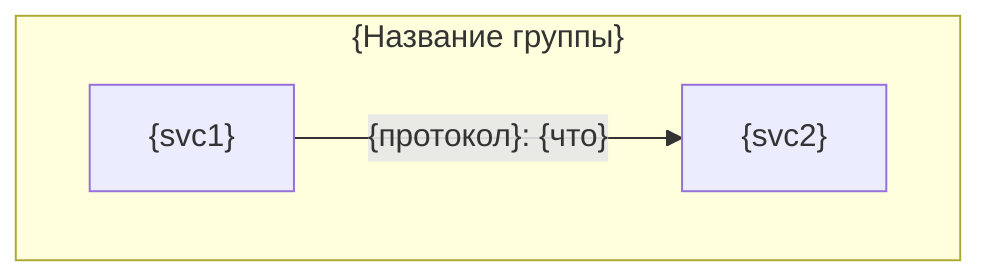
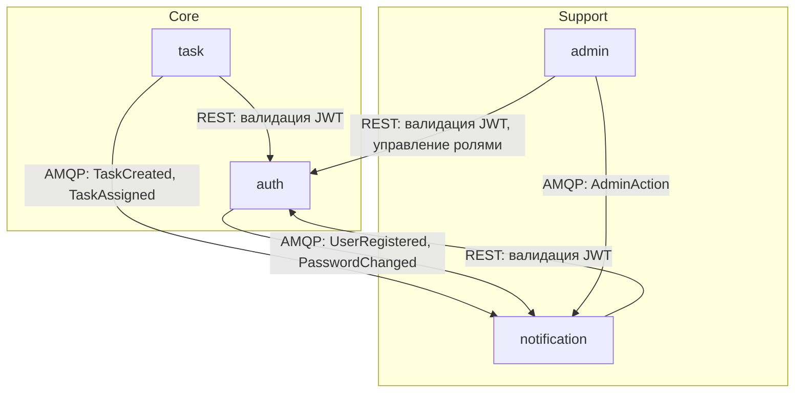

# Стандарт overview.md

Версия стандарта: 1.1

Формат и правила для `specs/docs/.system/overview.md` — единого документа с архитектурой системы для LLM-разработчика. Определяет секции, порядок, шаблон.

**Полезные ссылки:**
- [Инструкции specs/](../../README.md)
- [Мета-стандарт docs/](../standard-docs.md)

**Связанные документы:**

| Тип | Документ |
|-----|----------|
| Стандарт | Этот документ |
| Валидация | [validation-overview.md](./validation-overview.md) |
| Создание | *Не требуется* |
| Модификация | [modify-overview.md](./modify-overview.md) |

## Оглавление

- [1. Назначение](#1-назначение)
- [2. Секции](#2-секции)
  - [Назначение системы](#назначение-системы)
  - [Карта сервисов](#карта-сервисов)
  - [Связи между сервисами](#связи-между-сервисами)
  - [Сквозные потоки](#сквозные-потоки)
  - [Контекстная карта доменов](#контекстная-карта-доменов)
  - [Shared-код](#shared-код)
- [3. Принципы](#3-принципы)
- [4. Шаблон](#4-шаблон)
- [5. Пример](#5-пример)

---

## 1. Назначение

`docs/.system/overview.md` — единый документ с архитектурой системы. Один файл — весь системный контекст: что за система, из каких сервисов состоит, как они связаны, какие сквозные сценарии, как соотносятся домены.

**Содержит:** системную архитектуру — карту сервисов, связи, потоки данных, контекстную карту доменов, shared-код.

**НЕ содержит:** per-service детали (API-контракты, Data Model, Flows) — это в `{svc}.md`. Конвенции API и shared-интерфейсы — это в `conventions.md`.

---

## 2. Секции

Документ состоит из 6 секций в фиксированном порядке. Все секции — h2 (`##`).

| # | Секция | Markdown-уровень | Содержание | Зачем LLM-разработчику |
|---|--------|-----------------|-----------|----------------------|
| 1 | Назначение системы | h2 | Что делает система, для кого, ключевые возможности. 3-5 предложений | Понять контекст — что за продукт |
| 2 | Карта сервисов | h2 | Таблица сервисов + mermaid-схема | Понять из чего состоит система, не читая каждый {svc}.md |
| 3 | Связи между сервисами | h2 | Таблица: кто -> кого -> через что -> зачем | Знать зависимости прежде чем менять контракт |
| 4 | Сквозные потоки | h2 | End-to-end сценарии через 2+ сервиса | Понять как данные проходят через систему |
| 5 | Контекстная карта доменов | h2 | Домены, DDD-паттерны связей | Знать границы ответственности |
| 6 | Shared-код | h2 | Что в shared/, кто владелец, кто потребитель | Знать что переиспользовать |

### Назначение системы

3-5 предложений: что делает система, для кого, ключевые возможности.

**Формат:** свободный текст, без таблиц и списков.

### Карта сервисов

Три элемента:

1. **Вводный абзац** — 1-3 предложения: общий принцип разделения на сервисы, какой сервис центральный, какие вспомогательные.

2. **Таблица сервисов:**

| Колонка | Содержание |
|---------|-----------|
| Сервис | Имя сервиса (совпадает с `/src/{svc}/`) |
| Зона ответственности | Что делает сервис, 5-10 слов |
| Критичность | Уровень критичности сервиса. Допустимые значения: `critical-high`, `critical-medium`, `critical-low`. Значение берётся из `{svc}.md` (SSOT — источник правды). Колонка обязательна для каждого сервиса |
| Владеет данными | Таблицы/коллекции, которыми владеет |
| Ключевые API | 2-4 основных публичных endpoint (формат: `VERB /path`). Полный список — в `{svc}.md`. Выбирать endpoints, необходимые для понимания назначения сервиса при чтении карты |

**Порядок строк:** алфавитный по имени сервиса.

3. **Mermaid-схема** — визуальная карта связей между сервисами. Группировка через `subgraph`, рёбра с подписями `протокол: что`.

**Правила mermaid-схемы:**
- Группировать сервисы по роли (Core, Support, Infrastructure). Максимум 5-7 узлов на группу. Если сервисов > 8 — вынести инфраструктурные компоненты в отдельный `subgraph "Infrastructure"`.
- **Внешние системы:** если сервис зависит от внешней системы (payment gateway, email-провайдер, S3) — отобразить её как отдельный узел в `subgraph "External"`. Внешние системы не указываются в таблице сервисов (они не часть системы), но указываются в таблице связей как Приёмник.
- **Если сервисов один:** mermaid-схему не удалять. Показать сервис и его хранилище данных.

### Связи между сервисами

Три элемента:

1. **Вводный абзац** — 3-5 предложений, покрывающих: (а) паттерны коммуникации и обоснование выбора, (б) центральную зависимость системы, (в) принцип организации потока событий. Все три аспекта обязательны.

2. **Таблица связей:**

| Колонка | Содержание |
|---------|-----------|
| Источник | Сервис-инициатор |
| Приёмник | Сервис-получатель (в т.ч. внешняя система) |
| Протокол | REST / AMQP / WS / gRPC / SMTP / S3 |
| Назначение | Зачем вызывает, 5-10 слов |
| Паттерн | sync/async, pub-sub/request-reply |

**Порядок строк:** алфавитный по колонке «Источник», при равенстве — по «Приёмник».

3. **Практический абзац** — что делать при добавлении нового сервиса или нового события.

### Сквозные потоки

End-to-end сценарии, в которых участвуют 2+ сервиса.

**Вводный абзац** — 1-3 предложения: что такое сквозные потоки в контексте этой системы и по какому критерию выбраны описанные ниже сценарии.

**Каждый поток** оформляется как h3-подсекция (`###`):

1. **Заголовок** — `### {Название сценария}`
2. **Участники** — `**Участники:** {svc1}, {svc2}, {svc3}`
3. **Шаги** — нумерованный список в code-блоке: `{актор} -> {svc}: {действие} ({протокол})`. Допустимы подстроки с телом запроса (с отступом в 3 пробела): `   Тело: {payload}`.
4. **Ключевые контракты** — ссылки на endpoints из шагов, где происходит внешний вызов (REST, AMQP-подписка). Внутренние шаги (создание записи в БД, проверка условия) — без ссылок. Минимум 1 ссылка на поток.

**Количество потоков:** 2-5. Критерии отбора (в порядке приоритета): (1) покрыть все паттерны коммуникации (если REST и AMQP — оба представлены); (2) включить happy-path для основной бизнес-функции системы; (3) включить сценарии, затрагивающие 3+ сервиса.

### Контекстная карта доменов

Четыре элемента:

1. **Вводный абзац** — как домены соотносятся с сервисами (1:1 или есть исключения). Как выбирается паттерн связи между доменами.

2. **Таблица доменов:**

| Колонка | Содержание |
|---------|-----------|
| Домен | Имя домена |
| Реализует сервис | Имя сервиса |
| Агрегаты | Ключевые DDD-агрегаты |
| Связь с другими доменами | Паттерн: описание связи |

**Порядок строк:** алфавитный по имени домена.

3. **DDD-паттерны связей** — список используемых паттернов с пояснением, кто и к кому применяет:
   - **Conformist** — принимает модель без адаптации
   - **ACL (Anti-Corruption Layer)** — адаптирует модель через слой трансляции
   - **Published Language** — публикует стандартные события
   - **Shared Kernel** — общий код в shared/

4. **Практический абзац** — 2-4 предложения о практических последствиях для разработчика. Описывать только паттерны, применяемые в данной системе. Формат: «Если X — то Y (Conformist). Если Z — то W (ACL).»

**Если проект не использует DDD:** секцию не удалять. Оставить таблицу доменов в полном формате (домен = сервис, агрегаты = основные сущности). Раздел «DDD-паттерны связей» заменить на «Связи между доменами» в свободной форме. Практический абзац — сохранить.

### Shared-код

Два элемента:

1. **Вводный абзац** — что выносится в `shared/` и почему. Принцип создания shared-пакета. Владелец отвечает за API пакета и обратную совместимость. Ссылка на полные интерфейсы в `conventions.md`.

2. **Таблица пакетов:**

| Колонка | Содержание |
|---------|-----------|
| Пакет | Путь: `shared/{package}` |
| Назначение | Что делает пакет |
| Владелец | Сервис-владелец |
| Потребители | Сервисы-потребители |

**Если shared-кода нет:** секцию не удалять. Написать: `*Shared-пакеты будут добавлены при появлении переиспользуемого кода между сервисами.*`

---

## 3. Принципы

**Frontmatter обязателен.** overview.md ДОЛЖЕН содержать frontmatter с полями `description` и `standard` (как в шаблоне). Это обеспечивает трассируемость к стандарту.

**Системный взгляд, не per-service.** overview.md описывает систему целиком. Per-service детали (API-контракты, Data Model) — в `{svc}.md`. Если информация дублируется — оставить в одном месте и дать SSOT-ссылку.

**Практичность для LLM.** Каждая секция отвечает на конкретный вопрос разработчика. Не описывать архитектуру ради архитектуры — описывать то, что нужно для принятия решений при написании кода.

**Вводные абзацы обязательны.** Каждая секция начинается с абзаца свободного текста, объясняющего контекст и принцип. Таблица без вводного абзаца — справочник без объяснения. LLM нужен контекст для правильной интерпретации табличных данных.

**Ссылки на per-service документы.** Сквозные потоки ссылаются на конкретные endpoints в `{svc}.md` через якорные ссылки. Формат: `[{svc}.md#endpoint](../{svc}.md#endpoint)`.

**Разделение с conventions.md.** overview.md описывает *что есть* (структура, связи, потоки). conventions.md описывает *как делать* (форматы ошибок, пагинация, shared-интерфейсы). Полные интерфейсы shared-пакетов — в conventions.md, overview.md содержит только таблицу пакетов.

**Синхронизация с {svc}.md.** Колонки «Зона ответственности», «Критичность» и «Ключевые API» в Карте сервисов — проекции из соответствующего `{svc}.md`. Значение «Критичность» берётся из `{svc}.md` (SSOT) и должно совпадать. При изменении `{svc}.md` (новый endpoint, изменение зоны, изменение критичности) — обновить overview.md. После создания или изменения overview.md — запустить валидацию: см. [validation-overview.md](./validation-overview.md).

**Актуализация при изменениях системы:**

| Изменение | Что обновить в overview.md |
|-----------|--------------------------|
| Добавлен новый сервис | Карта сервисов, Связи, Контекстная карта, mermaid-схема |
| Удалён сервис | Те же секции, что при добавлении |
| Изменён протокол связи | Связи, mermaid-схема, затронутые Сквозные потоки |
| Появился новый shared-пакет | Shared-код |
| Добавлен новый домен | Контекстная карта |
| Изменён endpoint сервиса | Карта сервисов (если endpoint ключевой), Сквозные потоки (если затронут) |
| Изменена критичность сервиса | Карта сервисов (колонка «Критичность») |

---

## 4. Шаблон

`````markdown
---
description: Архитектура системы — карта сервисов, связи, потоки, домены
standard: specs/.instructions/docs/overview/standard-overview.md
---

# Архитектура системы

## Назначение системы

{3-5 предложений: что делает система, для кого, ключевые возможности.}

## Карта сервисов

{1-3 предложения: общий принцип разделения на сервисы — почему именно так, какой сервис центральный, какие вспомогательные.}

| Сервис | Зона ответственности | Критичность | Владеет данными | Ключевые API |
|--------|---------------------|-------------|----------------|-------------|
| {svc} | {что делает} | {critical-high/critical-medium/critical-low} | {таблицы/коллекции} | {2-4 endpoints} |



## Связи между сервисами

{3-5 предложений: (а) паттерны коммуникации и обоснование, (б) центральная зависимость, (в) поток событий.}

| Источник | Приёмник | Протокол | Назначение | Паттерн |
|----------|---------|----------|-----------|---------|
| {svc1} | {svc2} | {REST/AMQP/WS} | {зачем вызывает} | {sync/async, pub-sub/request-reply} |

{Абзац: практические последствия — при добавлении нового сервиса он должен {что}. При добавлении нового события — нужно {что}.}

## Сквозные потоки

{1-3 предложения: что такое сквозные потоки в этой системе и по какому критерию выбраны описанные ниже сценарии.}

### {Название сценария}

**Участники:** {svc1}, {svc2}, {svc3}

```
1. {Актор} -> {svc1}: {действие} ({протокол})
   Тело: {payload}
2. {svc1} -> {svc2}: {действие} ({протокол})
3. {svc2} -> {svc3}: {действие} ({протокол})
4. {svc3} -> {Актор}: {результат} ({протокол})
```

**Ключевые контракты:**
- Шаг 1: см. [{svc1}.md#endpoint](../{svc1}.md#endpoint)
- Шаг 2: см. [{svc2}.md#endpoint](../{svc2}.md#endpoint)

## Контекстная карта доменов

{Абзац: как домены соотносятся с сервисами. Как выбирается паттерн связи.}

| Домен | Реализует сервис | Агрегаты | Связь с другими доменами |
|-------|-----------------|----------|------------------------|
| {domain} | {svc} | {агрегаты} | {паттерн}: {описание связи} |

**DDD-паттерны связей:**
- **Conformist:** {кто} конформен к {кому} — принимает модель без адаптации
- **ACL:** {кто} адаптирует модель {кого} через слой трансляции
- **Published Language:** {кто} публикует стандартные события
- **Shared Kernel:** {что} разделяют {кто и кто} — общий код в shared/

{2-4 предложения: практические последствия. Формат: «Если X — то Y (паттерн).»}

## Shared-код

{Абзац: что выносится в shared/ и почему. Полные интерфейсы — в [conventions.md](conventions.md#shared-пакеты).}

| Пакет | Назначение | Владелец | Потребители |
|-------|-----------|---------|-------------|
| shared/{package} | {что делает} | {svc-владелец} | {svc1}, {svc2} |
`````

---

## 5. Пример

`````markdown
---
description: Архитектура системы — карта сервисов, связи, потоки, домены
standard: specs/.instructions/docs/overview/standard-overview.md
---

# Архитектура системы

## Назначение системы

MyApp — платформа управления задачами для команд. Пользователи создают задачи,
назначают исполнителей, отслеживают прогресс. Система поддерживает real-time
уведомления через WebSocket, ролевой доступ (admin/manager/member) и
административную панель для управления пользователями и ролями.

## Карта сервисов

Система разделена на 4 сервиса по принципу бизнес-домена. auth — центральный сервис, от которого зависят все остальные (JWT-авторизация). task — основная бизнес-логика. notification — вспомогательный сервис, подписанный на события остальных. admin — надстройка над auth с дополнительной проверкой ролей.

| Сервис | Зона ответственности | Критичность | Владеет данными | Ключевые API |
|--------|---------------------|-------------|----------------|-------------|
| admin | Админ-панель, управление ролями, аудит-лог | critical-low | audit_log | GET /admin/users, PATCH /admin/users/{id}/role |
| auth | Регистрация, логин, JWT, роли | critical-high | users, roles, sessions | POST /auth/register, POST /auth/login, POST /auth/validate |
| notification | Push-уведомления, WebSocket, история | critical-medium | notifications, ws:connections | GET /notifications, WS /ws/notifications |
| task | Задачи, проекты, назначения, статусы | critical-high | tasks, projects, assignments | CRUD /tasks, CRUD /projects |



## Связи между сервисами

В системе два паттерна коммуникации. **Синхронный REST** используется для request-reply: все сервисы валидируют JWT через auth при каждом входящем запросе. **Асинхронный AMQP** используется для событий: auth, task и admin публикуют доменные события в единый exchange `system.events`, notification подписан на все события и создаёт уведомления. auth — центральная зависимость: без него ни один сервис не обработает входящий запрос. Прямых sync-вызовов между task и notification нет — только через события.

| Источник | Приёмник | Протокол | Назначение | Паттерн |
|----------|---------|----------|-----------|---------|
| admin | auth | REST | Валидация JWT + управление ролями | sync, request-reply |
| admin | notification | AMQP | Публикация событий AdminAction | async, pub-sub |
| auth | notification | AMQP | Публикация событий UserRegistered, PasswordChanged | async, pub-sub |
| notification | auth | REST | Валидация JWT при WS-подключении и REST | sync, request-reply |
| task | auth | REST | Валидация JWT при каждом запросе | sync, request-reply |
| task | notification | AMQP | Публикация событий TaskCreated, TaskAssigned | async, pub-sub |

При добавлении нового сервиса: он должен подключить shared/auth middleware для JWT-валидации и, если генерирует события, публиковать их в `system.events` (см. [conventions.md](conventions.md#sharedevents--схемы-событий-amqp)). Если сервис потребляет события — подписаться на `system.events` и обработать нужные типы.

## Сквозные потоки

Ниже описаны ключевые сценарии, покрывающие оба паттерна коммуникации (REST и AMQP) и затрагивающие 3+ сервиса. Отобраны happy-path для основных бизнес-функций: регистрация, создание задачи, административное действие.

### Регистрация пользователя и welcome-уведомление

**Участники:** frontend, auth, notification

```
1. frontend -> auth: POST /auth/register (REST)
   Тело: { email, password, name }
2. auth: создаёт пользователя в users, генерирует JWT
3. auth -> frontend: 201 Created { user, token } (REST)
4. auth -> AMQP: публикует UserRegistered { user_id, email, name }
5. notification: получает UserRegistered из system.events
6. notification: создаёт welcome-уведомление в PostgreSQL
7. notification -> frontend: push через WebSocket (если подключён)
```

**Ключевые контракты:**
- Шаг 1: см. [auth.md#post-apiv1authregister](../auth.md#post-apiv1authregister)
- Шаг 5: см. [notification.md#event-systemevents-subscriber](../notification.md#event-systemevents-subscriber)

### Создание задачи с уведомлением назначенному

**Участники:** frontend, auth, task, notification

```
1. frontend -> task: POST /tasks (REST, Bearer JWT)
2. task -> auth: POST /auth/validate (REST, внутренний вызов)
3. auth -> task: 200 { valid: true, user_id, role }
4. task: создаёт задачу в tasks, назначение в assignments
5. task -> frontend: 201 Created { task } (REST)
6. task -> AMQP: публикует TaskCreated { task_id, creator_id }
7. task -> AMQP: публикует TaskAssigned { task_id, assignee_id }
8. notification: получает TaskAssigned из system.events
9. notification: создаёт уведомление для assignee в PostgreSQL
10. notification -> assignee frontend: push через WebSocket
```

**Ключевые контракты:**
- Шаг 1: см. [task.md#post-apiv1tasks](../task.md#post-apiv1tasks)
- Шаг 2: см. [auth.md#post-apiv1authvalidate](../auth.md#post-apiv1authvalidate)
- Шаг 8: см. [notification.md#event-systemevents-subscriber](../notification.md#event-systemevents-subscriber)

### Административное изменение роли

**Участники:** admin frontend, auth, admin, notification

```
1. admin frontend -> admin: PATCH /admin/users/{id}/role (REST, Bearer JWT)
2. admin -> auth: POST /auth/validate (REST)
3. auth -> admin: 200 { valid: true, user_id, role: "admin" }
4. admin: проверяет role == "admin"
5. admin -> auth: PATCH /auth/users/{id}/role (REST, внутренний)
6. auth: обновляет роль в users
7. admin: записывает audit_log
8. admin -> AMQP: публикует AdminAction { action: "role_changed", target_user_id }
9. notification: создаёт admin-уведомление для target user
10. notification -> target user frontend: push через WebSocket
```

**Ключевые контракты:**
- Шаг 1: см. [admin.md#patch-apiv1adminusersid-role](../admin.md#patch-apiv1adminusersid-role)
- Шаг 5: см. [auth.md#patch-apiv1authusersid-role](../auth.md#patch-apiv1authusersid-role)
- Шаг 8: см. [notification.md#event-systemevents-subscriber](../notification.md#event-systemevents-subscriber)

## Контекстная карта доменов

Каждый домен реализуется ровно одним сервисом (1:1). Identity — корневой домен, от которого зависят все остальные. Паттерн связи выбирается так: если сервис просто принимает чужую модель (user_id, JWT claims) — Conformist. Если нужна адаптация чужой модели (добавить проверку роли) — ACL. Если сервис публикует события для подписчиков — Published Language.

| Домен | Реализует сервис | Агрегаты | Связь с другими доменами |
|-------|-----------------|----------|------------------------|
| Administration | admin | AuditLog | ACL: адаптирует Identity API (дополняет проверкой role == admin). Conformist: к Task Management для чтения статистики |
| Identity | auth | User, Role, Session | Published Language: публикует UserRegistered, PasswordChanged |
| Notifications | notification | Notification, WebSocketConnection | Conformist: конформен к Identity. Published Language: подписан на события всех доменов |
| Task Management | task | Task, Project, Assignment | Conformist: конформен к Identity (принимает user_id без адаптации) |

**DDD-паттерны связей:**
- **Conformist:** task, notification, admin конформны к auth — принимают user_id и JWT-модель без адаптации
- **ACL:** admin оборачивает auth API дополнительной проверкой role == admin перед вызовом
- **Published Language:** auth, task, admin публикуют стандартные события в system.events; notification подписывается
- **Shared Kernel:** shared/auth/ — JWT middleware, используется task, notification, admin (владелец: auth)

Если task начнёт использовать новое поле из JWT (например, `organization_id`) — это Conformist, task просто читает поле, ничего адаптировать не нужно. Но если admin добавит новую проверку прав (например, `can_manage_users`) — это ACL, нужно расширить слой адаптации в admin, а не менять auth.

## Shared-код

В shared/ выносится код, который используется 2+ сервисами и имеет одного владельца. Владелец отвечает за API пакета и обратную совместимость. Потребители используют пакет как есть, без модификаций. Полные интерфейсы (сигнатуры, параметры, примеры вызова) — в [conventions.md](conventions.md#shared-пакеты).

| Пакет | Назначение | Владелец | Потребители |
|-------|-----------|---------|-------------|
| shared/auth | JWT middleware — валидация токена, извлечение user_id и role из claims | auth | task, notification, admin |
| shared/events | Схемы событий AMQP — UserRegistered, TaskCreated и др. TypedDict-определения | auth (Identity-события), task (Task-события) | notification |

Когда создавать новый shared-пакет: если два сервиса дублируют одинаковую логику (middleware, схемы данных, утилиты). Не выносить в shared: бизнес-логику конкретного домена, конфигурацию специфичную для одного сервиса.
`````
