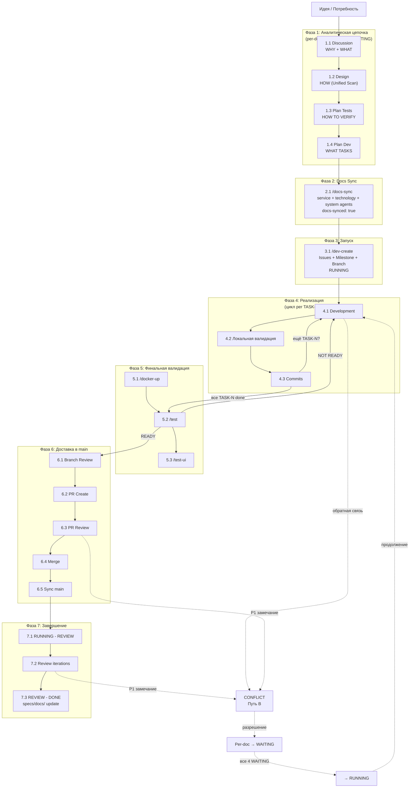
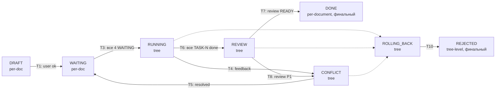
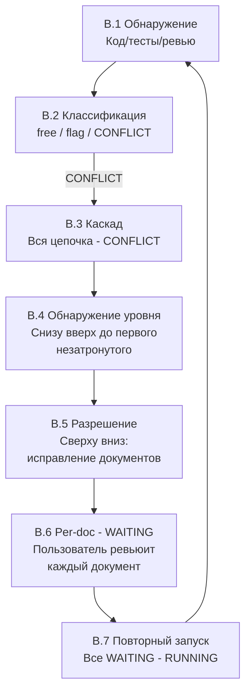

# Стандарт процесса поставки ценности

Версия стандарта: 1.3

Полный цикл поставки изменения: Идея → Analysis Chain → Development → Merge → Release. Описывает три пути прохождения и маппинг каждого шага на инструменты проекта.

**Точка входа:** `/chain` создаёт TaskList с полной последовательностью шагов. См. [create-chain.md](./create-chain.md).

**Полезные ссылки:**
- [Инструкции specs/](./README.md)

**Связанные документы:**

| Тип | Документ |
|-----|----------|
| Стандарт | Этот документ |
| Валидация | — (оркестратор, не имеет экземпляров) |
| Создание | — |
| Модификация | — |

**SSOT-зависимости:**

| Зона | Документ | Зона ответственности |
|------|----------|---------------------|
| Analysis chain | [standard-analysis.md](./analysis/standard-analysis.md) | 4 уровня, статусы, каскады, обновление specs/docs/ |
| Documentation | [standard-docs.md](./docs/standard-docs.md) | Контур specs/docs/, типы документов |
| GitHub workflow | [standard-github-workflow.md](/.github/.instructions/standard-github-workflow.md) | Issue → Branch → PR → Merge → Release |
| Development | [standard-development.md](/.github/.instructions/development/standard-development.md) | Процесс разработки в feature-ветке |
| Release | [standard-release.md](/.github/.instructions/releases/standard-release.md) | Версионирование, changelog, теги, hotfix, rollback |

**Зоны ответственности:**

> Этот документ — HIGH-LEVEL оркестратор всего процесса. Каждый шаг описан 1-2 предложениями + ссылка на SSOT. Детали — в зависимых стандартах. Не дублирует содержание.

## Оглавление

- [1. Обзорная диаграмма](#1-обзорная-диаграмма)
- [2. Модель статусов](#2-модель-статусов)
- [3. Выбор пути](#3-выбор-пути)
- [4. Обзор путей](#4-обзор-путей)
  - [Фаза 0: Инициализация проекта](#фаза-0-инициализация-проекта)
- [5. Путь A: Happy Path](#5-путь-a-happy-path)
  - [Фаза 1: Аналитическая цепочка](#фаза-1-аналитическая-цепочка)
  - [Фаза 2: Docs Sync](#фаза-2-docs-sync)
  - [Фаза 3: Запуск реализации](#фаза-3-запуск-реализации)
  - [Фаза 4: Реализация](#фаза-4-реализация)
  - [Фаза 5: Финальная валидация](#фаза-5-финальная-валидация)
  - [Фаза 6: Доставка в main](#фаза-6-доставка-в-main)
  - [Фаза 7: Завершение цепочки](#фаза-7-завершение-цепочки)
- [6. Путь B: CONFLICT](#6-путь-b-conflict)
- [7. Путь C: Альтернативные маршруты](#7-путь-c-альтернативные-маршруты)
- [8. Сводная таблица инструментов](#8-сводная-таблица-инструментов)
- [9. Quick Reference](#9-quick-reference)

---

## 1. Обзорная диаграмма



---

## 2. Модель статусов

> Краткая навигационная модель. Полное описание: [standard-analysis.md § 5](./analysis/standard-analysis.md#5-статусы).



| Статус | Скоуп | Когда |
|--------|-------|-------|
| DRAFT | per-document | Документ создаётся и итерируется (Фаза 1) |
| WAITING | per-document | Пользователь одобрил документ (между Фазой 1 и 3) |
| RUNNING | tree-level | Все 4 документа согласованы, идёт разработка (Фазы 4-6) |
| REVIEW | tree-level | Реализация завершена, ожидает ревью (Фаза 7) |
| DONE | per-document (финальный) | Всё готово, specs/docs/ обновлён (конец Фазы 7) |
| CONFLICT | tree-level | Обратная связь код → спеки (Путь B) |
| ROLLING_BACK | tree-level | Откат артефактов (Путь C.1) |
| REJECTED | tree-level (финальный) | Отклонён (Путь C.1) |

**Автоматизация:** Все переходы — через `chain_status.py` → `ChainManager.transition()`. Ручное изменение `status:` в frontmatter **запрещено**.

---

## 3. Выбор пути

> **Принцип:** Даже "мелкий" фикс проходит полную аналитическую цепочку. Изменение, которое кажется тривиальным, может затрагивать API контракты, data model или cross-service интеграции. Analysis chain выявляет это **до** написания кода, а не после.

| Что меняется | Команда | Описание |
|---|---|---|
| Поведение системы (API, data model, логика, UI) | **`/chain`** | Полная аналитическая цепочка: Discussion → Design → Plan Tests → Plan Dev → реализация → PR → Merge |
| Баги, production-инциденты, хотфиксы | **`/hotfix`** | Диагностика → решение → impact analysis → исправление кода и docs. [SSOT: standard-hotfix.md](/specs/.instructions/hotfixes/standard-hotfix.md) |

---

## 4. Обзор путей

### Фаза 0: Инициализация проекта

> Выполняется **однократно** при создании проекта. Не зависит от пути — обязательный нулевой шаг.

| # | Шаг | Описание | SSOT |
|---|------|---------|------|
| 0.1 | Настройка GitHub | Labels, Issue Templates, PR Template, CODEOWNERS, Actions, Security | [standard-github-workflow.md § 2](/.github/.instructions/standard-github-workflow.md#2-фаза-0-подготовка-инфраструктуры) |
| 0.2 | Настройка specs/docs/ | Стартовый набор: README, .system/, .technologies/, примеры | [standard-docs.md § 7](./docs/standard-docs.md#7-жизненный-цикл) |
| 0.3 | Настройка среды | `make setup` — pre-commit hooks, зависимости, Docker Desktop | [initialization.md](/.structure/initialization.md), [standard-docker.md](/platform/.instructions/standard-docker.md) |

**Скиллы:** `/init-project`, `/labels-modify`, `/milestone-create`

### Пути

| Путь | Описание | Частота |
|------|---------|---------|
| **A: Happy Path** | Линейный поток от идеи до завершения без конфликтов | Идеальный сценарий |
| **B: CONFLICT** | Обратная связь код → спецификации. Обнаружение → классификация → каскад → разрешение → повторный запуск | Частый — код регулярно выявляет несовместимость |
| **C: Альтернативные** | Rollback, Cross-chain координация | По ситуации |

---

## 5. Путь A: Happy Path

### Фаза 1: Аналитическая цепочка

> Каждое изменение проходит 4 уровня: Discussion → Design → Plan Tests → Plan Dev. Каждый уровень — цикл CLARIFY → GENERATE → VALIDATE → USER REVIEW → WAITING.

| # | Шаг | Вопрос | Скилл | SSOT |
|---|------|--------|-------|------|
| 1.1 | Discussion | Зачем это нужно? Какие требования? | `/discussion-create` | [standard-discussion.md](./analysis/discussion/standard-discussion.md) |
| 1.2 | Design | Какие сервисы затронуты? Как распределить ответственности? | `/design-create` | [standard-design.md](./analysis/design/standard-design.md) |
| 1.3 | Plan Tests | Как проверяем решение? | `/plan-test-create` | [standard-plan-test.md](./analysis/plan-test/standard-plan-test.md) |
| 1.4 | Plan Dev | Какие задачи? | `/plan-dev-create` | [standard-plan-dev.md](./analysis/plan-dev/standard-plan-dev.md) |

**Общий паттерн объекта (7 шагов):** PREPARE → CLARIFY → GENERATE → VALIDATE → AGENT REVIEW → USER REVIEW → REPORT. → [standard-analysis.md § 2.4](./analysis/standard-analysis.md#24-общий-паттерн-объекта)

**Агенты:** design-agent-first + design-agent-second (обяз. при Design, последовательно; WAITING один раз — после обоих + обработки PROP), plantest-agent + plantest-reviewer (обяз. при Plan Tests, последовательно), plandev-agent + plandev-reviewer (обяз. при Plan Dev, последовательно), discussion-reviewer (опц.), design-reviewer (опц.)

**`/review-create` — автоматически:** Вызывается внутри `/plan-dev-create` (Шаг 10) после одобрения пользователем. Отдельный вызов не требуется.

### Фаза 2: Docs Sync

> Когда все 4 документа цепочки в WAITING — синхронизация specs/docs/ через параллельные агенты.

| # | Шаг | Описание | Скилл | SSOT |
|---|------|---------|-------|------|
| 2.1 | /docs-sync | Три волны агентов: service-agent × N + technology-agent × M + system-agent mode=sync (overview.md) → ревью → исправления | `/docs-sync` | [create-docs-sync.md](./create-docs-sync.md) |

**Агенты:** service-agent (создание/обновление {svc}.md), service-reviewer (сверка с Design), technology-agent (per-tech стандарты), technology-reviewer (ревью per-tech), system-agent mode=sync (overview.md), system-reviewer mode=sync (сверка overview с Design).

**Результат:** Per-service docs обновлены (Planned Changes в § 9), per-tech стандарты созданы/обновлены, overview.md актуализирован. Маркер `docs-synced: true` в design.md.

### Фаза 3: Запуск реализации

> Когда все 4 документа цепочки в WAITING и docs-synced — запуск реализации.

| # | Шаг | Описание | Скилл | SSOT |
|---|------|---------|-------|------|
| 3.1 | dev-create | Создание Issues, Milestone, Branch → вся цепочка → RUNNING | `/dev-create` | [create-development.md](/.github/.instructions/development/create-development.md) |

**Результат:** GitHub Issues привязаны к Milestone, feature-ветка создана, все документы RUNNING.

### Фаза 4: Реализация

> Цикл по TASK-N из plan-dev.md. Повторяется для каждой задачи.

| # | Шаг | Описание | Скилл | SSOT |
|---|------|---------|-------|------|
| 4.1 | Development | Блоки (BLOCK-N) по волнам, dev-agent параллельно, CONFLICT-детекция | dev-agent | [modify-development.md](/.github/.instructions/development/modify-development.md) |
| 4.2 | Локальная валидация | `make test`, `make lint` + `make test-e2e` (при изменениях API/DB/inter-service) | `/principles-validate` | [validation-development.md](/.github/.instructions/development/validation-development.md) |
| 4.3 | Commits | Conventional Commits, [29 pre-commit хуков](/.structure/pre-commit.md) | — | [standard-commit.md](/.github/.instructions/commits/standard-commit.md) |

**Обратная связь:** При обнаружении несовместимости → [Путь B: CONFLICT](#6-путь-b-conflict).

### Фаза 5: Финальная валидация

> Все TASK-N выполнены — полный прогон тестов перед ревью.

| # | Шаг | Описание | Скилл | SSOT |
|---|------|---------|-------|------|
| 5.1 | Docker Environment | `docker compose up -d --build` → healthcheck всех сервисов → порты доступны | `/docker-up` | [create-docker-env.md](/specs/.instructions/create-docker-env.md) |
| 5.2 | Финальная валидация | sync main → make test/lint/build → e2e (httpx) → отчёт READY/NOT READY | `/test` | [create-test.md](/specs/.instructions/create-test.md) |
| 5.3 | Playwright Smoke | UI smoke-тесты через Playwright CLI (playwright-cli, agent) → скриншоты → отчёт | `/test-ui` | [create-test-ui.md](/specs/.instructions/create-test-ui.md) |

**При NOT READY:** Возврат к Фазе 4 для исправления.

### Фаза 6: Доставка в main

| # | Шаг | Описание | Скилл | SSOT |
|---|------|---------|-------|------|
| 6.1 | Branch Review | Локальное ревью ветки перед PR | `/review` | [validation-review.md](/.github/.instructions/review/validation-review.md) |
| 6.2 | PR Create | `git push` + `gh pr create` с привязкой Issues | — | [standard-pull-request.md](/.github/.instructions/pull-requests/standard-pull-request.md) |
| 6.3 | PR Review | Code-reviewer агенты проверяют PR | `/review {N}` | [standard-review.md](/.github/.instructions/review/standard-review.md) |
| 6.4 | Merge | Squash merge, Issues закрываются | — | [standard-review.md § 3](/.github/.instructions/review/standard-review.md#3-merge-стратегии) |
| 6.5 | Sync main | Локальная синхронизация | — | [standard-sync.md](/.github/.instructions/sync/standard-sync.md) |

### Фаза 7: Завершение цепочки

| # | Шаг | Описание | Скилл | SSOT |
|---|------|---------|-------|------|
| 7.1 | RUNNING → REVIEW | Все TASK-N выполнены → вся цепочка → REVIEW | `/analysis-status` | [standard-analysis.md § 6.5](./analysis/standard-analysis.md#65-running-to-review) |
| 7.2 | Review iterations | code-reviewer → итерации в review.md → вердикт | `/review` | [standard-review.md (analysis)](./analysis/review/standard-review.md) |
| 7.3 | REVIEW → DONE | Bottom-up каскад + system-agent mode=done (все 4 .system/) + обновление specs/docs/ (Planned Changes → AS IS) | `/chain-done` | [standard-analysis.md § 6.6](./analysis/standard-analysis.md#66-review-to-done), [create-chain-done.md](./create-chain-done.md) |

**При Design → DONE:** specs/docs/ обновляются — Planned Changes переносятся в AS IS, Changelog обновляется. system-agent mode=done обновляет все 4 файла .system/. → [standard-analysis.md § 7.3](./analysis/standard-analysis.md#73-обновление-при-реализации-to-done)

> **Релиз** выполняется отдельно через `/release-create` (не является частью chain). **Хотфиксы** — через `/hotfix`.

---

## 6. Путь B: CONFLICT

> Обратная связь код → спецификации. Частый сценарий — код регулярно выявляет несовместимость с проектированием.

**SSOT:** [standard-analysis.md §§ 6.3–6.4](./analysis/standard-analysis.md#63-running-to-conflict)

### Источники

| Источник | Когда | Пример |
|----------|-------|--------|
| Код | При Development (шаг 4.1) | Алгоритм из Design невозможно реализовать |
| Тесты | При Development (шаг 4.2) | Тесты падают из-за неверных спецификаций |
| Branch Review | При Branch Review (шаг 6.1) | P1 замечание code-reviewer |
| PR Review | При PR Review (шаг 6.3) | P1 замечание code-reviewer |
| Review iterations | При Review (шаг 7.2) | Вердикт CONFLICT в review.md |

### Классификация уровня

| Граница (из Code Map specs/docs/{svc}.md) | Уровень | Действие |
|--------------------------------------|---------|---------|
| **Свободно** (внутри пакета) | Спецификации не затронуты | Нет реакции |
| **Флаг** (между пакетами) | Plan Dev / Plan Tests | Рабочие правки — LLM автономно, статус не меняется |
| **CONFLICT** (API, data model, архитектура) | Design или выше | → Вся цепочка → CONFLICT |

**Автоматизация:** `chain_status.py` → `classify_feedback(level)` принимает `level`: `"free"` / `"flag"` / `"conflict"`, возвращает dict с ключами `allowed`, `action`, `reason`

### Процесс разрешения CONFLICT



| # | Шаг | Описание | Инструменты |
|---|------|---------|-------------|
| B.1 | Обнаружение | Код/тесты выявили несовместимость или P1 на ревью | chain_status.py (classify_feedback) |
| B.2 | Классификация | free → ничего, flag → рабочие правки, CONFLICT → стоп | [standard-analysis.md § 6.3](./analysis/standard-analysis.md#63-running-to-conflict) |
| B.3 | Каскад CONFLICT | Вся цепочка → CONFLICT (tree-level) | chain_status.py (T4/T8) |
| B.4 | Обнаружение уровня | Проверка снизу вверх: Plan Dev → … → Discussion | LLM (не автоматизировано) |
| B.5 | Разрешение сверху вниз | От самого высокого затронутого до Plan Dev | `/discussion-modify`, `/design-modify`, `/plan-test-modify`, `/plan-dev-modify` |
| B.6 | Per-doc → WAITING | Пользователь ревьюит каждый изменённый документ | chain_status.py (T5) |
| B.7 | Повторный запуск | Все 4 в WAITING → каскад RUNNING | chain_status.py (T3), `/dev-create {NNNN} --resume` (обнаруживает существующие Issues/Branch, создаёт новые Issues для задач, появившихся после разрешения CONFLICT) |

**Кросс-цепочечная обратная связь:** При обновлении specs/docs/ автоматически вызывается `check_cross_chain()` — может затронуть другие цепочки. → [standard-analysis.md § 7.2](./analysis/standard-analysis.md#72-конфликт-исполнения-conflict)

---

## 7. Путь C: Альтернативные маршруты

### C.1 Rollback / Reject

Отмена цепочки на любом этапе (кроме DONE).

| Шаг | Описание | SSOT |
|-----|---------|------|
| Любой → ROLLING_BACK | Пользователь отменяет или CONFLICT неразрешим | [standard-analysis.md § 6.7](./analysis/standard-analysis.md#67-to-rolling_back) |
| Откат артефактов | Issues закрыты, ветка удалена, Planned Changes убраны, per-tech откачены | chain_status.py (T9) |
| ROLLING_BACK → REJECTED | Финальный статус | chain_status.py (T10) |

**Инструменты:** rollback-agent (Task tool), create-rollback.md, chain_status.py

### C.2 Hotfix → отдельный процесс

> **Хотфиксы и багфиксы вынесены в отдельную команду `/hotfix`.**
> SSOT: [standard-hotfix.md](/specs/.instructions/hotfixes/standard-hotfix.md)
>
> `/hotfix` обеспечивает: диагностику инцидента, impact analysis на ВСЮ документацию, параллельное исправление кода и docs через специализированных агентов.

### C.5 Кросс-цепочечная координация

Параллельные цепочки: Planned Changes видны в specs/docs/, `check_cross_chain()` при каждом обновлении.

**SSOT:** [standard-analysis.md §§ 7.2, 7.4](./analysis/standard-analysis.md#74-параллельные-цепочки)

| Статус другой цепочки | Реакция |
|----------------------|---------|
| DRAFT | Перегенерация затронутых документов |
| WAITING | Дообновление |
| RUNNING | → CONFLICT |
| DONE | Новая Discussion для приведения к общему знаменателю |

---

## 8. Сводная таблица инструментов

### 8.1 Основная таблица: инструкции, скиллы, агенты, скрипты

| Шаг | Инструкция | Скилл | Агент | Script |
|-----|-----------|-------|-------|--------|
| **Фаза 0: Инициализация** | | | | |
| 0.1-0.2 GitHub + docs | standard-github-workflow, standard-docs | /init-project, /labels-modify, /milestone-create | — | sync-labels.py |
| 0.3 Настройка среды | [initialization.md](/.structure/initialization.md), [create-initialization.md](/.structure/.instructions/create-initialization.md), [standard-docker.md](/platform/.instructions/standard-docker.md) | /init-project | — | — |
| **Фаза 1: Аналитическая цепочка** | | | | |
| 1.1 Discussion | standard/create/modify/validation-discussion | /discussion-create, -modify, -validate | discussion-reviewer | validate-analysis-discussion.py, chain_status.py |
| 1.2 Design | standard/create/modify/validation-design | /design-create, -modify, -validate | design-agent-first, design-agent-second, design-reviewer | validate-analysis-design.py, chain_status.py |
| 1.3 Plan Tests | standard/create/modify/validation-plan-test | /plan-test-create, -modify, -validate | plantest-agent, plantest-reviewer | create-analysis-plan-test-file.py, validate-analysis-plan-test.py, chain_status.py |
| 1.4 Plan Dev | standard/create/modify/validation-plan-dev, create-review | /plan-dev-create (включает /review-create), -modify, -validate | plandev-agent, plandev-reviewer | create-analysis-plan-dev-file.py, validate-analysis-plan-dev.py, create-review-file.py, chain_status.py |
| **Фаза 2: Docs Sync** | | | | |
| 2.1 /docs-sync | create-docs-sync | /docs-sync | service-agent, service-reviewer, technology-agent, technology-reviewer, system-agent, system-reviewer, docker-agent mode=scaffold | chain_status.py |
| **Фаза 3: Запуск** | | | | |
| 3.1 dev-create | create-development, standard-issue, standard-milestone, standard-branching | /dev-create, /milestone-create, /branch-create | issue-agent, issue-reviewer | chain_status.py |
| **Фаза 4: Реализация** | | | | |
| 4.1 Development | standard-development, modify-development, standard-testing | — | dev-agent, docker-agent mode=update | — |
| 4.2 Validation | validation-development, standard-testing | /principles-validate | — | validate-principles.py |
| 4.3 Commits | standard-commit, create-commit | /commit | — | validate-commit-msg.py |
| **Фаза 5: Финальная валидация** | | | | |
| 5.1 Docker Environment | create-docker-env | /docker-up | — | — |
| 5.2 Финальная валидация | create-test, validation-development | /test | — | — |
| 5.3 Playwright Smoke | create-test-ui | /test-ui | — | — |
| **Фаза 6: Доставка** | | | | |
| 6.1 Branch Review | validation-review (github) | /review | code-reviewer | — |
| 6.2 PR Create | standard-pull-request, standard-pr-template, create-pull-request | /pr-create | — | collect-pr-issues.py |
| 6.3 PR Review | standard-review (github) | /review {N} | code-reviewer | — |
| 6.4 Merge | standard-review § 3, create-merge | /merge | — | — |
| 6.5 Sync | standard-sync | — | — | — |
| **Фаза 7: Завершение** | | | | |
| 7.1 → REVIEW | standard-analysis § 6.5 | /analysis-status | — | chain_status.py |
| 7.2 Review iter. | standard-review (analysis), create-review | /review | code-reviewer | extract-svc-context.py |
| 7.3 → DONE | standard-analysis § 6.6, § 7.3, create-chain-done | /chain-done | system-agent mode=done, system-reviewer mode=done | chain_status.py |
| **Фаза 8: Поставка** | | | | |
| 8.0 Pre-release | standard-testing | — | — | pre-release.yml (CI) |
| 8.1 Release | standard-release, create-release, validation-release | /release-create, /milestone-validate, /post-release | — | validate-pre-release.py, validate-post-release.py |
| 8.2 Deploy | [standard-deploy.md](/.github/.instructions/actions/deploy/standard-deploy.md), [validation-deploy.md](/.github/.instructions/actions/deploy/validation-deploy.md) | — | — | deploy.yml, validate-deploy.py |
| **Security** | | | | |
| Level 1-3 | standard-security.md + security-{tech}.md | /technology-create (шаг 10) | — | validate-pre-release.py (E009, E010), gitleaks |
| **Путь B: CONFLICT** | | | | |
| B.1-B.3 Обнаружение → Каскад | standard-analysis §§ 6.3 | /analysis-status | — | chain_status.py (classify_feedback, T4/T8) |
| B.5-B.7 Разрешение → RUNNING | modify-discussion/design/plan-test/plan-dev | -modify скиллы | — | chain_status.py (T5, T3) |
| **Путь C: Rollback** | | | | |
| C.1 Rollback | standard-analysis §§ 6.7-6.8, create-rollback | — | rollback-agent | chain_status.py (T9, T10) |

### 8.2 Pre-commit хуки по шагам

> Полный список: [pre-commit.md](/.structure/pre-commit.md)

| Шаг | Pre-commit хуки |
|-----|----------------|
| 1.1 Discussion | discussion-validate |
| 1.2 Design | design-validate |
| 1.3 Plan Tests | plan-test-validate |
| 1.4 Plan Dev | plan-dev-validate, review-validate |
| 2.1 /docs-sync | service-validate, docs-validate, technology-validate |
| 3.1 dev-create | branch-validate, type-templates-validate |
| 4.2 Validation | [29 pre-commit хуков](/.structure/pre-commit.md) (все) |
| 4.3 Commits | [29 pre-commit хуков](/.structure/pre-commit.md) (все) |
| 5.1 Финальная валидация | — (ручной запуск /test) |
| 6.1 Branch Review | review-validate |
| 6.2 PR Create | pr-template-validate |
| 7.2 Review iter. | review-validate |
| 7.3 → DONE | service-validate, docs-validate |

### 8.3 Rules по шагам

> Расположение: [/.claude/rules/](/.claude/rules/)

| Rule | Активируется на шагах |
|------|-----------------------|
| core | Все шаги (глобальный) |
| code | 4.1 Development, 4.2 Validation |
| development | 3.1 dev-create, 4.1-4.3, 5.1, 6.1-6.5 |
| analysis-status-transition | 1.1-1.4, 3.1, 7.1, 7.3, B.1-B.7 |
| service-architecture | 1.2 Design, 2.1 Docs Sync, 7.3 → DONE |

---

## 9. Quick Reference

Компактный список команд для каждой фазы.

```
Точка входа:
  /chain              → TaskList (Happy Path, 15 задач)
  /chain --resume     → Продолжить существующий TaskList
  /hotfix             → Диагностика + решение + impact + исправление (7 задач)
  /hotfix --resume    → Продолжить существующий хотфикс

Фаза 0 — Инициализация (однократно):
  /init-project         → полная интерактивная настройка (10 шагов)
  /init-project --check → только проверка (healthcheck)
  make setup            → минимум (pre-commit)
  make init             → setup + labels + verify

Фаза 1 — Аналитическая цепочка:
  /discussion-create    → discussion.md (DRAFT → WAITING)
  /design-create        → design.md (DRAFT → WAITING)
  /plan-test-create     → plan-test.md (DRAFT → WAITING)
  /plan-dev-create      → plan-dev.md (DRAFT → WAITING) + review.md (авто)

Фаза 2 — Docs Sync:
  /docs-sync {design-path} → per-service + per-tech + overview.md (docs-synced: true)

Фаза 3 — Запуск реализации:
  /dev-create {NNNN}    → Issues + Milestone + Branch → RUNNING

Фаза 4 — Реализация (BLOCK-N по волнам):
  dev-agent × N         → код + тесты + CONFLICT-CHECK
  make test && make lint && make test-e2e  (e2e — при изменениях API/DB/inter-service)
  git commit            → pre-commit hooks автоматически

Фаза 5 — Финальная валидация:
  /docker-up            → поднять Docker dev-окружение, healthcheck
  /test                 → sync main, tests, lint, build, e2e, отчёт READY/NOT READY
  /test-ui              → Playwright UI smoke-тесты

Фаза 6 — Доставка в main:
  /review               → локальное ревью ветки
  git push -u origin {branch}
  gh pr create --title "..." --body "Closes #N, #N"
  /review {PR-N}        → ревью PR
  gh pr merge {PR-N} --squash
  git checkout main && git pull

Фаза 7 — Завершение цепочки:
  /chain-done           → RUNNING → REVIEW → DONE (+ system-agent mode=done)
  /review               → итерации review.md → вердикт READY

Релиз (отдельно от chain):
  /release-create     → GitHub Release (changelog, tag, milestone close)

CONFLICT:
  /analysis-status      → RUNNING → CONFLICT
  /{level}-modify       → разрешение сверху вниз
  /analysis-status      → CONFLICT → WAITING (per-doc)
  /dev-create {NNNN} --resume → WAITING → RUNNING (повторный запуск, новые Issues если нужно)
```

---

## Скиллы

— (оркестратор не имеет собственных скиллов; скиллы определены в зависимых стандартах)
