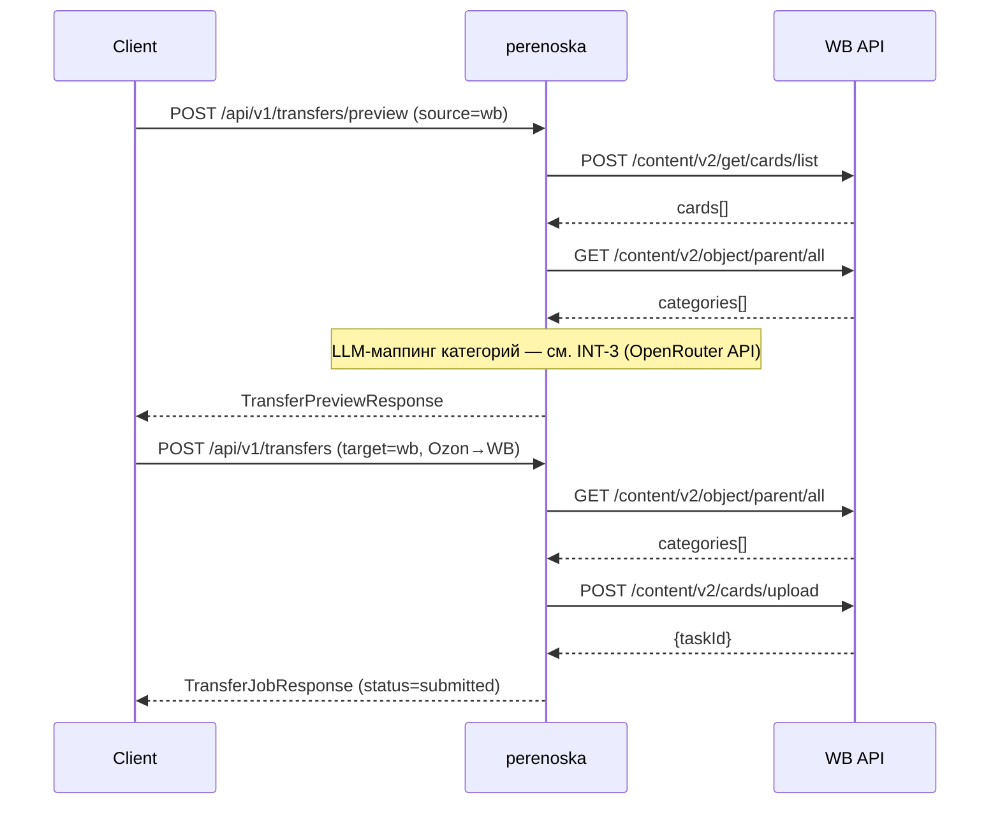
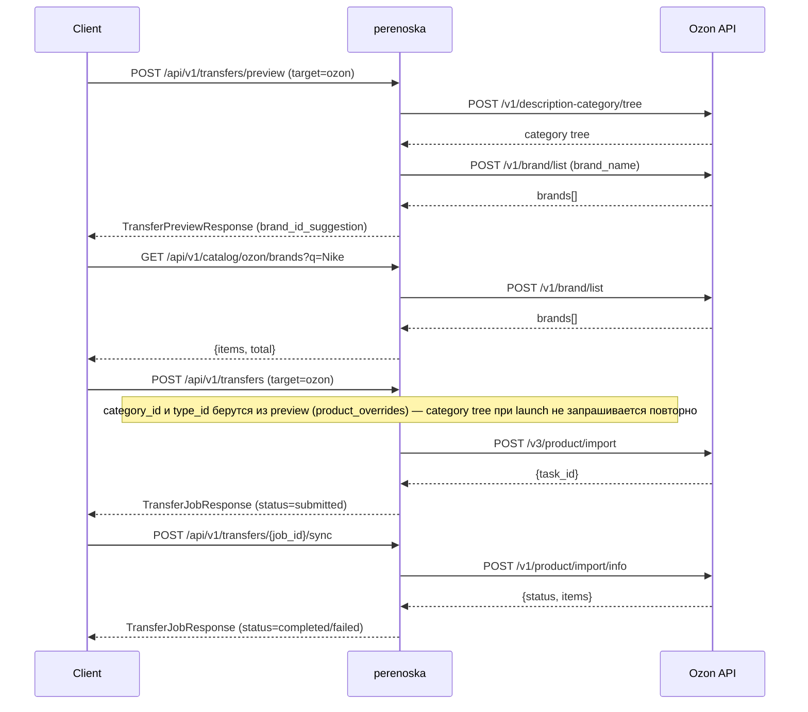
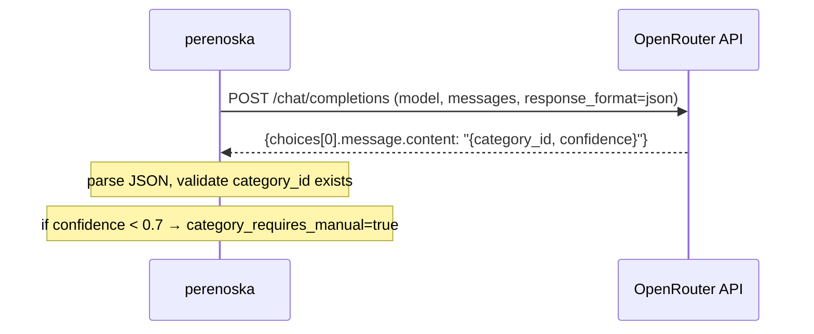

# 0002: Wb ozon product transfer — Design

## Резюме

Design затрагивает **один сервис** — монолитное FastAPI-приложение `perenoska` (SVC-1). Внутри него изменяются три слоя: `MappingService` (основной — замена `SequenceMatcher` на LLM-маппинг категорий через OpenRouter, поиск брендов через Ozon API, исправление маппинга полей `description↔annotation`), `WBClient`/`OzonClient` (вторичный — новые методы для брендового справочника Ozon и актуального дерева категорий), `TransferService` (вторичный — расширение preview-ответа полями для ручного выбора `category_id` и `brand_id`). `CatalogService` отклонён как отдельный scope — в Discussion нет требований к нему за пределами `MappingService`.

Ключевые архитектурные решения: **(1)** LLM-интеграция через OpenRouter с openai-совместимым SDK — модель конфигурируется через `Settings`, не вшита в код; **(2)** маппинг брендов — многошаговый поиск (`exact → case-insensitive → substring`) через Ozon API `/v1/brand/list`, без LLM; **(3)** маппинг категорий — LLM получает названия категорий из API, выбирает кандидата, возвращает `category_id` с уровнем уверенности; при низком confidence (`< 0.7`) preview помечает категорию как требующую ручного выбора; **(4)** карточка всегда создаётся в статусе черновика независимо от статуса источника.

Внутри монолита взаимодействия (INT-N) описывают синхронные вызовы: perenoska → OpenRouter API (LLM-запросы), perenoska → WB API, perenoska → Ozon API. Планируется **3 INT-N** (WB API, Ozon API, OpenRouter API) и **4 STS-N** (preview WB→Ozon, перенос WB→Ozon, перенос Ozon→WB, ненайденный бренд/категория).

## Выбор технологий

### Язык (SVC-1: perenoska)

**Язык:** Python 3.11 (указано в Discussion, используется в существующем коде). **Выбрано:** Python 3.11

### Фреймворк (SVC-1: perenoska)

**Фреймворк:** FastAPI 0.115 (указано в Discussion, используется в существующем коде). **Выбрано:** FastAPI 0.115

### База данных (SVC-1: perenoska)

**База данных:** SQLite через `app/db.py` (указано в Discussion, используется в существующем коде). Изменений в хранилище данные изменение не требует. **Выбрано:** SQLite (без изменений)

### LLM-провайдер для маппинга категорий (SVC-1: perenoska — MappingService)

Новая зависимость: REQ-7 требует LLM для подбора категории целевого маркетплейса. Текущая реализация (`SequenceMatcher`) заменяется LLM-вызовом.

| Критерий | OpenRouter (multi-model) | Anthropic API (claude-haiku) | Ollama (локальный) |
|---|---|---|---|
| Соответствие задаче | ★★★★★ (5) | ★★★★★ (5) | ★★★☆☆ (3) |
| Экосистема | ★★★★★ (5) | ★★★★☆ (4) | ★★★☆☆ (3) |
| Производительность | ★★★★☆ (4) | ★★★★★ (5) | ★★☆☆☆ (2) |
| DX | ★★★★★ (5) | ★★★★☆ (4) | ★★★☆☆ (3) |
| Качество кода LLM | ★★★★★ (5) | ★★★★☆ (4) | ★★★☆☆ (3) |
| Покрытие в обучении | ★★★★★ (5) | ★★★★☆ (4) | ★★★☆☆ (3) |
| Долгосрочная поддержка | ★★★★☆ (4) | ★★★★★ (5) | ★★★☆☆ (3) |
| **Итого** | **33/35** | **31/35** | **20/35** |

**Рекомендация:** OpenRouter — единая точка доступа к множеству моделей (включая бесплатный tier `mistralai/mistral-7b-instruct:free`), совместим с openai Python SDK через `base_url`, модель переключается через конфиг без изменения кода. Anthropic API ограничен одним вендором и дороже. Ollama требует инфраструктуры и показывает низкую производительность на слабом железе.

**Выбрано:** OpenRouter (`base_url=https://openrouter.ai/api/v1`, модель по умолчанию `mistralai/mistral-7b-instruct:free`, конфигурируется через `Settings.llm_model`)

### LLM Python SDK (SVC-1: perenoska — MappingService)

| Критерий | openai (официальный, с base_url override) | anthropic (официальный) | litellm (unified) |
|---|---|---|---|
| Соответствие задаче | ★★★★★ (5) | ★★★☆☆ (3) | ★★★★☆ (4) |
| Экосистема | ★★★★★ (5) | ★★★★☆ (4) | ★★★☆☆ (3) |
| Производительность | ★★★★☆ (4) | ★★★★☆ (4) | ★★★★☆ (4) |
| DX | ★★★★★ (5) | ★★★★☆ (4) | ★★★☆☆ (3) |
| Качество кода LLM | ★★★★★ (5) | ★★★★☆ (4) | ★★★☆☆ (3) |
| Покрытие в обучении | ★★★★★ (5) | ★★★★☆ (4) | ★★☆☆☆ (2) |
| Долгосрочная поддержка | ★★★★★ (5) | ★★★★★ (5) | ★★★☆☆ (3) |
| **Итого** | **34/35** | **28/35** | **22/35** |

**Рекомендация:** `openai` SDK с `base_url=https://openrouter.ai/api/v1` — OpenRouter полностью совместим с OpenAI API, SDK широко документирован, огромное покрытие в обучающих данных LLM. `anthropic` SDK не подходит для OpenRouter. `litellm` добавляет лишнюю зависимость без выгоды.

**Выбрано:** `openai` Python SDK (с `base_url` override на OpenRouter)

## SVC-1: perenoska

**Тип:** основной — монолитное FastAPI-приложение, реализующее перенос карточек товаров между Wildberries и Ozon. В рамках этого Design сервис получает корректный маппинг полей (`description↔annotation`, `name`, `vendor_code`, `brand`/`brand_id`, `images`, атрибуты), LLM-подбор категорий через OpenRouter и многошаговый поиск брендов через Ozon API. Ключевые изменения распределяются по трём слоям: `MappingService` (LLM-интеграция, поиск брендов, маппинг атрибутов), `WBClient`/`OzonClient` (новые методы API справочников), `TransferService` (расширенный preview-ответ с полями для ручного ввода). Стек: Python 3.11, FastAPI 0.115, SQLite, Pydantic 2, openai SDK (OpenRouter).

**Решение:** подтверждён (изменены MappingService, WBClient, OzonClient, TransferService; добавлена LLM-интеграция через openai SDK + OpenRouter).

### 1. Назначение

К существующей ответственности (перенос карточек через API маркетплейсов) добавляется корректный маппинг полей (`description↔annotation`, `name`, `vendor_code`, `brand`/`brand_id`, `images`, атрибуты), LLM-подбор категорий через OpenRouter и многошаговый поиск брендов через Ozon API `/v1/brand/list`. Сервис теперь гарантирует, что карточка всегда создаётся в статусе черновика и отображает пользователю поля, требующие ручного ввода.

### 2. API контракты

- **MODIFIED:** `POST /api/v1/transfers/preview` — расширен ответ `TransferPreviewItem`: добавлены поля `brand_id_suggestion` (найденный `brand_id` или `null`), `brand_id_requires_manual` (bool), `category_confidence` (float 0..1), `category_requires_manual` (bool). Запрос расширен: добавлены опциональные поля `brand_id` (override) и `category_id` (override) в `product_overrides[product_id]`.
  - **Auth:** Bearer token (обязательно)
  - **Request:**
    ```json
    {
      "source_marketplace": "wb",
      "target_marketplace": "ozon",
      "product_ids": ["12345678"],
      "product_overrides": {
        "12345678": {
          "category_id": 17028726,
          "brand_id": 1000,
          "price": "1500"
        }
      }
    }
    ```
  - **Response 200:**
    ```json
    {
      "source_marketplace": "wb",
      "target_marketplace": "ozon",
      "ready_to_import": false,
      "items": [{
        "product_id": "12345678",
        "title": "Футболка мужская",
        "source_category_id": 50,
        "target_category_id": 17028726,
        "target_category_name": "Футболки",
        "category_confidence": 0.85,
        "category_requires_manual": false,
        "brand_id_suggestion": 1000,
        "brand_id_requires_manual": false,
        "payload": {},
        "mapped_attributes": {},
        "missing_required_attributes": [],
        "missing_critical_fields": [],
        "warnings": []
      }]
    }
    ```
  - **Errors:** 401 Unauthorized, 400 Bad Request (нет credentials), 502 Bad Gateway (недоступен WB/Ozon API)

- **MODIFIED:** `POST /api/v1/transfers` — запрос расширен полями `brand_id`, `category_id` и `attributes` в `product_overrides`. Перенос блокируется если `missing_required_attributes` непустой и `attributes` override не передан, или если `brand_id_requires_manual=true`/`category_requires_manual=true` без override.
  - **Auth:** Bearer token (обязательно)
  - **Request (расширение product_overrides):**
    ```json
    {
      "source_marketplace": "wb",
      "target_marketplace": "ozon",
      "product_ids": ["12345678"],
      "product_overrides": {
        "12345678": {
          "category_id": 17028726,
          "brand_id": 1000,
          "attributes": [
            {"id": 85, "complex_id": 0, "values": [{"value": "Белый", "dictionary_value_id": 0}]}
          ]
        }
      }
    }
    ```
  - **Response 200:**
    ```json
    {"job_id": "job-abc123", "status": "pending", "product_count": 1}
    ```
  - **Errors:** 401 Unauthorized, 400 Bad Request (not ready_to_import или missing_required_attributes непустой), 502 Bad Gateway

- **ADDED:** `GET /api/v1/catalog/{marketplace}/brands` — поиск брендов в справочнике Ozon для ручного выбора пользователем.
  - **Auth:** Bearer token (обязательно)
  - **Query params:** `q` (string, поисковый запрос, обязательно), `limit` (int, default 20, max 100)
  - **Response 200:**
    ```json
    {
      "items": [
        {"id": 1000, "name": "Nike"},
        {"id": 1001, "name": "Nike Sport"}
      ],
      "total": 2
    }
    ```
  - **Errors:** 401 Unauthorized, 400 Bad Request (marketplace != ozon), 502 Bad Gateway

### 3. Data Model

_Нет изменений в Data Model._

### 4. Потоки

- **MODIFIED:** Поток preview WB→Ozon:
  1. Client → `POST /api/v1/transfers/preview` с `product_ids` и опциональными `product_overrides`
  2. `TransferService.preview()` вызывает `CatalogService.get_product_details(wb)` — возвращает `ProductDetails` (поле `description` = описание WB)
  3. `TransferService` вызывает `CatalogService.list_categories(ozon)` → список `CategoryNode`
  4. Если в `product_overrides` задан `category_id` — использовать его, пропустить LLM; иначе → `MappingService.auto_match_category_llm()` (LLM через OpenRouter)
  5. LLM возвращает `(category_id, confidence)`. Если `confidence < 0.7` → `category_requires_manual=true`
  6. `MappingService.find_brand_id()` — поиск `brand_id` в Ozon API: exact → case-insensitive → substring. Если не найден → `brand_id_requires_manual=true`
  7. `MappingService.build_import_payload()` — маппинг полей: `description→annotation`, `name→name`, `vendor_code→offer_id`, `images→images`; статус черновика не передаётся явно (Ozon создаёт черновик по умолчанию без `is_visible=true`)
  8. Client получает `TransferPreviewResponse` с `ready_to_import` и полями для ручного ввода

- **MODIFIED:** Поток preview Ozon→WB:
  1. Аналогично WB→Ozon, но `annotation→description`, `name→name`
  2. Бренд передаётся строкой (без верификации по WB-справочнику — WB принимает бренд как строку без верификации, отклонено в Discussion)
  3. LLM маппинг категорий работает в обратном направлении: Ozon категория → WB справочник

- **ADDED:** Внутренний поток поиска brand_id (`MappingService.find_brand_id()`):
  1. Вызов `OzonClient.list_brands(credentials, query=brand_name)` → POST `/v1/brand/list`
  2. Поиск exact match по полю `name` (case-sensitive)
  3. Если не найден → case-insensitive match
  4. Если не найден → поиск по подстроке (brand_name in result.name или vice versa)
  5. Возвращает `(brand_id: int | None, found: bool)`

- **ADDED:** Внутренний поток LLM маппинга категорий (`MappingService.auto_match_category_llm()`):
  1. Формирует промпт: категория источника + список категорий таргета (id + name)
  2. Вызывает `openai.AsyncOpenAI(base_url=openrouter_url, api_key=openrouter_key).chat.completions.create()`
  3. Парсит JSON-ответ: `{category_id: int, confidence: float}`
  4. Валидирует что `category_id` существует в полученном справочнике
  5. Возвращает `(CategoryNode | None, confidence: float)`

### 5. Code Map

#### Tech Stack

| Технология | Версия | Назначение |
|-----------|--------|-----------|
| Python | 3.11 | Язык сервиса (см. [Выбор технологий](#выбор-технологий)) |
| FastAPI | 0.115 | API-фреймворк (см. [Выбор технологий](#выбор-технологий)) |
| SQLite | 3.x | Хранилище (см. [Выбор технологий](#выбор-технологий)) |
| Pydantic | 2.x | Валидация схем |
| openai SDK | 1.x | LLM-клиент для OpenRouter (см. [Выбор технологий](#выбор-технологий)) |
| httpx | 0.27 | HTTP-клиент для WB API, Ozon API |

- **MODIFIED:** `app/services/mapping.py` — `MappingService`:
  - Метод `auto_match_category()` заменяется на `auto_match_category_llm()` с вызовом OpenRouter через openai SDK
  - Добавлен метод `find_brand_id(credentials, brand_name: str, ozon_client: OzonClient) -> tuple[int | None, bool]`
  - Исправлен маппинг поля: в `build_import_payload()` для Ozon использовать `"annotation"` вместо `"description"` (REQ-1)
  - `MappingService.__init__` принимает `llm_client: AsyncOpenAI` и `llm_model: str`

- **MODIFIED:** `app/clients/ozon.py` — `OzonClient`:
  - Добавлен метод `list_brands(credentials, query: str, limit: int = 100) -> list[dict]` → POST `/v1/brand/list`

- **MODIFIED:** `app/config.py` — `Settings`:
  - Добавлены поля `openrouter_api_key: str` (env `OPENROUTER_API_KEY`), `llm_model: str` (env `LLM_MODEL`, default `mistralai/mistral-7b-instruct:free`)

- **MODIFIED:** `app/services/container.py` — `ServiceContainer`:
  - Добавлена инициализация `AsyncOpenAI(base_url="https://openrouter.ai/api/v1", api_key=settings.openrouter_api_key)`
  - `MappingService` создаётся с `llm_client` и `llm_model`

- **MODIFIED:** `app/schemas.py`:
  - `TransferPreviewItem` — добавлены поля `brand_id_suggestion: int | None`, `brand_id_requires_manual: bool`, `category_confidence: float | None`, `category_requires_manual: bool`
  - `TransferPreviewRequest.product_overrides` расширен: значение словаря может содержать `brand_id: int | None` и `category_id: int | None`

- **ADDED:** `app/api/routes/catalog.py` — новый endpoint `GET /api/v1/catalog/{marketplace}/brands`

### 6. Зависимости

- **ADDED:** Потребляет: `OpenRouter API` через `openai` SDK — см. [INT-3: perenoska → OpenRouter API](#int-3-perenoska--openrouter-api)
- **MODIFIED:** Потребляет: `WB API` — см. [INT-1: perenoska → WB API](#int-1-perenoska--wb-api)
- **MODIFIED:** Потребляет: `Ozon API` — добавлен endpoint `/v1/brand/list` — см. [INT-2: perenoska → Ozon API](#int-2-perenoska--ozon-api)

### 7. Доменная модель

- **MODIFIED:** Агрегат `TransferPreviewItem` — расширен полями маппинга: `brand_id_suggestion`, `brand_id_requires_manual`, `category_confidence`, `category_requires_manual`
- **ADDED:** Инвариант: карточка передаётся на целевой маркетплейс без явного `status` (Ozon создаёт как черновик по умолчанию; WB — аналогично)
- **ADDED:** Инвариант: перенос блокируется (`ready_to_import=false`) если хотя бы одно из полей `brand_id_requires_manual` или `category_requires_manual` равно `true` и override не предоставлен

### 8. Границы автономии LLM

| Действие | Уровень | Обоснование |
|----------|---------|-------------|
| Маппинг полей description↔annotation | Свободно | Детерминированный маппинг, покрыт тестами |
| Передача images (URL) | Свободно | Простая передача списка без трансформации |
| Маппинг атрибутов (FIELD_SYNONYMS) | Свободно | Существующая логика, расширение словаря |
| Промпт для LLM маппинга категорий | Флаг | Изменение промпта влияет на качество маппинга |
| LLM-модель (llm_model) | Флаг | Смена модели влияет на поведение маппинга |
| Логика поиска brand_id (exact/fuzzy) | Флаг | Изменение алгоритма может нарушить маппинг |
| Порог confidence (< 0.7) | Флаг | Влияет на UX: слишком высокий порог = много ручного ввода |
| Изменение контракта API preview (поля ответа) | CONFLICT | Breaking change для клиентов |
| Изменение `build_import_payload()` формата Ozon | CONFLICT | Влияет на корректность создания карточки |

### 9. Решения по реализации

- **Замена SequenceMatcher на LLM в `auto_match_category`:** Текущий `SequenceMatcher` даёт низкую точность при сопоставлении неоднородных справочников WB и Ozon (разные термины для одной категории). LLM понимает семантику ("Футболки мужские" WB = "Футболки" Ozon). WHY: семантический поиск через LLM точнее текстового сравнения для разных маркетплейсовых таксономий. Исключение: если `category_id` явно передан в `product_overrides` — LLM не вызывается, экономия latency.

- **Многошаговый поиск brand_id без LLM:** Поиск бренда — детерминированная задача (есть/нет в справочнике Ozon). LLM не нужен: точный поиск в `/v1/brand/list` надёжнее и дешевле. Порядок: exact → case-insensitive → substring даёт высокий recall без риска галлюцинации несуществующего `brand_id`. WHY: LLM может сгенерировать несуществующий ID, тогда как API-поиск гарантирует валидность.

- **Формат промпта для LLM:** промпт запрашивает JSON-ответ `{"category_id": N, "confidence": 0.0..1.0}`. LLM получает список категорий как `[{id, name}]`. Ограничение: до 50 категорий в промпте (Ozon дерево большое — передаём только leaf-категории). WHY: JSON-ответ проще парсить, confidence позволяет различать уверенный и неуверенный маппинг.

- **`annotation` вместо `description` в payload Ozon:** Текущий код передаёт `"description"` в payload Ozon — это неверно. Ozon API `/v3/product/import` принимает текстовое описание в поле `annotation`. WHY: исправление соответствует REQ-1 и официальной документации Ozon API.

- **Создание карточки всегда в статусе черновика:** Ozon создаёт карточку как черновик по умолчанию (нет `is_visible: true`). WB аналогично не публикует сразу. Явная передача статуса не требуется. WHY: упрощает payload, соответствует REQ-14.

## INT-1: perenoska → WB API

**Участники:** WB API (provider) ↔ perenoska (consumer)
**Паттерн:** sync (REST/JSON)

### Контракт

**Используемые endpoints:**

`GET /content/v2/object/parent/all` — получение списка родительских категорий WB (справочник для маппинга)
- **Auth:** `Authorization: {token}` (заголовок)
- **Response 200:**
  ```json
  {
    "data": [
      {"id": 50, "name": "Одежда", "isVisible": true}
    ]
  }
  ```
- **Errors:** 401 Unauthorized, 429 Too Many Requests

`GET /content/v2/object/all` — дочерние категории WB по `parentID`
- **Auth:** `Authorization: {token}`
- **Query params:** `parentID` (int), `limit` (int, max 1000), `offset` (int)
- **Response 200:**
  ```json
  {
    "data": [
      {"subjectID": 315, "subjectName": "Футболки", "parentID": 50}
    ]
  }
  ```
- **Errors:** 401 Unauthorized

`POST /content/v2/get/cards/list` — получение карточек товаров WB
- **Auth:** `Authorization: {token}`
- **Request:**
  ```json
  {
    "settings": {
      "cursor": {"limit": 100},
      "filter": {"textSearch": "12345678", "withPhoto": -1}
    }
  }
  ```
- **Response 200:**
  ```json
  {
    "cards": [
      {
        "nmID": 12345678,
        "vendorCode": "ART-001",
        "subjectID": 315,
        "subjectName": "Футболки",
        "brand": "Nike",
        "title": "Футболка мужская",
        "description": "Описание товара",
        "mediaFiles": [{"big": "https://basket-01.wbbasket.ru/.../1.webp"}],
        "characteristics": [{"id": 1, "name": "Цвет", "value": ["Белый"]}],
        "sizes": [{"techSize": "M", "skus": ["1234567890"]}]
      }
    ]
  }
  ```
- **Errors:** 401 Unauthorized, 400 Bad Request

`POST /content/v2/cards/upload` — создание карточек на WB (при переносе Ozon→WB)
- **Auth:** `Authorization: {token}`
- **Request:**
  ```json
  [
    {
      "subjectID": 315,
      "variants": [{
        "vendorCode": "ART-001",
        "title": "Футболка мужская",
        "description": "Описание товара",
        "brand": "Nike",
        "characteristics": [],
        "sizes": [{"techSize": "0", "wbSize": "", "price": "1500", "skus": ["1234567890"]}]
      }]
    }
  ]
  ```
- **Response 200:** `{"taskId": "abc123"}`
- **Errors:** 401 Unauthorized, 400 Bad Request (некорректные данные карточки)

При недоступности WB API perenoska возвращает 502 Bad Gateway с кодом `WB_API_UNAVAILABLE`.

### Sequence



## INT-2: perenoska → Ozon API

**Участники:** Ozon API (provider) ↔ perenoska (consumer)
**Паттерн:** sync (REST/JSON)

### Контракт

**Используемые endpoints:**

`POST /v1/description-category/tree` — дерево категорий Ozon
- **Auth:** `Client-Id: {client_id}`, `Api-Key: {api_key}` (заголовки)
- **Request:** `{}`
- **Response 200:**
  ```json
  {
    "result": [
      {
        "description_category_id": 17028726,
        "category_name": "Одежда",
        "children": [
          {
            "description_category_id": 17028727,
            "category_name": "Футболки",
            "type_id": 94765,
            "type_name": "Футболка"
          }
        ]
      }
    ]
  }
  ```
- **Errors:** 401 Unauthorized

`POST /v1/brand/list` — ADDED: поиск брендов в справочнике Ozon
- **Auth:** `Client-Id`, `Api-Key`
- **Request:**
  ```json
  {"brand_name": "Nike", "last_id": 0, "limit": 100}
  ```
- **Response 200:**
  ```json
  {
    "result": [
      {"id": 1000, "name": "Nike"},
      {"id": 1001, "name": "Nike Sport"}
    ]
  }
  ```
- **Errors:** 401 Unauthorized

`POST /v3/product/import` — создание карточек на Ozon
- **Auth:** `Client-Id`, `Api-Key`
- **Request:**
  ```json
  {
    "items": [{
      "offer_id": "ART-001",
      "name": "Футболка мужская",
      "annotation": "Описание товара",
      "description_category_id": 17028727,
      "type_id": 94765,
      "attributes": [{"id": 85, "complex_id": 0, "values": [{"value": "Nike", "dictionary_value_id": 1000}]}],
      "images": ["https://basket-01.wbbasket.ru/.../1.webp"],
      "price": "1500",
      "old_price": "1500",
      "vat": "0",
      "stock": 10,
      "barcode": "1234567890",
      "height": 50, "width": 200, "depth": 300, "weight": 200,
      "dimension_unit": "mm", "weight_unit": "g"
    }]
  }
  ```
- **Response 200:** `{"result": {"task_id": "456789"}}`
- **Errors:** 400 Bad Request (невалидные данные), 401 Unauthorized

`POST /v1/product/import/info` — статус импорта задачи Ozon
- **Auth:** `Client-Id`, `Api-Key`
- **Request:** `{"task_id": "456789"}`
- **Response 200:**
  ```json
  {
    "result": {
      "items": [{"offer_id": "ART-001", "status": "imported", "errors": []}]
    }
  }
  ```

При недоступности Ozon API perenoska возвращает 502 Bad Gateway с кодом `OZON_API_UNAVAILABLE`.

### Sequence



## INT-3: perenoska → OpenRouter API

**Участники:** OpenRouter API (provider) ↔ perenoska (consumer)
**Паттерн:** sync (REST/JSON через openai SDK)

### Контракт

**Endpoint:** `POST https://openrouter.ai/api/v1/chat/completions` (openai-совместимый)
- **Auth:** `Authorization: Bearer {OPENROUTER_API_KEY}` (заголовок, через openai SDK)
- **Request (через openai SDK):**
  ```json
  {
    "model": "mistralai/mistral-7b-instruct:free",
    "messages": [
      {
        "role": "system",
        "content": "You are a product category mapping assistant. Return JSON only."
      },
      {
        "role": "user",
        "content": "Source category: 'Футболки мужские' (WB). Target marketplace: Ozon. Available categories: [{\"id\": 17028727, \"name\": \"Футболки\"}, ...]. Return: {\"category_id\": N, \"confidence\": 0.0..1.0}"
      }
    ],
    "response_format": {"type": "json_object"},
    "temperature": 0.1,
    "max_tokens": 100
  }
  ```
- **Response 200:**
  ```json
  {
    "choices": [{
      "message": {
        "content": "{\"category_id\": 17028727, \"confidence\": 0.92}"
      }
    }]
  }
  ```
- **Errors:** 401 Unauthorized (неверный API key), 429 Too Many Requests, 502 (модель недоступна)

При ошибке OpenRouter `MappingService` возвращает `(None, 0.0)` — preview устанавливает `category_requires_manual=true`.

### Sequence



## Системные тест-сценарии

| ID | Сценарий | Участники | Тип | Источник |
|----|----------|-----------|-----|----------|
| STS-1 | Preview WB→Ozon: LLM успешно подбирает категорию (confidence ≥ 0.7) и находит brand_id — ready_to_import=true | perenoska, WB API, Ozon API, OpenRouter API | e2e | INT-1, INT-2, INT-3 |
| STS-2 | Перенос WB→Ozon: карточка создаётся на Ozon с полями annotation (не description), brand_id, images, статус черновик | perenoska, WB API, Ozon API | e2e | INT-1, INT-2 |
| STS-3 | Preview WB→Ozon: бренд не найден в Ozon API → brand_id_requires_manual=true, перенос заблокирован; после передачи brand_id override → ready_to_import=true | perenoska, WB API, Ozon API | integration | INT-2 |
| STS-4 | Preview с низким confidence LLM (< 0.7) → category_requires_manual=true; после передачи category_id override → ready_to_import=true | perenoska, OpenRouter API | integration | INT-3 |
| STS-5 | Перенос Ozon→WB: карточка создаётся на WB с полями description (из annotation), name, vendor_code, brand (строка), images, категория | perenoska, Ozon API, WB API | e2e | INT-1, INT-2 |
| STS-6 | Preview WB→Ozon: список URL фотографий пустой или недоступен → preview возвращает предупреждение, ready_to_import=false | perenoska, WB API | integration | INT-1 |
| STS-7 | WB API недоступен во время preview → 502 Bad Gateway с кодом WB_API_UNAVAILABLE; Ozon API недоступен → 502 с OZON_API_UNAVAILABLE | perenoska, WB API, Ozon API | integration | INT-1, INT-2 |

## Предложения

_Все предложения обработаны._
