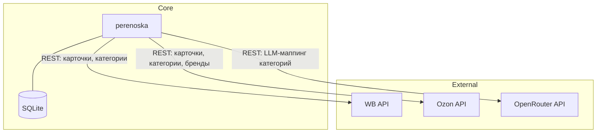

# Архитектура системы

## Назначение системы

Perenoska — веб-сервис для переноса карточек товаров между маркетплейсами Wildberries и Ozon. Пользователи подключают API-ключи маркетплейсов, выбирают товары для переноса, получают preview с автоматически подобранными категориями и брендами, и запускают перенос. Система поддерживает LLM-маппинг категорий через OpenRouter (семантический подбор с уровнем уверенности), многошаговый поиск брендов через Ozon API, ручной override категорий и брендов при низкой уверенности. Карточки всегда создаются в статусе черновика независимо от статуса источника.

## Карта сервисов

Система реализована как монолитное FastAPI-приложение (один сервис). perenoska — единственный и центральный сервис, реализующий всю бизнес-логику: аутентификацию, хранение credentials маркетплейсов, маппинг и перенос карточек. Внешние зависимости (WB API, Ozon API, OpenRouter API) — сторонние провайдеры, не являющиеся частью системы.

| Сервис | Зона ответственности | Критичность | Владеет данными | Ключевые API |
|--------|---------------------|-------------|----------------|-------------|
| perenoska | Аутентификация, хранение API-ключей маркетплейсов, маппинг и перенос карточек товаров | critical-high | users, sessions, marketplace_connections, transfer_jobs | POST /api/v1/transfers/preview, POST /api/v1/transfers, POST /api/v1/transfers/{job_id}/sync, GET /api/v1/catalog/{marketplace}/brands |



## Связи между сервисами

В системе один паттерн коммуникации — **синхронный REST** к внешним API. perenoska вызывает WB API для получения карточек и справочника категорий, Ozon API для получения дерева категорий, поиска брендов и создания карточек, OpenRouter API для LLM-маппинга категорий. Все внешние вызовы — request-reply: perenoska инициирует запрос и ждёт ответа. При недоступности WB API или Ozon API perenoska возвращает 502 Bad Gateway. При ошибке OpenRouter API `MappingService` возвращает `(None, 0.0)` — graceful degradation: preview устанавливает `category_requires_manual=true` без прерывания запроса.

| Источник | Приёмник | Протокол | Назначение | Паттерн |
|----------|---------|----------|-----------|---------|
| perenoska | OpenRouter API | REST | LLM-маппинг категорий товаров (chat/completions) | sync, request-reply |
| perenoska | Ozon API | REST | Получение дерева категорий, поиск брендов, создание и проверка статуса карточек | sync, request-reply |
| perenoska | WB API | REST | Получение карточек и справочника категорий WB, создание карточек | sync, request-reply |

При добавлении нового маркетплейса: реализовать `MarketplaceClient` ABC (`app/clients/base.py`), зарегистрировать в `MarketplaceClientFactory`, добавить строку в таблицу связей.

## Сквозные потоки

Ниже описаны ключевые сценарии для основных бизнес-функций системы: preview и перенос WB→Ozon как приоритетное направление (Design 0002). Выбраны happy-path сценарии, покрывающие все три внешних интеграции (WB API, Ozon API, OpenRouter API).

### Preview WB→Ozon с LLM-маппингом категорий

**Участники:** Client, perenoska, WB API, Ozon API, OpenRouter API

```
1. Client -> perenoska: POST /api/v1/transfers/preview (REST, Bearer token)
   Тело: { source_marketplace: "wb", target_marketplace: "ozon", product_ids: [...], product_overrides: {} }
2. perenoska -> WB API: POST /content/v2/get/cards/list (REST)
   WB API -> perenoska: cards[]
3. perenoska -> Ozon API: POST /v1/description-category/tree (REST)
   Ozon API -> perenoska: category tree
4. perenoska -> OpenRouter API: POST /chat/completions (REST, через openai SDK)
   Тело: { model, messages: [{ role: user, content: "Source category + target categories list" }], response_format: json }
   OpenRouter API -> perenoska: { category_id, confidence }
5. perenoska: если confidence < 0.7 → category_requires_manual=true
6. perenoska -> Ozon API: POST /v1/brand/list (REST, exact → case-insensitive → substring)
   Ozon API -> perenoska: brands[]
7. perenoska: если бренд не найден → brand_id_requires_manual=true
8. Client <- perenoska: TransferPreviewResponse { ready_to_import, items[{ category_confidence, category_requires_manual, brand_id_suggestion, brand_id_requires_manual }] }
```

**Ключевые контракты:**
- Шаг 1: см. [perenoska.md#post-apiv1transferspreview](../perenoska.md#post-apiv1transferspreview)
- Шаг 4: см. [perenoska.md#int-3-perenoska--openrouter-api](../perenoska.md#int-3-perenoska--openrouter-api)

### Перенос WB→Ozon

**Участники:** Client, perenoska, Ozon API

```
1. Client -> perenoska: POST /api/v1/transfers (REST, Bearer token)
   Тело: { source_marketplace: "wb", target_marketplace: "ozon", product_ids: [...], product_overrides: { product_id: { category_id, brand_id, attributes } } }
2. perenoska: проверяет ready_to_import, создаёт transfer_job (PENDING)
3. perenoska -> Ozon API: POST /v3/product/import (REST)
   Тело: { items: [{ offer_id, name, annotation, description_category_id, brand_id, images, attributes }] }
   Ozon API -> perenoska: { task_id }
4. perenoska: обновляет transfer_job статус → SUBMITTED
5. Client <- perenoska: { job_id, status: "submitted", product_count }
```

**Ключевые контракты:**
- Шаг 1: см. [perenoska.md#post-apiv1transfers](../perenoska.md#post-apiv1transfers)

### Перенос Ozon→WB

**Участники:** Client, perenoska, Ozon API, WB API

```
1. Client -> perenoska: POST /api/v1/transfers/preview (REST, Bearer token)
   Тело: { source_marketplace: "ozon", target_marketplace: "wb", product_ids: [...], product_overrides: {} }
2. perenoska -> Ozon API: GET карточек Ozon
   Ozon API -> perenoska: cards[] (поле annotation → description на WB)
3. perenoska -> WB API: GET /content/v2/object/parent/all (REST)
   WB API -> perenoska: categories[]
4. perenoska -> OpenRouter API: POST /chat/completions (REST)
   OpenRouter API -> perenoska: { category_id, confidence } (Ozon категория → WB справочник)
5. perenoska: бренд передаётся строкой (без верификации по WB-справочнику)
6. Client <- perenoska: TransferPreviewResponse { ready_to_import, items }

7. Client -> perenoska: POST /api/v1/transfers (REST, Bearer token)
   Тело: { source_marketplace: "ozon", target_marketplace: "wb", product_ids: [...], product_overrides: {} }
8. perenoska: проверяет ready_to_import, создаёт transfer_job (PENDING)
9. perenoska -> WB API: POST /content/v2/cards/upload (REST)
   Тело: items[{ offer_id: vendor_code, name, description (из annotation), brand (строка), images, attributes }]
   WB API -> perenoska: { taskId }
10. perenoska: обновляет transfer_job статус → SUBMITTED
11. Client <- perenoska: { job_id, status: "submitted", product_count }
```

**Ключевые контракты:**
- Шаг 1: см. [perenoska.md#post-apiv1transferspreview](../perenoska.md#post-apiv1transferspreview)
- Шаг 7: см. [perenoska.md#post-apiv1transfers](../perenoska.md#post-apiv1transfers)

### Синхронизация статуса переноса

**Участники:** Client, perenoska, Ozon API

```
1. Client -> perenoska: POST /api/v1/transfers/{job_id}/sync (REST, Bearer token)
2. perenoska -> Ozon API: POST /v1/product/import/info (REST)
   Тело: { task_id }
   Ozon API -> perenoska: { items[{ offer_id, status, errors }] }
3. perenoska: маппит remote status → PROCESSING / COMPLETED / FAILED
4. Client <- perenoska: TransferJobResponse { job_id, status }
```

**Ключевые контракты:**
- Шаг 1: см. [perenoska.md#post-apiv1transfersjob_idsync](../perenoska.md#post-apiv1transfersjob_idsync)

## Контекстная карта доменов

Система реализует один домен на один сервис (1:1). Perenoska объединяет несколько бизнес-поддоменов внутри монолита: Identity (аутентификация), Marketplace Integration (работа с API маркетплейсов), Transfer (перенос карточек), Mapping (маппинг категорий и брендов). perenoska принимает модели WB и Ozon API без адаптации в слое клиентов.

| Домен | Реализует сервис | Агрегаты | Связь с другими доменами |
|-------|-----------------|----------|------------------------|
| Mapping | perenoska | TransferPreviewItem | принимает категории и бренды из внешних API для маппинга |
| Marketplace Integration | perenoska | MarketplaceConnection | принимает модели внешних API без адаптации |
| Transfer | perenoska | TransferJob | Зависит от Mapping (preview → launch) и Marketplace Integration (вызовы API) |
| User Identity | perenoska | User, Session | Изолирован внутри монолита; Bearer-токен передаётся всеми остальными доменами |

### DDD-паттерны связей

- **Mapping** → LLM-провайдер (OpenRouter): использует внешний API как инструмент подбора категорий, graceful degradation при ошибке (`(None, 0.0)` → `category_requires_manual=true`).
- **Marketplace Integration** → маркетплейсы (WB, Ozon): клиенты (`WBClient`, `OzonClient`) принимают модели внешних API без адаптации бизнес-логики; изоляция достигается через `MarketplaceClient` ABC.
- **Transfer** → Mapping + Marketplace Integration: оркестрирует preview и launch, не зависит от конкретных клиентов напрямую.

Если нужно добавить новый маркетплейс — реализовать новый `MarketplaceClient` без изменения `TransferService`. Если изменится формат ответа внешнего API — обновить только клиент (`WBClient`/`OzonClient`), бизнес-логика `TransferService` и `MappingService` изолирована от этих изменений.

## Shared-код

*Shared-пакеты будут добавлены при появлении переиспользуемого кода между сервисами.*
